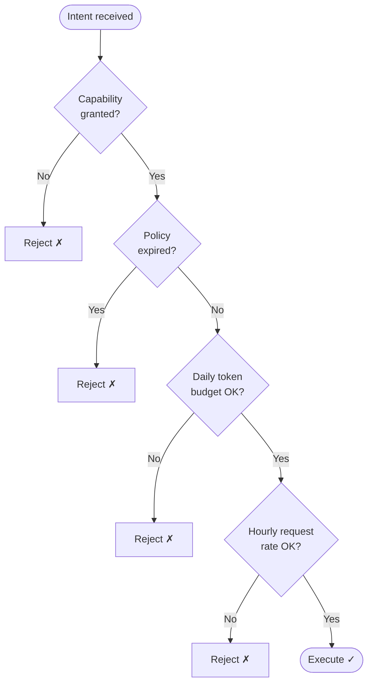

# Policies API

A **policy** is a governance record that grants an agent a set of capabilities and optional resource limits. When a policy is created or revoked the control plane immediately triggers a **certificate reissue** for any connected agent — so enforcement is instantaneous, not deferred.

Unlike the old `policy_update` WebSocket message (now deprecated), policies are embedded inside the [VaultysId Challenger certificate](/docs/security/vaultys-id) that both sides sign during the auth handshake. This means limits cannot be tampered with in transit.

:::tip Governance dashboard
Policies can also be managed from the **Governance** page and from the **Governance tab** on each agent detail page. The API is the same underlying layer.
:::

---

## Create a policy

```http
POST /api/policies
```

**Auth:** Global admin only.

### Request body

```json
{
  "agentDid": "did:vaultys:z6Mkf9x3TQ...",
  "capabilities": ["api_call", "internet_access"],
  "resourceLimits": {
    "maxTokensPerDay": 50000,
    "maxRequestsPerHour": 60,
    "allowedDomains": ["api.openai.com", "example.com"]
  },
  "expiresAt": "2025-12-31T23:59:59Z"
}
```

| Field | Type | Required | Description |
|---|---|---|---|
| `agentDid` | string | No | Target agent DID. Omit to create a realm-scoped policy. |
| `realmId` | string | No | Target realm ID. At least one of `agentDid` / `realmId` should be set. |
| `capabilities` | string[] | **Yes** | Capabilities to grant (non-empty array). |
| `resourceLimits` | object | No | Runtime limits embedded in the certificate. |
| `resourceLimits.maxTokensPerDay` | number | No | Maximum total LLM tokens (prompt + completion) per calendar day. |
| `resourceLimits.maxRequestsPerHour` | number | No | Maximum intent executions per rolling 60-minute window. |
| `resourceLimits.allowedDomains` | string[] | No | Advisory list of permitted outbound domains. |
| `expiresAt` | string | No | ISO 8601 timestamp. Agent rejects intents after this time. |

### Response `201 Created`

```json
{
  "policy": {
    "id": "policy-01HZABC...",
    "agentDid": "did:vaultys:z6Mkf9x3TQ...",
    "realmId": null,
    "capabilities": ["api_call", "internet_access"],
    "resourceLimits": {
      "maxTokensPerDay": 50000,
      "maxRequestsPerHour": 60
    },
    "expiresAt": "2025-12-31T23:59:59Z",
    "createdBy": "did:vaultys:adminDid...",
    "createdAt": "2025-06-01T12:00:00Z"
  },
  "sentTo": ["did:vaultys:z6Mkf9x3TQ..."]
}
```

`sentTo` lists the agent DIDs that received a live certificate reissue. An empty array means the agent was offline — the policy is stored in the database and will be applied on its next connection.

---

## List policies

```http
GET /api/policies
```

**Auth:** Global admin only.

### Query parameters

| Parameter | Type | Default | Description |
|---|---|---|---|
| `agentDid` | string | — | Filter to a specific agent. |
| `realmId` | string | — | Filter to a specific realm. |
| `includeExpired` | boolean | `false` | Include policies whose `expiresAt` is in the past. |

### Response `200 OK`

```json
{
  "policies": [
    {
      "id": "policy-01HZABC...",
      "agentDid": "did:vaultys:z6Mkf9x3TQ...",
      "realmId": null,
      "capabilities": ["api_call"],
      "resourceLimits": null,
      "expiresAt": null,
      "createdBy": "did:vaultys:adminDid...",
      "createdAt": "2025-06-01T12:00:00Z"
    }
  ]
}
```

---

## Get a policy

```http
GET /api/policies/{id}
```

**Auth:** Global admin only.

### Response `200 OK`

```json
{
  "policy": {
    "id": "policy-01HZABC...",
    "agentDid": "did:vaultys:z6Mkf9x3TQ...",
    "realmId": null,
    "capabilities": ["api_call", "internet_access"],
    "resourceLimits": { "maxTokensPerDay": 50000 },
    "expiresAt": "2025-12-31T23:59:59Z",
    "createdBy": "did:vaultys:adminDid...",
    "createdAt": "2025-06-01T12:00:00Z"
  }
}
```

---

## Revoke a policy

```http
DELETE /api/policies/{id}
```

**Auth:** Global admin only.

Deletes the policy record and, if the policy was bound to a specific agent that is currently connected, triggers an immediate certificate reissue that removes the resource limits from the certificate.

### Response `200 OK`

```json
{
  "ok": true,
  "sentTo": ["did:vaultys:z6Mkf9x3TQ..."]
}
```

---

## How policies are enforced

Policies are **embedded in the VaultysId Challenger certificate** — not delivered as a separate signed document. This design prevents tampering and makes enforcement offline-capable.

### Certificate embedding flow

```
Admin creates policy via POST /api/policies
    ↓
Policy persisted to database
    ↓
If agent is connected:
    Control plane sends update_capabilities message
    (carries capabilities + resourceLimits + policyId + policyExpiresAt)
    ↓
    Agent stores the metadata and sets reAuthPending = true
    ↓
    Control plane opens a new auth session
    ↓
    Challenger.update() embeds metadata as native types in the cert
    ↓
    Both parties sign the certificate
    ↓
    handleAuthComplete reads capabilities + governance metadata from cert
```

Because the metadata is co-signed by both the control plane and the agent, it cannot be forged or replayed.

### Agent-side enforcement gates (in order)

When an agent receives an intent, it runs these checks **before** executing:

1. **Capability check** — Is the action in the granted capabilities list?
2. **Policy expiry** — Has `policyExpiresAt` passed? Reject if so.
3. **Daily token budget** — Has `maxTokensPerDay` been reached today (prompt + completion tokens)? Reject if so.
4. **Hourly request rate** — Has `maxRequestsPerHour` been reached in the current rolling window? Reject if so.



### Offline agent behaviour

If an agent is offline when a policy is created or revoked:

- The policy change is written to the database.
- On the agent's next reconnect, the control plane detects a capability mismatch and triggers a certificate reissue automatically, embedding the current policy metadata.

---

## Resource limits reference

| Field | Unit | Behaviour when exceeded |
|---|---|---|
| `maxTokensPerDay` | Total tokens (prompt + completion) | Intent rejected with `Daily token budget exhausted` error |
| `maxRequestsPerHour` | Intent executions per rolling 60-minute window | Intent rejected with `Hourly request limit reached` error |
| `allowedDomains` | Array of hostnames | Advisory — agents may enforce this for outbound HTTP tools |

Token usage is tracked in the agent's local SQLite database by `recordTokenUsage()` and queried by `getDailyTokenUsage()`. The daily counter resets at UTC midnight.

---

## Audit trail

Every policy creation and revocation is recorded in the `activity_log` table and is visible in the **Governance → Audit Log** tab on the dashboard.
