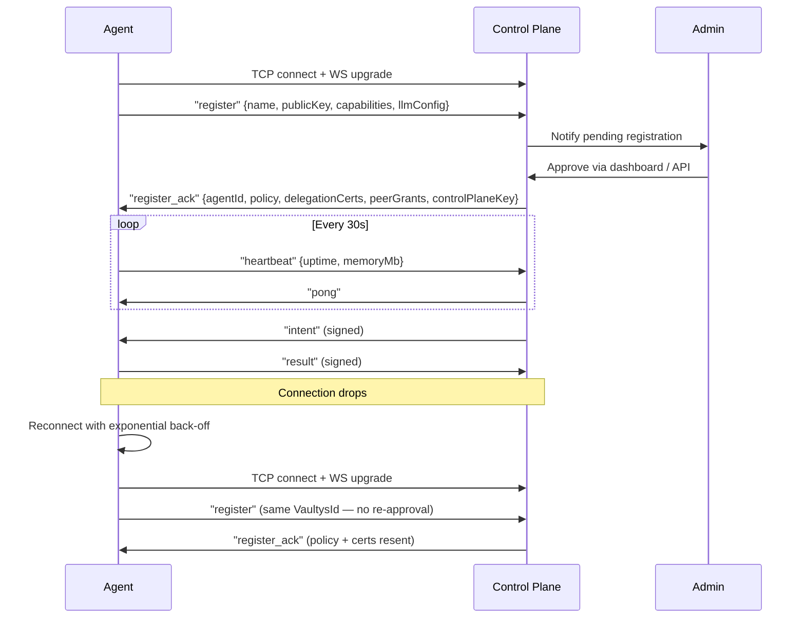
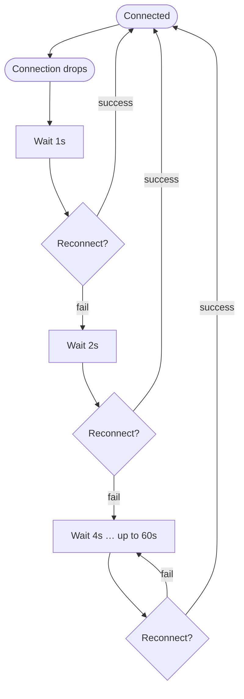

# WebSocket Protocol

The control plane WebSocket hub (default port 8080) is the backbone of real-time communication between the control plane and agent controllers. This page documents the protocol for anyone building a custom agent controller or integrating at the WebSocket level.

## Connection

Agents connect via standard WebSocket to:

```
ws://localhost:8080        (development)
wss://vaultysclaw.acme.com/ws  (production, via reverse proxy)
```

## Message envelope

Every message on the channel is a JSON string with this envelope:

```typescript
interface WsMessage {
  type: string;             // Message type (see below)
  payload: object;          // Message-specific payload
  signature?: string;       // Base64 signature of the payload
  publicKey?: string;       // Sender's VaultysId public key
  timestamp: string;        // ISO 8601 — used for freshness checks
}
```

**Verification:** Recipients verify `signature` over `JSON.stringify(payload) + timestamp` using the sender's `publicKey`. Messages with invalid signatures are discarded.

## Connection lifecycle



## Message types — Agent → Control Plane

### `register`

Sent by an agent immediately after connecting.

```json
{
  "type": "register",
  "payload": {
    "name": "my-agent",
    "publicKey": "z6Mkf9...",
    "capabilities": ["api_call", "file_access"],
    "llmConfig": {
      "provider": "openai",
      "model": "gpt-4o",
      "maxTokens": 4096
    },
    "version": "1.0.0"
  },
  "signature": "base64...",
  "publicKey": "z6Mkf9...",
  "timestamp": "2026-05-15T09:00:00.000Z"
}
```

### `result`

Sent after executing an intent.

```json
{
  "type": "result",
  "payload": {
    "intentId": "int_01HZ...",
    "status": "success",
    "output": { "summary": "..." },
    "executedAt": "2026-05-15T09:01:00Z"
  },
  "signature": "base64...",
  "publicKey": "z6Mkf9...",
  "timestamp": "2026-05-15T09:01:00.001Z"
}
```

### `heartbeat`

Sent every 30 seconds.

```json
{
  "type": "heartbeat",
  "payload": {
    "uptime": 3600,
    "memoryMb": 128,
    "llmProvider": "openai",
    "connected": true
  },
  "timestamp": "2026-05-15T09:00:30.000Z"
}
```

### `tool_approval_request`

Sent when an agent encounters a tool requiring admin approval.

```json
{
  "type": "tool_approval_request",
  "payload": {
    "requestId": "tap_01HZ...",
    "tool": "system_command",
    "context": {
      "command": "ls -la /data",
      "workingDir": "/home/vaultys"
    },
    "intentId": "int_01HZ..."
  },
  "signature": "base64...",
  "publicKey": "z6Mkf9...",
  "timestamp": "..."
}
```

## Message types — Control Plane → Agent

### `register_ack`

Sent after admin approval.

```json
{
  "type": "register_ack",
  "payload": {
    "agentId": "did:vaultys:z6Mkf9...",
    "policy": { "capabilities": ["api_call"], "version": 1 },
    "controlPlanePublicKey": "z6MkCP...",
    "delegationCerts": [ ... ],
    "peerGrants": [ ... ]
  },
  "signature": "base64...",
  "publicKey": "z6MkCP...",
  "timestamp": "..."
}
```

### `intent`

Routes work to the agent.

```json
{
  "type": "intent",
  "payload": {
    "id": "int_01HZ...",
    "agentControllerId": "did:vaultys:z6Mkf9...",
    "action": "summarise_document",
    "params": { "url": "...", "format": "bullets" },
    "timestamp": "2026-05-15T09:01:00Z"
  },
  "signature": "base64...",
  "publicKey": "z6MkCP...",
  "timestamp": "2026-05-15T09:01:00.001Z"
}
```

### `policy_update`

Sent when capabilities change.

```json
{
  "type": "policy_update",
  "payload": {
    "id": "pol_01HZ...",
    "agentControllerId": "did:vaultys:z6Mkf9...",
    "capabilities": ["api_call", "file_access"],
    "resourceLimits": { "maxCpuPercent": 50 },
    "version": 3
  },
  "signature": "base64...",
  "publicKey": "z6MkCP...",
  "timestamp": "..."
}
```

### `tool_approval_response`

Sent after admin decision.

```json
{
  "type": "tool_approval_response",
  "payload": {
    "requestId": "tap_01HZ...",
    "approved": true,
    "reason": null
  },
  "signature": "base64...",
  "publicKey": "z6MkCP...",
  "timestamp": "..."
}
```

## Reconnect behaviour



After reconnecting, the agent re-sends `register` with the same VaultysId. The control plane recognises the existing identity and re-sends the current policy and delegation certificates **without requiring admin re-approval**.
