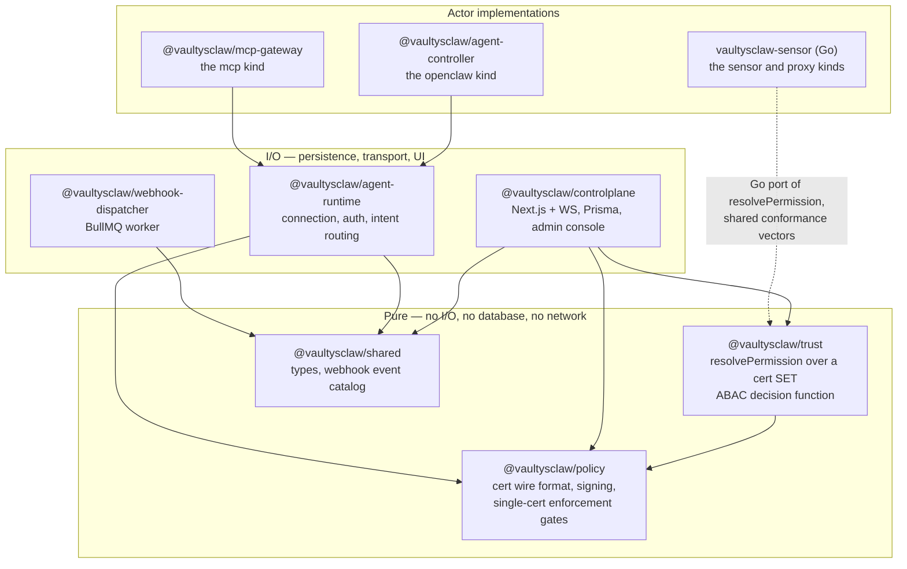

# Architecture

VaultysClaw is a pnpm/Turborepo monorepo plus one Go binary. The layering is
deliberate and enforced by dependency direction: pure decision logic at the
bottom, I/O at the top, and nothing pointing the wrong way.

## The layering rule

`packages/policy` and `packages/trust` **have no database, no network, and no
framework.** They take already-verified inputs and return decisions.

This is not tidiness for its own sake. `resolvePermission` is the function a
security audit will scrutinise hardest, and it is worth being able to point at one
self-contained artefact with property-based tests over random certificate-set
combinations — rather than at a function tangled into a web framework's request
lifecycle.

The control plane fetches rows and acts on decisions. The agent runtime evaluates
locally with no database in the loop. Both consume the same function.

## The packages

### `@vaultysclaw/policy`

Certificate wire format and signing. Owns `signCert` / `openCert`, the
`capability_request` and `capability_grant` bodies, the `AgentCapability` enum,
`ResourceLimits`, and single-certificate enforcement gates.

Also owns `decodeCertUnsafe` — decode without verifying, for display only, used by
the console's certificate inspector to show a payload even when verification
fails.

### `@vaultysclaw/trust`

`resolvePermission(action, activeCerts, now)` and the `CertScope` types. The
multi-certificate ABAC decision function.

Kept separate from `policy` on purpose: resolving over a *set* of concurrent,
overlapping, scoped certificates is a different responsibility with a different
test shape — property and fuzz tests over random combinations, not gate-by-gate
unit tests. Two invariants are asserted directly:

- **Revoking a certificate never grants more access.**
- **Adding a certificate never removes access**, except through an explicit
  scope-narrowing supersession.

It contains no signing or verification. It takes opened, verified payloads.

### `@vaultysclaw/shared`

Cross-package types and the webhook event catalog — the single source of truth for
event types, labels, and groups, shared by both control-plane packages so they
cannot fork.

### `@vaultysclaw/controlplane`

The rebuilt control plane: Next.js App Router, a WebSocket server, Prisma over
Postgres, all in **one custom-server process**. This is the only package that
persists anything or drives the pure packages with I/O.

Architectural notes worth knowing before reading the code:

- **Server Actions over DAOs, not a typed REST contract.** There is no ts-rest
  layer and, today, no REST API surface at all.
- **The WebSocket server is a module-level singleton**, which is what lets a
  Server Action reach the live connection map to deliver a certificate to a
  connected Actor.
- **The handshake state is in-process, not round-tripped through a session
  row** — this is a long-lived process, not a stateless serverless function.

See [Control plane](/docs/architecture/control-plane).

### `@vaultysclaw/agent-runtime`

The transport and authentication layer every Actor implementation builds on.
Loads or generates a local VaultysId, connects over WebSocket or PeerJS, drives
`register` → pending → approval → `auth_complete`, holds the resulting
capabilities and limits, and composes the policy enforcer.

You extend it by subclassing `BaseAgentRuntime` and implementing two methods —
`executeIntent` and `executeChat` — plus whichever optional hooks your kind needs.

It has deliberately no LLM, tool, or skill concepts, and bundles no WebRTC
polyfill: the caller's entry point polyfills RTC globals before importing.

See [Building an Actor](/docs/architecture/building-an-actor).

### `@vaultysclaw/webhook-dispatcher`

A standalone BullMQ worker. One worker fans every event out to **both**
subscription kinds — signed webhooks and Apprise notification channels. It is not
two pipelines.

It must be run as a separate process; the control plane enqueues, and if nothing
consumes, events sit in the queue forever. The console has a health panel
specifically to surface that, because reachability of Redis and Apprise does not
answer "is anything actually consuming this queue".

### `vaultysclaw-sensor` (Go)

Two roles from one binary:

- **Observe** — polls process and socket state, classifies AI and agent workloads
  from data-driven rules, and reports graded telemetry with confidence scores and
  reasons. Registers as `sensor`. Gated entirely on `process_read`.
- **Intercept** — a CONNECT proxy that refuses traffic its signed rule set and
  certificate do not authorise. Registers as `proxy`. Decides offline from
  periodically-refreshed artefacts, with a durable audit spool that emits gap
  markers rather than silently dropping records when it overflows.

It contains a **Go port of `resolvePermission`**. Both implementations run the
same committed conformance vectors, and a divergence between them is a release
blocker.

### `@vaultysclaw/agent-controller` and `@vaultysclaw/mcp-gateway`

The reference implementations of the `openclaw` and `mcp` kinds respectively.

## What the rebuild removed

The rebuilt control plane lives **alongside** the older proof-of-concept
(`packages/control-plane`), not in place of it. Nothing points production traffic
at the rebuild until a cutover is deliberate.

The rebuild deleted, rather than reimplemented: the workflow engine, channel
collaboration and chat, Teams and generic bridges, the in-app/email/push
notification stack, the end-user settings area, and three parallel grant models
that all collapsed into the one certificate ledger.

See [What was removed, and why](/docs/reference/removed-surface).
