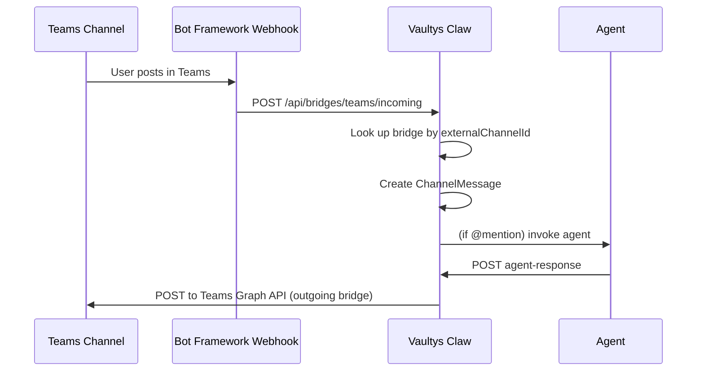

# External Bridges

A **bridge** links a Vaultys Claw channel to an external messaging service. Messages flow in the configured direction: `incoming` (external → channel), `outgoing` (channel → external), or `bidirectional`.

Two bridge types are currently supported:

| Type                | Status              | Direction support                 |
| ------------------- | ------------------- | --------------------------------- |
| **Generic webhook** | Stable              | Incoming, outgoing, bidirectional |
| **Microsoft Teams** | Preview (Graph API) | Incoming, outgoing, bidirectional |

---

## Webhook bridges

A webhook bridge exposes a public HTTPS endpoint that any external service (CI/CD systems, monitoring tools, custom bots) can POST to. Outgoing messages are forwarded to a URL you configure.

### Security model

All incoming webhook requests are authenticated via **HMAC-SHA256**. The request must include an `X-Signature` header with value `sha256=<hex>`, where the hex is an HMAC computed over the raw request body using the shared secret.

The control plane verifies the signature using a constant-time comparison to prevent timing attacks.

### Adding a webhook bridge via the dashboard

1. Open the channel you want to bridge.
2. Click the **Bridges** icon (link icon) in the channel header.
3. Click **Add Bridge** → select **Webhook**.
4. Optionally enter a custom **outgoing URL** (where the control plane will POST outgoing messages).
5. The dashboard generates a random **secret**. Copy it — you will need to configure it in the external service.
6. Select the sync direction.
7. Click **Save**. The **incoming URL** is shown; configure it in your external service.

### Adding a webhook bridge via API

```http
POST /api/channels/:channelId/bridges
```

```json
{
  "externalService": "webhook",
  "externalChannelId": "ci-alerts",
  "externalChannelName": "CI Alerts",
  "externalWorkspaceId": "acme-ci",
  "syncDirection": "incoming",
  "config": {
    "webhookUrl": "",
    "outgoingUrl": "https://hooks.acme.com/vaultysclaw-events",
    "secret": "a-random-secret-at-least-32-chars"
  }
}
```

| Field                 | Description                                                                       |
| --------------------- | --------------------------------------------------------------------------------- |
| `externalChannelId`   | An identifier you choose; must be unique per `(channelId, externalService)` tuple |
| `externalChannelName` | Human-readable label shown in the UI                                              |
| `externalWorkspaceId` | Logical group identifier (e.g., your CI platform name)                            |
| `syncDirection`       | `"incoming"`, `"outgoing"`, or `"bidirectional"`                                  |
| `config.webhookUrl`   | Unused for `webhook` type (leave empty)                                           |
| `config.outgoingUrl`  | URL the control plane POSTs to for outgoing messages                              |
| `config.secret`       | Shared secret for HMAC-SHA256 verification                                        |

:::caution Keep the secret safe
The `config` field is **never returned by the API** — once saved, retrieve the secret from wherever you stored it. If lost, delete the bridge and recreate it with a new secret.
:::

### Incoming webhook URL

The generated incoming URL has the form:

```
https://vaultysclaw.acme.com/api/bridges/webhook/<bridgeId>/incoming
```

Configure this URL in your external service's webhook settings. Every request to this URL must include the `X-Signature` header.

### Incoming payload format

```json
{
  "message": "Build failed on branch main",
  "author": "ci-system",
  "metadata": {
    "buildId": "12345",
    "repository": "acme/backend"
  }
}
```

| Field      | Required | Description                                                |
| ---------- | -------- | ---------------------------------------------------------- |
| `message`  | Yes      | The message content posted to the channel                  |
| `author`   | No       | DID or name of the sender. Defaults to `webhook:external`. |
| `metadata` | No       | Arbitrary JSON stored as message metadata                  |

### Outgoing payload format

When a message is posted to the channel and an outgoing bridge is active, the control plane sends:

```json
{
  "channelId": "ch_01HZ...",
  "messageId": "msg_01HZ...",
  "authorDid": "did:vaultys:z6MkAlice...",
  "authorType": "user",
  "content": "Deployment to production started.",
  "threadId": null,
  "createdAt": "2026-05-26T10:00:00Z"
}
```

The outgoing POST also includes `X-Signature: sha256=<hmac>` so the receiving service can verify authenticity.

### Signing requests yourself (HMAC verification)

```python
import hmac, hashlib, requests, json

secret = "a-random-secret-at-least-32-chars"
payload = json.dumps({"message": "Deploy started", "author": "deploy-bot"})
sig = "sha256=" + hmac.new(
    secret.encode(), payload.encode(), hashlib.sha256
).hexdigest()

requests.post(
    "https://vaultysclaw.acme.com/api/bridges/webhook/<bridgeId>/incoming",
    data=payload,
    headers={
        "Content-Type": "application/json",
        "X-Signature": sig,
    },
)
```

```javascript
const crypto = require("crypto");

const secret = "a-random-secret-at-least-32-chars";
const body = JSON.stringify({
  message: "Deploy started",
  author: "deploy-bot",
});
const sig =
  "sha256=" + crypto.createHmac("sha256", secret).update(body).digest("hex");

await fetch(
  "https://vaultysclaw.acme.com/api/bridges/webhook/<bridgeId>/incoming",
  {
    method: "POST",
    headers: { "Content-Type": "application/json", "X-Signature": sig },
    body,
  }
);
```

---

## Microsoft Teams bridges

:::info Preview
The Teams bridge is in preview. Bot Framework JWT verification and full OAuth token refresh are flagged as TODOs in the current codebase. It is suitable for testing but not production use without those additions.
:::

The Teams bridge integrates with the **Microsoft Teams Graph API** to relay messages bidirectionally between a Vaultys Claw channel and a Teams channel.

### Architecture



### Adding a Teams bridge via API

```http
POST /api/channels/:channelId/bridges
```

```json
{
  "externalService": "teams",
  "externalChannelId": "19:abc123...@thread.tacv2",
  "externalChannelName": "Engineering (Teams)",
  "externalWorkspaceId": "your-tenant-id",
  "syncDirection": "bidirectional",
  "config": {
    "accessToken": "eyJ...",
    "tenantId": "your-tenant-id",
    "botId": "your-bot-app-id"
  }
}
```

| Field                 | Description                                                               |
| --------------------- | ------------------------------------------------------------------------- |
| `externalChannelId`   | The Teams channel ID (from Teams client: `...` → **Get link to channel**) |
| `externalWorkspaceId` | Your Azure AD tenant ID                                                   |
| `config.accessToken`  | OAuth 2.0 access token for the Microsoft Graph API                        |
| `config.tenantId`     | Azure AD tenant ID                                                        |
| `config.botId`        | App registration client ID of your Teams bot                              |

### Incoming Teams webhook URL

```
https://vaultysclaw.acme.com/api/bridges/teams/incoming
```

Configure this as the **messaging endpoint** in your Teams bot manifest.

---

## Managing bridges

### List bridges for a channel

```http
GET /api/channels/:channelId/bridges
```

```json
{
  "bridges": [
    {
      "id": "br_01HZ...",
      "channelId": "ch_01HZ...",
      "externalService": "webhook",
      "externalChannelId": "ci-alerts",
      "externalChannelName": "CI Alerts",
      "externalWorkspaceId": "acme-ci",
      "syncDirection": "incoming",
      "isSyncEnabled": true,
      "createdAt": "2026-05-26T09:00:00Z"
    }
  ]
}
```

Note: `configJson` (containing secrets and tokens) is **never** returned by any API endpoint.

### Toggle a bridge on/off

```http
PATCH /api/channels/:channelId/bridges/:bridgeId
```

```json
{
  "isSyncEnabled": false
}
```

Disabling a bridge stops both incoming and outgoing sync without removing the configuration. Re-enable by setting `isSyncEnabled: true`.

### Update sync direction

```http
PATCH /api/channels/:channelId/bridges/:bridgeId
```

```json
{
  "syncDirection": "outgoing"
}
```

### Delete a bridge

```http
DELETE /api/channels/:channelId/bridges/:bridgeId
```

```json
{ "success": true }
```

The bridge configuration (including the secret) is permanently deleted. Any external service still pointing at the incoming URL will receive `404 Not Found`.

---

## Bridge fan-out internals

Every time a message is posted to a channel, `BridgeFactory.fanOutMessage` runs in the background:

```typescript
// Simplified from lib/bridges/bridge-factory.ts
async fanOutMessage(channelId: string, message: MessagePayload): Promise<void> {
  const bridges = ChannelBridgeService.listBridges(channelId);
  const active = bridges.filter(
    b => b.isSyncEnabled && b.syncDirection !== "incoming"
  );

  await Promise.allSettled(
    active.map(bridge => {
      const config = ChannelBridgeService.getDecryptedConfig(bridge);
      switch (bridge.externalService) {
        case "webhook": return WebhookGateway.sendOutgoing(config, message);
        case "teams":   return TeamsGateway.sendMessage(config, message);
      }
    })
  );
}
```

`Promise.allSettled` ensures one failing bridge never prevents others from receiving the message. Individual failures are logged but do not produce errors visible to the message sender.

---

## Troubleshooting

| Symptom                         | Likely cause                                | Fix                                                                                 |
| ------------------------------- | ------------------------------------------- | ----------------------------------------------------------------------------------- |
| Incoming webhook returns `401`  | Wrong or missing `X-Signature` header       | Recompute HMAC over the raw body string (not re-serialised JSON)                    |
| Incoming webhook returns `403`  | Bridge `syncDirection` is `"outgoing"` only | Change direction to `"incoming"` or `"bidirectional"`                               |
| Incoming webhook returns `403`  | `isSyncEnabled` is `false`                  | Re-enable the bridge via PATCH                                                      |
| Outgoing messages not delivered | `outgoingUrl` is unreachable                | Check the external URL; view server logs for `[WebhookGateway] sendOutgoing failed` |
| Teams messages not appearing    | Bot not connected or access token expired   | Regenerate an access token and update via PATCH + `config` field                    |
