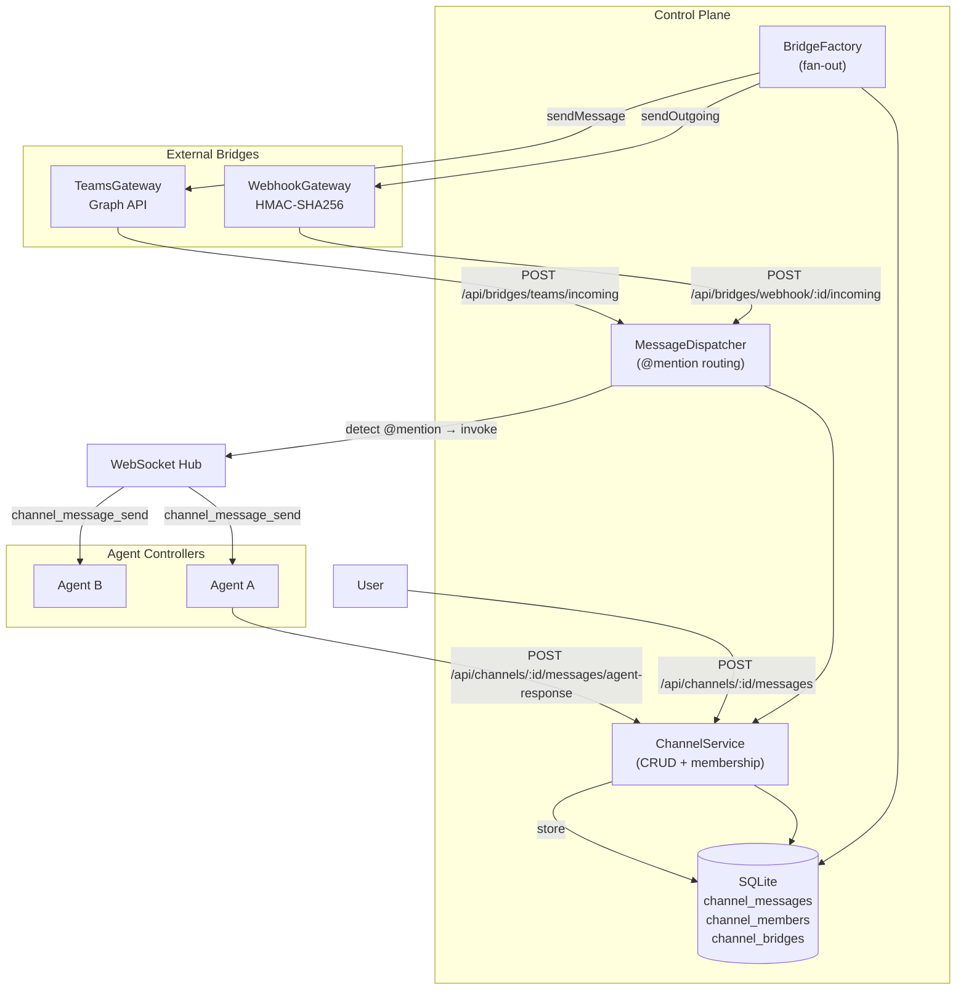
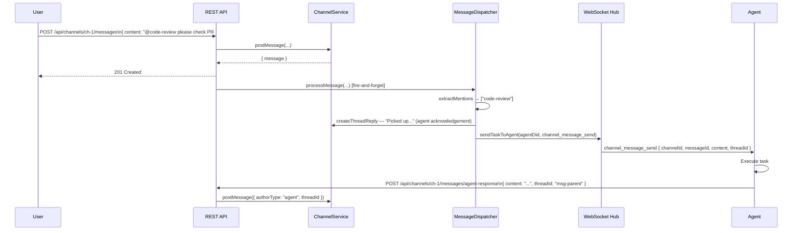
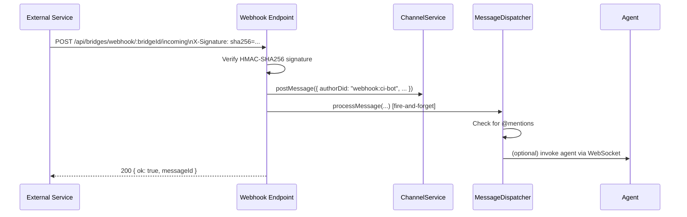

# Channel Architecture

VaultysClaw organises all communication — between users, between users and agents, and between agents — through **persistent named channels**. This replaces the previous point-to-point WebRTC model with an asynchronous pub/sub layer that scales to enterprise deployments and integrates naturally with external platforms like Microsoft Teams.

## Why channels?

| Concern                   | Without channels                         | With channels                                |
| ------------------------- | ---------------------------------------- | -------------------------------------------- |
| **Multi-agent workflows** | Pair-wise P2P connections; O(n²) wiring  | Any agent joins a channel; O(n) membership   |
| **Async tasks**           | Blocked on the target agent being online | Messages queue; agent processes on reconnect |
| **Audit trail**           | Ephemeral; lost on reconnect             | All messages persisted and searchable        |
| **External integration**  | Custom webhooks per agent                | Bridge the channel once; all members benefit |
| **Group collaboration**   | Not supported                            | Users + agents share a channel naturally     |

## Core concepts

### Channel

A channel is a named, persistent room that accumulates messages over time. Channels are either **workspace-scoped** (visible only to members of a specific workspace) or **global** (visible to every workspace in the installation).

```typescript
interface Channel {
  id: string;
  workspaceId: string | null; // null = global channel
  name: string;
  slug: string; // URL-safe identifier, unique within workspace
  description: string | null;
  topic: string | null;
  isPublic: boolean; // true: all workspace members can view; false: invite-only
  isArchived: boolean;
  creatorDid: string;
  createdAt: string;
  updatedAt: string;
}
```

### Channel member

Both **users** and **agents** are first-class members of a channel. Each member carries a role:

| Role        | Permissions                                         |
| ----------- | --------------------------------------------------- |
| `owner`     | Full control — edit, archive, add/remove any member |
| `moderator` | Add members, delete any message                     |
| `member`    | Post messages, read history                         |

```typescript
interface ChannelMember {
  id: string;
  channelId: string;
  memberDid: string; // User or agent DID
  memberType: "user" | "agent";
  role: "member" | "moderator" | "owner";
  joinedAt: string;
  invitedBy: string | null;
}
```

### Channel message

Messages persist in the database and support **threading**. A reply is a message with `threadId` set to the parent message's ID.

```typescript
interface ChannelMessage {
  id: string;
  channelId: string;
  threadId: string | null; // Parent message ID, or null for top-level
  authorDid: string;
  authorType: "user" | "agent";
  content: string; // Markdown supported
  metadata: {
    toolCalls?: Record<string, unknown>;
    attachments?: Array<{ type: "file" | "link" | "json"; data: unknown }>;
    mentions?: string[];
    agentAction?: string; // e.g. "webhook_incoming", "task_created"
  };
  reactions: Record<string, string[]>; // { "👍": ["did:1", "did:2"] }
  editedAt: string | null;
  deletedAt: string | null; // Soft delete
  createdAt: string;
}
```

### Channel bridge

A bridge connects a channel to an external service — currently **webhooks** and **Microsoft Teams** (bidirectional). Bridges can be configured per-direction:

| Direction       | Behaviour                                           |
| --------------- | --------------------------------------------------- |
| `incoming`      | External messages are posted into the channel       |
| `outgoing`      | Channel messages are pushed to the external service |
| `bidirectional` | Both directions active                              |

## System architecture



## How messages flow

### User sends a message with an @mention



The agent's response always goes into a **reply thread** on the original message, keeping the channel uncluttered.

### Incoming webhook bridges a message into the channel



### Outgoing fan-out to bridges

Every message posted to a channel (by user, agent, or webhook) is automatically fanned out to all active **outgoing** bridges via `BridgeFactory.fanOutMessage`. Bridge failures are isolated — one bridge erroring never blocks the others.

## Database tables

```sql
-- Named rooms, workspace-scoped or global
CREATE TABLE channels (
  id TEXT PRIMARY KEY,
  workspace_id TEXT,                      -- NULL = global
  name TEXT NOT NULL,
  slug TEXT NOT NULL,
  description TEXT,
  topic TEXT,
  is_public INTEGER DEFAULT 1,
  is_archived INTEGER DEFAULT 0,
  creator_did TEXT NOT NULL,
  created_at TEXT NOT NULL,
  updated_at TEXT NOT NULL,
  UNIQUE(workspace_id, slug)
);

-- Who is in each channel (users and agents)
CREATE TABLE channel_members (
  id TEXT PRIMARY KEY,
  channel_id TEXT NOT NULL,
  member_did TEXT NOT NULL,
  member_type TEXT NOT NULL,          -- "user" | "agent"
  role TEXT NOT NULL,                 -- "member" | "moderator" | "owner"
  joined_at TEXT NOT NULL,
  invited_by TEXT,
  UNIQUE(channel_id, member_did)
);

-- Persisted messages with optional threading
CREATE TABLE channel_messages (
  id TEXT PRIMARY KEY,
  channel_id TEXT NOT NULL,
  thread_id TEXT,                     -- NULL or parent message ID
  author_did TEXT NOT NULL,
  author_type TEXT NOT NULL,          -- "user" | "agent"
  content TEXT NOT NULL,
  metadata TEXT,                      -- JSON
  reactions TEXT,                     -- JSON: { "👍": ["did:1"] }
  edited_at TEXT,
  deleted_at TEXT,
  created_at TEXT NOT NULL
);

-- External service integrations
CREATE TABLE channel_bridges (
  id TEXT PRIMARY KEY,
  channel_id TEXT NOT NULL,
  external_service TEXT NOT NULL,     -- "teams" | "webhook"
  external_channel_id TEXT NOT NULL,
  external_channel_name TEXT,
  external_workspace_id TEXT NOT NULL,
  sync_direction TEXT NOT NULL,       -- "incoming" | "outgoing" | "bidirectional"
  is_sync_enabled INTEGER DEFAULT 1,
  created_at TEXT NOT NULL,
  config_json TEXT NOT NULL,          -- Encrypted: tokens, secrets, URLs
  UNIQUE(channel_id, external_service, external_channel_id)
);
```

## Workspace-scoped vs global channels

|                      | Workspace channel                       | Global channel                 |
| -------------------- | ----------------------------------- | ------------------------------ |
| **Visibility**       | Members of that workspace only          | All workspaces in the installation |
| **slug uniqueness**  | Unique per workspace                    | Unique globally                |
| **Creator required** | Any workspace admin                     | Global admin only              |
| **Bridge scoping**   | Workspace-specific integration          | Organisation-wide integration  |
| **Typical use**      | `#engineering`, `#customer-support` | `#announcements`, `#outages`   |

## Agent-to-agent communication

Agent-to-agent communication is routed through channels. When a user grants an agent access to a channel that contains other agents, those agents can collaborate by reading and posting to the shared channel.

The `buildChannelAgentTools` function in the agent controller creates LLM-callable tools that:

1. Post an `@mention` to the target agent's channel
2. Poll the resulting thread (up to 60 seconds) for the reply
3. Return the reply content as the tool result
4. Fall back to direct WebRTC invocation if no `channelId` is configured on the grant

This replaces the previous peer-to-peer WebRTC model, which is no longer supported.

## Next steps

- [Channels and Members](/docs/channels/channels-and-members) — create channels, manage membership
- [Messaging and Threads](/docs/channels/messaging) — post messages, @mentions, threading
- [External Bridges](/docs/channels/bridges) — connect Teams and webhooks
- [Channels API Reference](/docs/api/channels) — REST endpoints
