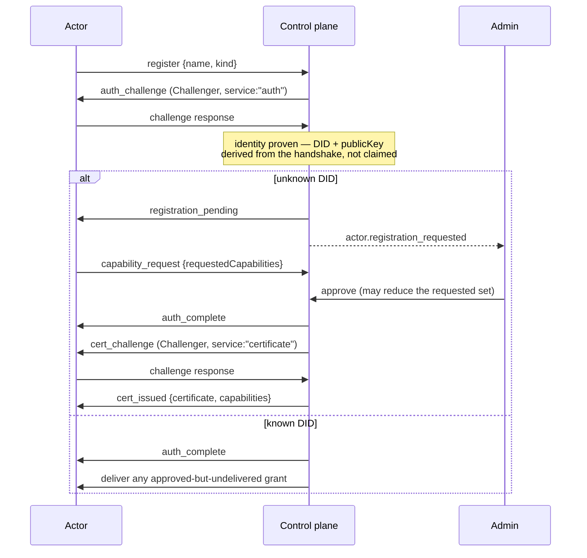

# Actors

An **Actor** is anything that holds a VaultysId DID. That is the whole model.

There is no separate table for agents, another for sensor devices, another for
users. One entity, one registration flow, one certificate ledger, one audit
trail. What differs between an LLM agent and a Go telemetry daemon is the
configuration each carries and the admin panel that edits it — never the identity
model, the approval flow, or the permission check.

```prisma
model Actor {
  did          String   @id
  name         String
  kind         String   // open-ended
  workspaceId  String?
  publicKey    String?  // captured at registration, enables offline re-verification
  ownerDid     String?  // "belongs to / acts for"
  kindConfig   Json     @default("{}")
  registeredAt DateTime @default(now())
  lastSeen     DateTime @default(now())
}
```

## Why this matters

The previous design had `Agent` and `SensorDevice` as two Prisma models with two
admin pages and two structurally identical registration flows. A sensor had been
bolted on as a parallel system rather than recognised as another kind of the same
thing. That pattern does not survive contact with a third kind, let alone a fifth.

Under the unified model, adding a kind means adding one config schema and one
panel component. It does not mean a new table, a new registration path, a new
revocation story, or a new place for an auditor to look.

## Kinds

`Actor.kind` is a **flat, open-ended string**. An unrecognised kind renders
gracefully rather than crashing — kinds are a deploy-time concept, not
runtime-configurable data.

| Kind | Category | What it is |
|---|---|---|
| `human` | human | A person, onboarded by login rather than the registration handshake |
| `openclaw` | agent | An LLM-driven agent running the reference agent runtime |
| `mcp` | agent | A Model Context Protocol server exposed as an Actor |
| `sensor` | agent | The Go endpoint daemon in observe-only mode — reports workloads, enforces nothing |
| `proxy` | agent | The same Go binary with interception active — **refuses traffic**, see [Blast radius](/docs/concepts/blast-radius) |
| `device` | agent | A browser, computer, or server. Registers exactly like any other kind. |

The `human`/`agent` split is the only grouping concept, and it exists for one
reason: humans onboard through login, everything else onboards through the
WebSocket registration handshake.

:::note `sensor` and `proxy` are the same binary
One Go binary, roles selected by config. It registers as `sensor` while
observe-only and as `proxy` once interception is active. The `proxy` badge is
danger-coloured in the console on purpose: it means traffic is being refused
somewhere.
:::

## Humans are Actors

This is load-bearing, not a modelling flourish.

Because a human is an Actor, the question *"may this person open the admin
console?"* is answered by exactly the same ledger lookup as *"may this agent read
this file?"* — `hasCapability(did, "admin_console_access")` runs the same
resolution function over the same certificate rows.

There is **no role enum**. No Owner/Admin/Member. The session carries no `role`
field, because a session that carried authority would be a second source of truth
racing the ledger. `admin_console_access` and `portal_access` are ordinary
capabilities, granted and revoked and expired identically to `file_access`.

A `User` row exists as a 1:1 profile extension of a `kind: "human"` Actor —
name, email, profile-completion state. It holds no authority.

## kindConfig

Kind-specific configuration lives in one JSON column rather than in per-kind
columns that are null for every other kind.

| Kind | What `kindConfig` holds |
|---|---|
| `openclaw` | LLM provider/model, knowledge sources, skill overrides |
| `mcp` | Server URL, tool allow-list, transport |
| `sensor` | Host metadata merged from telemetry (hostname, OS) |
| `proxy` | Interception mode, listen address, signed rule set, `maxStatusAgeSeconds` |
| `device` | Nothing today |

A malformed `kindConfig` is **rejected, not silently dropped** — an unparseable
proxy rule that quietly disappeared would be a rule an admin believes is enforcing
something.

## Relationships

Two distinct, deliberately weak relations. Both are **descriptive only**: neither
is consulted by permission resolution.

**`Actor.ownerDid`** — "this Actor belongs to / acts for that Actor". Settable on
any non-human Actor, pointing at any other Actor. It exists so a device can be
recorded as belonging to a human today, ahead of the [delegation
mechanism](/docs/zero-trust/roadmap#delegation-chains) that would let it actually
act in that human's name.

**`ActorLink`** — a directed, freely-labelled edge between any two Actors:
"reports to", "manages", "belongs to". Deliberately generic rather than a fixed
relation type, because the previous design's sensor-only "assigned user" field was
exactly the kind of single-purpose relation that needs replacing the moment a
second use case appears.

:::caution Ownership is not authority
Recording that a device belongs to a human grants that device nothing. Until
delegation certificates are built, an Actor's permissions are only what its own
certificates say.
:::

## Lifecycle



Two properties of that flow are worth naming:

**An admin may approve a *different* set than was requested.** "Accept but modify"
is the same action as "accept", with edited input. The certificate records what
was granted, and the audit trail records both.

**Approval does not mint a certificate.** It marks the registration approved with
delivery pending. The certificate is produced by a live, mutually-authenticated
exchange — so an agent-negotiated grant requires both parties to be
cryptographically present at the moment of issuance. If the Actor is offline,
delivery waits for its next successful authentication.

See [Onboarding actors](/docs/guides/onboarding-actors) for the operator's view.

## Registration is not authorisation

A completed handshake proves identity. It grants nothing. An Actor that has
registered, been approved, and connected, but holds no certificate, can do
nothing at all — and that is a valid, normal state. A sensor approved with zero
capabilities is exactly this: connected, attributable, and permitted nothing.
