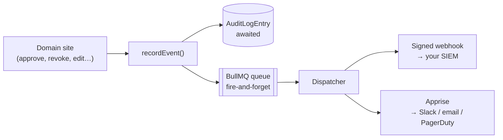

# Audit log

One table, one write path, every event attributed to a DID.

The previous design split this in two — an intent log for agent execution and a
separate activity log for admin events — which meant an auditor had to correlate
two sources and hope they agreed. The rebuild has no separate "intent execution"
concept to track, so there is one log.

## The shape

```prisma
model AuditLogEntry {
  id         String   @id @default(cuid())
  eventType  String            // the same catalog webhooks use
  actorDid   String?           // null for events with no human origin
  actorName  String?
  targetType String?           // "actor" | "certificate" | "workspace"
  targetId   String?
  details    Json              // the sanitised event payload
  createdAt  DateTime @default(now())
}
```

The data-access layer exposes `create`, `list`, `count`, and `recent`. **There is
no update or delete path in code.**

:::caution Append-only by discipline, not by storage
That is an honest limitation. Nothing at the database level prevents a privileged
operator from rewriting this table, and audit rows are not signed or hash-chained.

What *is* tamper-evident is the artefacts the log points at: a certificate row in
the log carries a live-recomputed signed/invalid badge, derived by re-verifying
the actual stored certificate bytes rather than trusting any stored flag. Forging
the log entry does not forge the certificate.

Tamper-evident log storage is on the [roadmap](/docs/zero-trust/roadmap).
:::

## One call drives both the record and the alert

Every domain event goes through a single function:

```ts
await recordEvent({ eventType, payload, performedBy, target });
```

which does two things from the same sanitised payload:

1. **Writes the audit row** — awaited, reliable.
2. **Enqueues the event** — fire-and-forget — onto the queue that feeds both
   [webhooks](/docs/guides/webhooks) and
   [notification channels](/docs/guides/notification-channels).



The property this buys: **the trail an auditor reads and the alert an operator
receives are the same data.** They cannot describe different events, and an alert
cannot exist without a corresponding audit row. No domain site calls the queue
directly.

## What an entry contains

**Attribution.** `actorDid` and `actorName` name the human who acted — or are
explicitly null for events with no human origin, such as an Actor's own
registration attempt. Null is a statement, not a gap.

**What actually changed.** A field-level diff, not merely "something was
updated":

```json
{
  "changes": [
    { "field": "description", "from": "test", "to": "audit-log-verification" }
  ],
  "performedBy": { "did": "did:vaultys:…", "name": "admin test" },
  "adminUrl": "https://…/admin/workspaces/default"
}
```

For events with no "before" to diff against, the meaningful change is recorded
instead. An approval carries `grantedCapabilities` — **the filtered set actually
persisted, not the raw list submitted** — which is what makes an admin's decision
to approve a *reduced* capability set visible in the trail.

**A deep link.** `adminUrl` is an absolute link back to the relevant page,
attached at the emission site rather than derived downstream, and it rides along
on the outbound webhook payload too.

**Sanitised details.** The same explicit per-entity allow-list builders that
produce webhook payloads, followed by a recursive secret-key strip. Audit
`details` never contain a secret because they are built by the same code that
cannot emit one.

## Reading it

The Audit Log page filters by event type, actor DID, and date range using plain
GET parameters — shareable and bookmarkable. Each row discloses its full JSON
payload, links to the target's detail page, and — for certificate events — shows
the live re-verification badge described above.

Actor kind badges and certificate re-verification are batch-resolved once per page
load rather than per row.

The Overview page carries the twenty most recent entries as a live pulse, so the
posture summary is not only static counts.

## Event catalog

Audit events use the same catalog as webhooks. The rebuilt control plane emits:

| Group | Events |
|---|---|
| **Actors** | `actor.registration_requested`, `actor.approved`, `actor.denied`, `actor.updated`, `human.invited`, `human.invitation_redeemed` |
| **Certificates** | `certificate.issued`, `certificate.revoked` |
| **Workspaces** | `workspace.created`, `workspace.updated` |
| **Models** | `model.created`, `model.updated`, `model.deleted` |
| **Proxy** | `proxy.config_updated` |

The shared catalog also defines events belonging to the older control plane
(agents, knowledge, skills, workflows). Those never fire here, and the console
filters them out of every subscription form rather than offering a checkbox for an
event that will never arrive.

See the [webhook event reference](/docs/reference/webhook-events).
