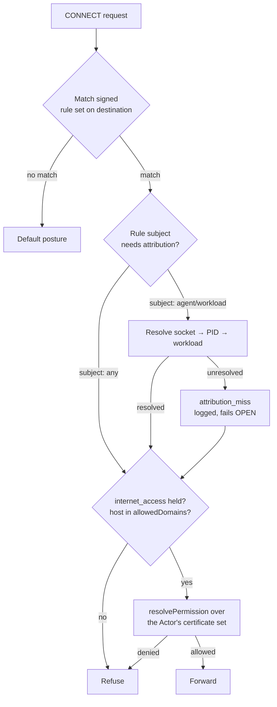

# Blast radius

Assume the agent is compromised. What can it reach?

VaultysClaw bounds this along three axes, in increasing order of how much they
depend on the agent cooperating.

## 1. Tenancy — workspaces

A **Workspace** is the tenancy boundary: it scopes Actors, certificates, and model
access. An Actor assigned to a workspace, holding certificates scoped to that
workspace, does not reach another workspace's resources.

Workspaces carry no workflow, channel, or chat concept — those were removed. What
remains is deliberately narrow: which Actors belong here, who holds
workspace-scoped grants, and which models are catalogued as usable.

Membership is not a table either. "Who has access to this workspace" is answered
by querying which humans hold a certificate whose `CertScope.resource` is
`workspace:<id>` — the same ledger, again, rather than a parallel membership list
that could disagree with it.

## 2. Vocabulary — per-kind capability allow-lists

An Actor cannot be granted a capability its kind is not eligible for. A sensor may
hold `process_read` and nothing else; no admin mistake, and no crafted form post,
can grant it `system_command`.

This filter runs server-side at approval time. See
[Capabilities](/docs/concepts/capabilities#per-kind-allow-lists).

## 3. Network — the interception point

The first two axes are enforced by the control plane, and they bound what an Actor
is *authorised* to do. Neither stops a compromised binary from opening a socket.

That is what the **`proxy` Actor kind** is for.

### What it is

An interception point is an Actor deployed into an agent estate it did not
originate — for agents that will never embed VaultysClaw's runtime: n8n,
LangChain, off-the-shelf MCP servers, third-party tools. It reports activity up
and pushes refusals down.

Its trust story is completely ordinary: it registers as an Actor, an admin
approves it, it receives a certificate. Zero new tables, one new kind-agnostic
message type for configuration push.

It is the **same Go binary** as the sensor. Observe-only, it registers as
`sensor`. With interception active, it registers as `proxy` — and gets a
danger-coloured badge in the console, because that badge means traffic is being
refused somewhere.

### How a decision is made

**Attribution is the only node that fails open**, and it is logged as
`attribution_miss` when it does. Everything from the capability check downward
fails closed. That asymmetry is deliberate: failing closed on attribution would
mean an unidentifiable process silently breaks, with no signal about why.

Rules are matched on the **destination first**, and attribution is resolved
lazily — only when a matched rule's subject actually requires it.

### What it enforces

No new vocabulary. The same capabilities and limits the rest of the platform
uses:

| Mechanism | Effect at the interception point |
|---|---|
| `internet_access` | Absent → egress refused |
| `ResourceLimits.allowedDomains` | Host allow-list. **This is its first real consumer** — the field was declared and rendered for a long time while no enforcement code read it. |
| `CertScope.resourcePattern` / `maxUses` / expiry | Narrow the grant per destination |
| `trust.failMode` | Whether an unrefreshed decision refuses or proceeds |

### Decisions are made offline, by design

The interception point does not call the control plane per request. It reads
periodically-refreshed artefacts from disk — a grant, a signed rule set, a trust
anchor — verifies them offline, and decides locally. Artefacts are re-read on a
timer.

This has two consequences worth understanding before deploying one:

- **`maxStatusAgeSeconds` governs how stale a decision may be**, and `0` means
  "no cached status is acceptable" — which for an offline decider means denying
  every governed request. Unbounded must be written as a negative. See
  [Trust verification](/docs/concepts/trust-verification#trust-policy-fail-mode-and-staple-ttl).
- **Every startup failure is fatal.** A misconfigured interception point refuses
  to start rather than starting permissively. In `explicit` mode it will *refuse*
  a subject-scoped rule set outright rather than silently failing open on rules it
  cannot attribute.

### Two limits to be explicit about

:::caution A proxy governs a zone, not an agent
An interception point governs everything pointed at it. **Two agents behind one
proxy are indistinguishable to its decision** unless attribution resolves them.
Deploy accordingly: one interception point per trust zone, not one per estate.
:::

:::caution Tier 1 only, today
The interception point sees only the CONNECT line's host and port — no
decryption, no CA in the host trust store. That is a feature for compatibility
(it works against certificate-pinned clients) and a limit for granularity (it
cannot inspect a request body).

Tier 2 — request-aware adapters for HTTP, MCP, and LLM traffic — requires
installing a CA into the host's trust store. That is deliberately gated behind
being a loud, explicit operator decision, because it is precisely an
adversary-in-the-middle signature and should never happen quietly.
:::

## 4. Tool calls — the harness supervisor

The newest surface, and the only one that governs an agent's actions on the *host*
rather than its reach off it. `vaultysclaw-sensor` in its **supervise** role
launches a coding harness and decides every tool call locally, from a signed grant
and a signed rule set, with no control-plane round trip.

Where the interception point asks *"may this reach that host"*, this asks *"may
this read that path, run that command"* — the same certificates and the same
`resolvePermission`, over resource URIs instead of network destinations.

### Two settings decide whether it contains anything

| `mode` | |
|---|---|
| `observe` | Decides and records every call, refuses **nothing**. The default, and the right one at first: the resource strings this produces end up inside signed certificates, so they are learned from real traffic before being frozen. `vaultysclaw-sensor report` is how you read them back. |
| `explicit` | Refuses anything no certificate covers. |

| `sandbox` | |
|---|---|
| `off` / `auto` / `require` | Whether tier-B OS confinement is established. `require` **refuses to launch** where it cannot be, rather than continuing in advisory mode. |

:::caution Without OS confinement, `explicit` is advisory
The decision runs in a hook. A subprocess, or an edited harness configuration,
goes around it. That makes `explicit` a real control against a cooperating harness
and no control at all against a determined one — the same asymmetry that justifies
the interception point, one layer in.

`sandbox: require` is what converts it into kernel-enforced containment, and
`vaultysclaw-sensor sandbox-check` proves it is actually in force rather than
assumed.
:::

:::caution macOS only, today
The confinement backend is a generated seatbelt profile applied with
`sandbox-exec`. Linux (user namespaces, Landlock, seccomp) and Windows
(restricted token / AppContainer) are designed and **not built** — and an unbuilt
platform reports an error the launcher surfaces, never a silent pass that leaves
an operator believing they are confined.

`sandbox-exec` is itself deprecated by Apple, while remaining the only way to
apply a profile to an arbitrary child process from userland.
:::

## What is not provided

**Container or hypervisor isolation per agent.** VaultysClaw bounds authority and
network reach, and — for a supervised harness on macOS, with `sandbox: require` —
confines that one process at the kernel. It does not otherwise sandbox agents. If
your threat model requires that any compromised agent cannot read the host
filesystem at all, that is a deployment control — run it in a container — and
VaultysClaw does not substitute for it.

See the [matrix, domain 3](/docs/zero-trust/matrix#3-resource-boundaries--blast-radius).
