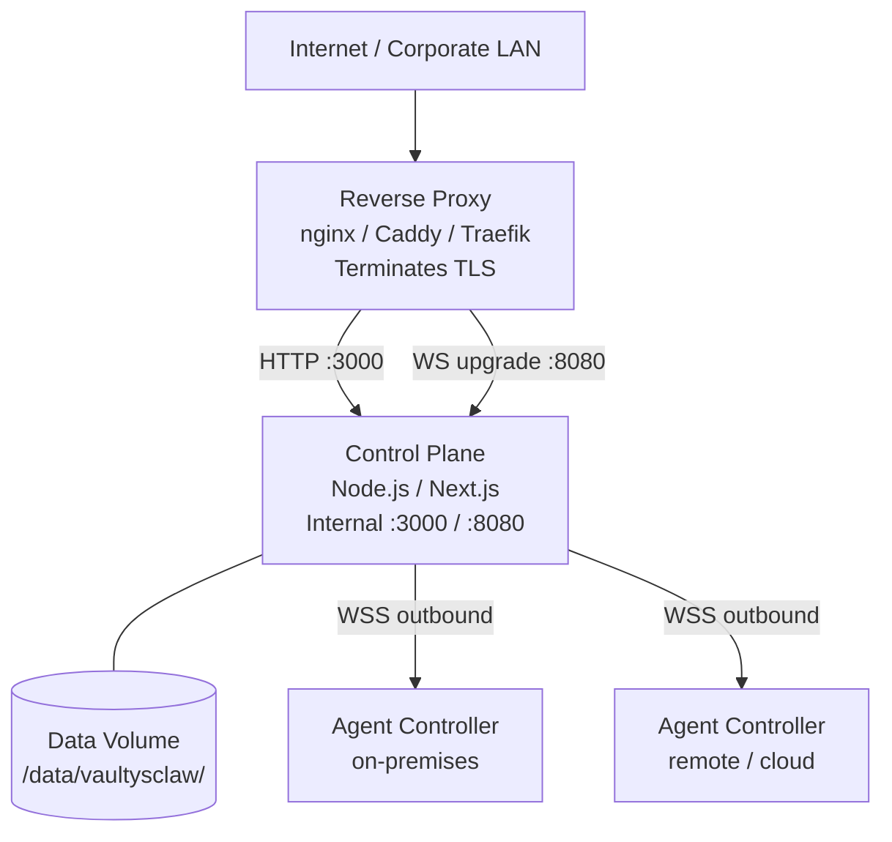
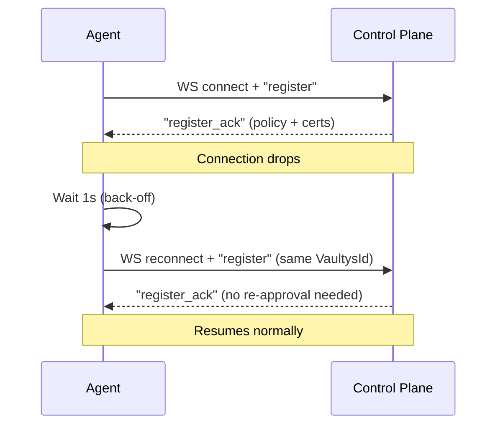

# Production Deployment

This guide covers hardening and deploying Vaultys Claw for production use.

## Architecture overview



Agents connect outbound — no inbound rules needed on agent machines.

## Step-by-step

### 1. Build the control plane

```bash
pnpm build -F @vaultysclaw/control-plane
```

### 2. Configure production environment

```env
# /etc/vaultysclaw/control-plane.env
NODE_ENV=production
PORT=3000
WS_PORT=8080
HOSTNAME=127.0.0.1

NEXTAUTH_URL=https://vaultysclaw.acme.com
NEXTAUTH_SECRET=<openssl rand -base64 64>

DATABASE_URL=sqlite:/data/vaultysclaw/db.sqlite
VAULTYS_ID_PATH=/data/vaultysclaw/.vaultys/control-plane.id

LOG_LEVEL=info
```

### 3. Set up nginx reverse proxy

```nginx
# /etc/nginx/sites-available/vaultysclaw
server {
    listen 443 ssl http2;
    server_name vaultysclaw.acme.com;

    ssl_certificate     /etc/ssl/acme/vaultysclaw.crt;
    ssl_certificate_key /etc/ssl/acme/vaultysclaw.key;
    ssl_protocols       TLSv1.2 TLSv1.3;

    # HTTP traffic → control plane
    location / {
        proxy_pass         http://127.0.0.1:3000;
        proxy_set_header   Host              $host;
        proxy_set_header   X-Real-IP         $remote_addr;
        proxy_set_header   X-Forwarded-For   $proxy_add_x_forwarded_for;
        proxy_set_header   X-Forwarded-Proto $scheme;
    }

    # WebSocket upgrade → WS hub
    location /ws {
        proxy_pass         http://127.0.0.1:8080;
        proxy_http_version 1.1;
        proxy_set_header   Upgrade    $http_upgrade;
        proxy_set_header   Connection "upgrade";
        proxy_set_header   Host       $host;
        proxy_read_timeout 3600s;
    }
}

server {
    listen 80;
    server_name vaultysclaw.acme.com;
    return 301 https://$host$request_uri;
}
```

:::tip Using Caddy?
Caddy handles TLS automatically. A minimal `Caddyfile`:

```
vaultysclaw.acme.com {
    reverse_proxy /ws localhost:8080 {
        header_up Upgrade {>Upgrade}
        header_up Connection {>Connection}
    }
    reverse_proxy localhost:3000
}
```

:::

### 4. Run the control plane as a service

```ini
# /etc/systemd/system/vaultysclaw-control-plane.service
[Unit]
Description=Vaultys Claw Control Plane
After=network.target

[Service]
Type=simple
User=vaultys
WorkingDirectory=/opt/vaultysclaw
ExecStart=/usr/bin/node packages/control-plane/.next/standalone/server.js
Restart=always
RestartSec=5
EnvironmentFile=/etc/vaultysclaw/control-plane.env

[Install]
WantedBy=multi-user.target
```

```bash
sudo systemctl enable --now vaultysclaw-control-plane
```

### 5. Configure agents for production

```env
CONTROL_PLANE_WS_HOST=vaultysclaw.acme.com
CONTROL_PLANE_WS_PORT=443
NODE_TLS_REJECT_UNAUTHORIZED=1
NODE_ENV=production
```

## Docker Compose (full stack)

A reference Docker Compose file is provided:

```bash
cd docker
cp .env.docker.example .env
# Edit .env
docker compose up -d
```

The Compose file starts:

- `control-plane` — the Next.js app + WebSocket hub
- `caddy` — reverse proxy with automatic HTTPS (Let's Encrypt)

Agents are deployed separately (they typically run close to your data sources).

## Agent reconnect flow



## Database backups

SQLite is a single file. Back it up with:

```bash
# Safe online backup (no service interruption)
sqlite3 /data/vaultysclaw/db.sqlite ".backup /backups/db-$(date +%Y%m%d-%H%M%S).sqlite"
```

Schedule this as a cron job or use a tool like `litestream` for continuous replication to S3.

## VaultysId backup

The control plane identity file (`control-plane.id`) is the root of trust. If it is lost, all existing delegation certificates become unverifiable.

```bash
# Encrypt and back up the identity file
gpg --symmetric /data/vaultysclaw/.vaultys/control-plane.id
# Store the encrypted file in your secrets manager
```

## Monitoring

### Structured logging

In production, Pino outputs newline-delimited JSON:

```json
{"level":30,"time":1716...,"msg":"Agent connected","did":"did:vaultys:..."}
```

Pipe to your SIEM:

```bash
# Datadog
node server.js | dd-log-agent

# Elastic
node server.js | filebeat
```

### Health endpoints

| Endpoint                      | Returns                  |
| ----------------------------- | ------------------------ |
| `GET /api/health`             | Control plane health     |
| `GET /api/agents?online=true` | List of connected agents |

## Upgrade procedure

1. Pull the latest release: `git pull && git checkout <tag>`
2. Install dependencies: `pnpm install --frozen-lockfile`
3. Build: `pnpm build -F @vaultysclaw/control-plane`
4. Restart the service: `sudo systemctl restart vaultysclaw-control-plane`
5. Verify agents reconnect automatically (they will, within their reconnect back-off window)

Database migrations run automatically on startup. Always review the changelog before upgrading.
