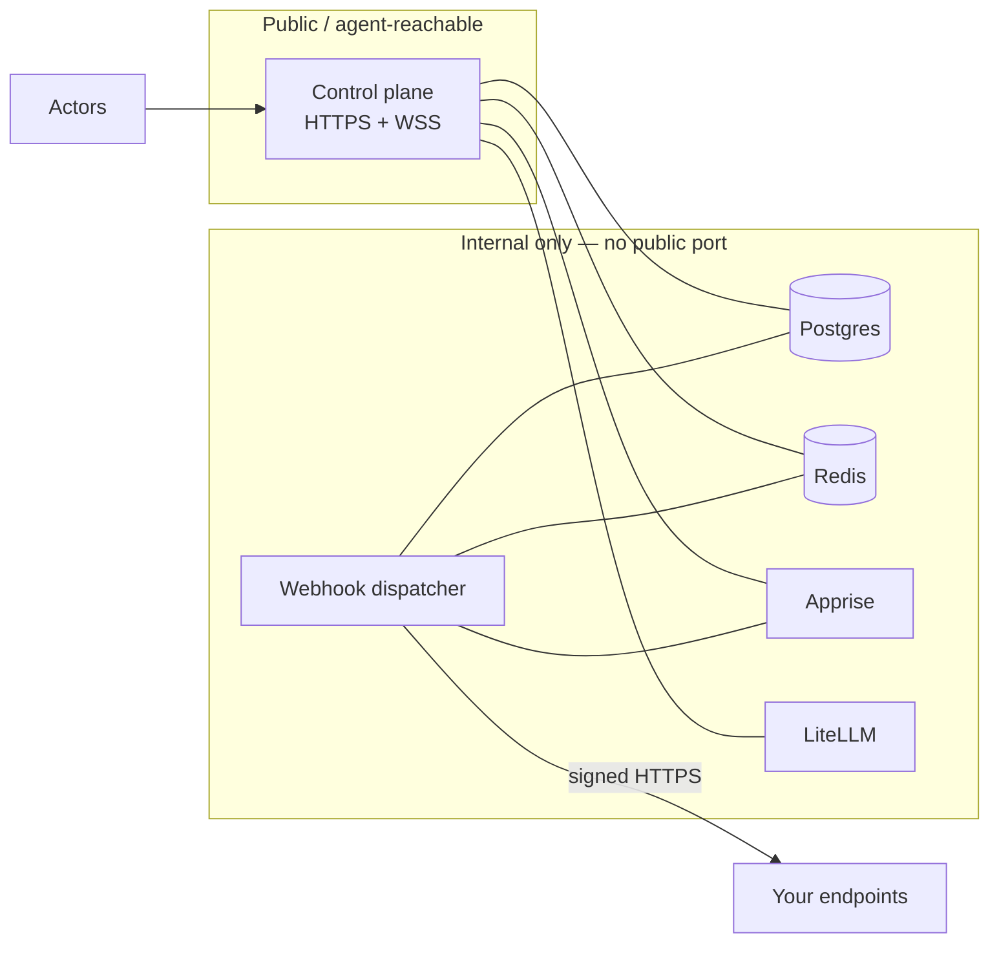

# Deployment

## Processes

| Process | Required | Notes |
|---|---|---|
| **Control plane** | Yes | Next.js + WebSocket in one custom-server process |
| **Postgres** | Yes | The ledger, the audit log, everything |
| **Webhook dispatcher** | For event delivery | Separate process. Without it, events enqueue and sit. |
| **Redis** | For webhooks & channels | Unset disables both, silently and safely |
| **Apprise** | For notification channels | Unset disables channels only |
| **LiteLLM proxy** | Optional | Model registry degrades to catalogue data without it |

## Environment variables

| Variable | Required | Purpose |
|---|---|---|
| `DATABASE_URL` | ✅ | Postgres connection string |
| `NEXTAUTH_SECRET` | ✅ | Session secret. Generate a real one. |
| `NEXTAUTH_URL` | ✅ | Browser-facing base URL |
| `APP_URL` | — | Overrides `NEXTAUTH_URL` when building deep links in webhook payloads and alerts |
| `CONTROLPLANE_PORT` | — | HTTP port, default 3001 |
| `CONTROLPLANE_WS_PORT` | — | WebSocket port, default 8081 |
| `REDIS_URL` | — | BullMQ queue. Unset ⇒ webhooks and channels no-op. |
| `APPRISE_API_URL` | — | Apprise base URL. Unset ⇒ notification channels off. |
| `NEXT_PUBLIC_WALLET_URL` | — | Wallet app URL used to build the QR deep link |
| `LITELLM_BASE_URL` / `LITELLM_MASTER_KEY` | — | Deployment-time **fallback** only — settings edited in the console win |

### Dispatcher

| Variable | Purpose |
|---|---|
| `DATABASE_URL` | Point at **this** control plane's database |
| `REDIS_URL` | Same Redis as the producer |
| `BULLMQ_PREFIX` | Must be `vaultysclaw-controlplane` for this schema |
| `APPRISE_API_URL` | Unset ⇒ notification fan-out is skipped; webhooks unaffected |
| `WEBHOOK_TIMEOUT_MS` | Per-endpoint delivery timeout, default 10000 |

:::danger Get the prefix right on a shared Redis
The rebuilt control plane and the older one use the **same queue name** with
different prefixes, and their databases are entirely separate. A dispatcher with
the wrong prefix will consume the other application's jobs against the wrong
schema.

This is a deployment-time configuration difference, not a code change.
:::

## Network posture

```mermaid
flowchart LR
  subgraph pub["Public / agent-reachable"]
    CP["Control plane<br/>HTTPS + WSS"]
  end
  subgraph int["Internal only — no public port"]
    PG[("Postgres")]
    RD[("Redis")]
    AP["Apprise"]
    DISP["Webhook dispatcher"]
    LL["LiteLLM"]
  end
  AGENTS["Actors"] --> CP
  CP --- PG
  CP --- RD
  CP --- AP
  CP --- LL
  DISP --- RD
  DISP --- PG
  DISP --- AP
  DISP -->|signed HTTPS| SIEM["Your endpoints"]
```

**Apprise must never be exposed externally.** It has no authentication of its own
by design — that is what keeps it a genuinely swappable container. It is reachable
only from the control plane's admin API and the dispatcher.

Agents need only the HTTPS and WebSocket ports.

## Backups and recovery

Back up two things.

### 1. Postgres

The ledger, the audit log, Actors, settings, and every encrypted secret.

### 2. The server identity

The control plane's own VaultysId is the root issuer for the entire ledger **and**
the key that encrypts every vault secret.

:::danger Losing the server identity is unrecoverable
Without it you cannot decrypt LiteLLM master keys, SSO client secrets, or Apprise
service URLs, and you cannot issue certificates that verify against existing ones.
Restoring the database alone does not restore the deployment.
:::

There is also **no admin recovery path**. Authority is keyed to DIDs; there is no
password to reset and no support account with standing authority. Issue a second
`admin_console_access` certificate to a separate identity as your first
administrative act.

## Production checklist

- [ ] A real `NEXTAUTH_SECRET`, not the example value
- [ ] TLS terminated in front of both HTTP and WebSocket
- [ ] Postgres, Redis, and Apprise on an internal network with no public ports
- [ ] A dispatcher running, with the correct `BULLMQ_PREFIX`, and the health panel
      showing all three checks green
- [ ] The bootstrap certificate reviewed — reissued with an expiry, or consciously
      kept
- [ ] A second admin identity issued
- [ ] The server identity backed up
- [ ] Trust policy reviewed under **Settings** — `closed` is the default and the
      stricter choice

## Known state

- **No production deployment artefacts for the dispatcher against this schema
  exist in the repository yet** — no compose entry, no dedicated Dockerfile
  variant. The dev script proves the wiring; packaging it is a deployment-time
  decision.
- **Per-workspace trust policy overrides are not in the schema.** Org-wide is the
  only level.
- **The Server Action authorisation retrofit is incomplete.** Until it lands,
  treat `portal_access` as "can reach the application", not "cannot reach admin
  mutations". See the [roadmap](/docs/zero-trust/roadmap).
