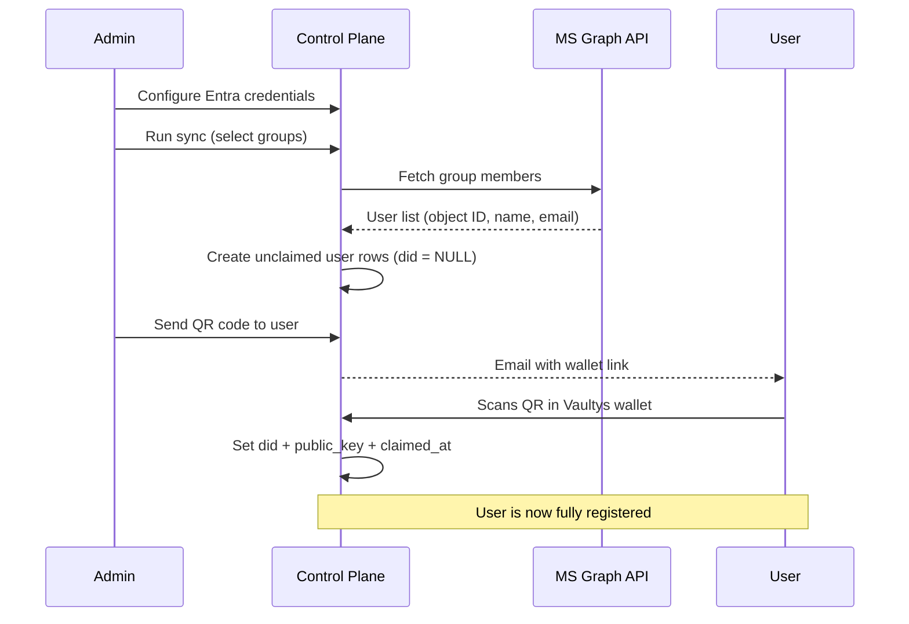

# Entra ID User Sync

VaultysClaw can import users directly from **Microsoft Entra ID** (formerly Azure AD). Provisioned users appear in the control plane immediately — they receive a QR code link by email (or from an admin) and activate their full VaultysID account when they scan it with the Vaultys wallet.

## How it works

Key points:

- Users imported from Entra have **no VaultysID until they claim their account**. They appear in the control plane but cannot log in.
- The `users.id` (internal UUID) is stable from provisioning; `users.did` is set only after the wallet scan.
- Capability grants require a claimed account — an unclaimed user cannot receive grants.
- Realm memberships are assigned at sync time and are preserved when the user claims their account.
- Re-running the sync is **idempotent**: existing users are updated in place rather than duplicated.

## Prerequisites

### 1. Register an application in Azure

1. Open the [Azure Portal](https://portal.azure.com) → **Azure Active Directory** → **App registrations** → **New registration**.
2. Give it a name (e.g. `VaultysClaw Sync`) and leave the redirect URI blank.
3. Click **Register** and note the **Application (client) ID** and **Directory (tenant) ID**.

### 2. Create a client secret

In your app registration, go to **Certificates & secrets** → **New client secret**. Copy the value immediately — it is only shown once.

### 3. Grant API permissions

Go to **API permissions** → **Add a permission** → **Microsoft Graph** → **Application permissions**. Add:

| Permission       | Why                                   |
| ---------------- | ------------------------------------- |
| `User.Read.All`  | Read user profiles (name, email, UPN) |
| `Group.Read.All` | List groups and their members         |

:::warning Application permissions, not Delegated
You must add these as **Application** permissions (the second tab), not Delegated permissions. Delegated permissions require a signed-in user, which is incompatible with the server-to-server sync flow.
:::

After adding both permissions, click **Grant admin consent for [your tenant]**. The status column must show a green ✓ — without this, all Graph calls will return 403.

## Configuration

In the control plane, go to **Server settings** → **Integrations** → **Microsoft Entra ID** and fill in the three fields:

| Field             | Where to find it                                                       |
| ----------------- | ---------------------------------------------------------------------- |
| **Tenant ID**     | Azure Portal → App registration → Overview → _Directory (tenant) ID_   |
| **Client ID**     | Azure Portal → App registration → Overview → _Application (client) ID_ |
| **Client Secret** | The value you copied when creating the secret                          |

Click **Save**, then **Check connection**. The diagnostic panel runs three checks:

| Check                          | What it verifies                                         |
| ------------------------------ | -------------------------------------------------------- |
| Obtain access token            | Credentials are correct and the app exists in the tenant |
| Read users (`User.Read.All`)   | Application permission granted and admin-consented       |
| Read groups (`Group.Read.All`) | Application permission granted and admin-consented       |

Each failing check shows an actionable hint — for example, distinguishing between a bad client secret and a missing admin consent.

## Running a sync

Click **Sync users** to open the sync wizard.

### Step 1 — Select groups

Choose one or more Entra groups to import. Only members of the selected groups will be provisioned. Leave all groups unchecked to import every user in the tenant.

Members who appear in multiple selected groups are deduplicated automatically.

### Step 2 — Map groups to realms

For each selected group, choose how to handle realm membership:

| Option                     | Effect                                                                                                                 |
| -------------------------- | ---------------------------------------------------------------------------------------------------------------------- |
| _(no mapping)_             | Users are imported without realm assignment                                                                            |
| Existing realm             | Users are added to that realm                                                                                          |
| **Create from group name** | A new realm is created using the group's display name as the slug; re-syncing is idempotent — the same realm is reused |

### Step 3 — Confirm and sync

Review the summary (groups, user count, realms to create) and click **Start sync**. The result shows:

- **Created** — new users provisioned
- **Updated** — existing users linked to their Entra identity
- **Skipped** — users already up to date
- **Errors** — per-user failures (e.g. Graph permission error for a nested group)

## Account claim flow

After a sync, unclaimed users appear under **Users** → **Unclaimed** tab. For each user, admins can:

- **Show QR** — displays a QR code the user scans with the Vaultys wallet
- **Send by email** — emails the claim link directly (requires [SMTP configured](#smtp-configuration))

The QR encodes a time-limited P2P session. Once the user scans it:

1. The wallet runs the VaultysID challenger protocol with the control plane.
2. On success, `did`, `public_key`, and `claimed_at` are written to the user record.
3. The user moves from the Unclaimed tab to the Registered tab and can now log in normally.

:::tip Clicking an unclaimed user
Click any row in the Unclaimed tab to open the user's detail page (`/users/unregistered/:id`). From there you can edit their name, email, role, and description, view their realm memberships, and trigger the claim flow.
:::

## SMTP configuration

Go to **Server settings** → **Integrations** → **Email (SMTP)** and fill in your mail server details:

| Field        | Example                        |
| ------------ | ------------------------------ |
| Host         | `smtp.example.com`             |
| Port         | `587`                          |
| Username     | `noreply@example.com`          |
| Password     | _(your SMTP password)_         |
| From address | `noreply@example.com`          |
| TLS          | Enable for port 587 (STARTTLS) |

Click **Test connection** to send a test message and verify the settings before enabling email delivery.

Once SMTP is configured, the **Send by email** button appears next to any unclaimed user who has an email address on record.

## Re-syncing

You can run the sync wizard as often as needed:

- New Entra members are provisioned.
- Members already in the DB are refreshed in `entra_identities` (name/email kept current) but not duplicated.
- Users who have already claimed their account are left untouched.
- Users removed from Entra are **not** automatically deleted — remove them manually from the Users page if needed.

## Troubleshooting

| Symptom                                            | Likely cause                                                 | Fix                                                                     |
| -------------------------------------------------- | ------------------------------------------------------------ | ----------------------------------------------------------------------- |
| _Check connection_ fails at "Obtain access token"  | Wrong tenant ID, client ID, or expired secret                | Re-check the values in Azure; generate a new secret if needed           |
| Token obtained but user/group check fails with 403 | Permissions not granted or no admin consent                  | Re-add the permission as Application type and click Grant admin consent |
| Sync creates 0 users                               | Group has no direct members (nested groups are not expanded) | Add users directly to the group, or sync the nested group separately    |
| User's "Send by email" button is greyed out        | SMTP not configured, or user has no email                    | Configure SMTP in Integrations, or check the user's email field         |
| User scans QR but nothing happens                  | QR session expired (4-minute timeout)                        | Click Show QR again to generate a fresh session                         |
