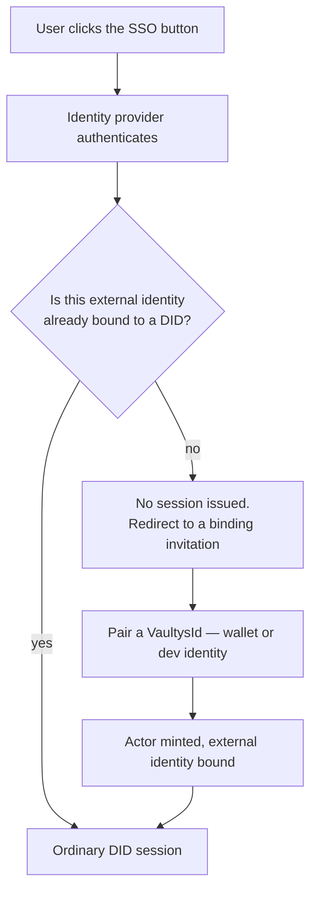

# Onboarding humans

Three routes in. All three converge on the same place: a `kind: "human"` Actor
with a VaultysId DID, holding exactly the certificates someone granted it.

## Self-registration

Anyone can reach the login page and pair a VaultysId. An unknown DID becomes a
human Actor named "Unnamed", holding **no capabilities**, able to reach nothing.

That is a safe default rather than an oversight: identity without authority is the
entire premise. An admin then grants whatever is appropriate.

A first-login prompt lets a self-registered human set their own name and email, or
explicitly skip it so it does not nag on every sign-in. Skipping records that the
prompt was answered, not that the profile was completed.

## Invitations

An admin invites a specific person from **Actors → Invite human**.

| Field | Notes |
|---|---|
| Name, email | Seed the Actor and profile on redemption |
| Workspace | Optional assignment |
| Capabilities | `portal_access` is pre-checked |
| Expiry | 1, 7, or 30 days — 7 by default |

The link is shown **once** and never again. Only a hash of the token is persisted,
so the raw link cannot be recovered from the database.

Redemption walks the invitee through the same VaultysId pairing UI, scoped to that
one invitation. The invited human is created only when the handshake genuinely
completes, and profile completion is marked immediately — the invitation already
carried a real name and email.

### Two bugs fixed by construction

Worth stating, because both are easy to reintroduce:

1. **The invite is not burned at QR-generation time.** It is marked redeemed only
   after the handshake completes. Opening the page and walking away does not
   consume it.
2. **"Already claimed" is re-checked at the moment of registration**, not only at
   page load. A pre-flight check and the registration path both independently
   reject an expired or redeemed token, so reopening a used link cannot mint a
   second unrelated account.

## SSO — OIDC and Microsoft Entra ID

### Configuring a connection

**Integrations → Identity**. One form, with a kind switch: OIDC asks for an issuer
URL, Entra asks for a tenant ID and derives the issuer from it, so an admin cannot
paste a subtly wrong Microsoft URL.

The form **refuses to save** against an issuer whose discovery document does not
resolve or lacks authorization, token, or JWKS endpoints. Unlike a webhook URL, an
identity provider is live infrastructure, and a bad one produces a login button
that fails only for whoever clicks it first.

The detail page shows the **redirect URI with a copy button** — a mismatch there is
the most common reason a new connection fails on first use.

Multiple connections coexist. Providers are built per request from the database,
so a change takes effect on the next login, not the next deploy.

### What happens at login

**An unbound SSO login never produces a session.** There is deliberately no
"signed in but not yet anybody in the trust model" state — that would be exactly
the parallel trust tier this design exists to avoid.

The binding invitation is system-issued, valid one hour, carries the provider's
own name and email, and is redeemed through the ordinary invite flow. The invite
page changes its wording when arriving this way, since "you've been invited" is
the wrong thing to say to someone who just authenticated with their own corporate
account and is mid-flow.

A freshly bound human holds `portal_access` **only**. This is not configurable per
connection, on purpose: which provider you came from is not a good reason to hold
more capability.

:::caution Anyone your IdP will authenticate can obtain an Actor
With no capabilities — but an Actor nonetheless. That is the same trust boundary
as the provider itself, which is the point of federating. Point a connection at a
directory whose membership you control, not a public multi-tenant issuer.
:::

### Not built

Entra **directory sync** — pre-provisioning users and groups through Microsoft
Graph. Login works without it.

## Granting access

Whichever route they came in by, a human holds only what someone granted:

| Capability | Reaches |
|---|---|
| `portal_access` | The Access Portal — their own certificates and connect grants |
| `admin_console_access` | The admin console |
| Workspace-scoped grants | Recorded as a certificate whose scope names the workspace |

Grant these like any other certificate. See
[Issuing certificates](/docs/guides/issuing-certificates).

## Offboarding

Revoke their certificates. The Actor row remains — it is the audit anchor for
everything they did, and deleting it would orphan the trail. What changes is that
every check now returns `revoked`.
