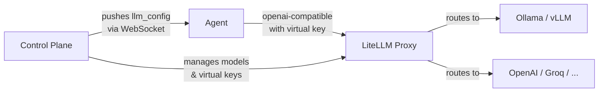

# LLM Routing with LiteLLM

VaultysClaw integrates with [LiteLLM Proxy](https://docs.litellm.ai/docs/proxy/quick_start) to provide **centralized LLM management**: register models once, assign them to realms, and let the control plane push the right configuration — including scoped virtual keys — to each agent automatically.

## Why use it

| Without LiteLLM                                | With LiteLLM                                               |
| ---------------------------------------------- | ---------------------------------------------------------- |
| Each agent carries its own API key in env vars | Keys are stored in the control plane only                  |
| Changing providers requires redeploying agents | Swap models from the dashboard; agents pick it up live     |
| No per-realm model access control              | Each realm gets a virtual key scoped to its allowed models |
| No unified cost tracking                       | All usage flows through one proxy with budget limits       |

## How it works



1. An admin registers a model in the **Model Registry** (once per model/provider).
2. The control plane calls `/model/new` on the LiteLLM proxy to register it.
3. When a model is **granted to a realm**, the control plane calls `/key/generate` to create a realm-scoped virtual key that can only access that realm's models.
4. When an agent joins a realm (or an admin sets "Realm Routing" mode), the control plane pushes an `llm_config` WebSocket message containing the proxy URL and the realm's virtual key.
5. The agent connects to LiteLLM as an OpenAI-compatible endpoint — it never sees the underlying API key.

## Prerequisites

- A running LiteLLM proxy reachable from the control plane.
- `LITELLM_BASE_URL` and `LITELLM_MASTER_KEY` set in the control plane environment.

```env
LITELLM_BASE_URL=http://litellm:4000
LITELLM_MASTER_KEY=sk-my-master-key
```

If these variables are not set, the model registry and realm routing features remain available but LiteLLM sync calls are skipped (non-fatal).

### Quick LiteLLM setup

```bash
pip install litellm
litellm --port 4000 --master_key sk-my-master-key
```

Or with Docker:

```yaml
services:
  litellm:
    image: ghcr.io/berriai/litellm:main-latest
    ports:
      - "4000:4000"
    command: >
      --master_key sk-my-master-key
      --port 4000
```

## Registering a model

### Via the dashboard

1. Navigate to **Models** in the sidebar.
2. Click **Register model**.
3. Fill in: name, provider, model ID, and base URL (for self-hosted models).
4. Save — the model appears in LiteLLM immediately.

### Via the API

```bash
curl -X POST https://vaultysclaw.acme.com/api/models \
  -H "Cookie: next-auth.session-token=..." \
  -H "Content-Type: application/json" \
  -d '{
    "name": "Llama 3 (local)",
    "provider": "openai-compatible",
    "modelId": "llama3-8b",
    "baseUrl": "http://ollama:11434/v1"
  }'
```

See [Models API](/docs/api/models) for the full reference.

## Granting a model to a realm

```bash
curl -X POST https://vaultysclaw.acme.com/api/models/{modelId}/realms \
  -H "Cookie: ..." \
  -H "Content-Type: application/json" \
  -d '{ "realmId": "realm-uuid" }'
```

This:

1. Creates (or refreshes) a LiteLLM virtual key for the realm, scoped to the newly allowed model list.
2. Pushes updated `llm_config` to every agent currently in that realm.

## Setting an agent to realm routing mode

### Via the dashboard

1. Open the agent detail page → **Config** tab.
2. Select **Realm Routing** mode.
3. Choose the realm and model from the dropdowns.
4. Click **Save** — the config is stored and pushed live if the agent is online.

The config view shows a violet **Realm Routing** banner when this mode is active, confirming the agent uses the LiteLLM proxy.

### Via the API

```bash
# Shortcut: resolve virtual key server-side — the API key never touches the client
curl -X PUT https://vaultysclaw.acme.com/api/agents/{did}/llm-config \
  -H "Cookie: ..." \
  -H "Content-Type: application/json" \
  -d '{
    "realmId": "realm-uuid",
    "realmModelId": "model-registry-id"
  }'
```

The control plane looks up the realm's virtual key and the model's LiteLLM name, assembles an `openai-compatible` config, stores it, and pushes it to the agent — the raw API key is never exposed.

## Automatic config push on realm join

When an agent is added to a realm that already has a virtual key and active models, the control plane immediately pushes an `llm_config` message to the agent (if connected), so no manual configuration step is needed.

## Per-realm budget limits

When granting model access, you can set a monthly budget cap:

```bash
curl -X POST .../api/models/{modelId}/realms \
  -d '{ "realmId": "...", "monthlyBudgetUsd": 50.0 }'
```

This passes `max_budget` to LiteLLM when generating the virtual key.

## Checking connectivity

```bash
curl https://vaultysclaw.acme.com/api/agents/{did}/realm-llm \
  -H "Cookie: ..."
```

Response:

```json
{
  "litellmConfigured": true,
  "litellmBaseUrl": "http://litellm:4000",
  "realms": [
    {
      "realmId": "...",
      "realmName": "Engineering",
      "isPrimary": true,
      "hasVirtualKey": true,
      "models": [
        {
          "id": "...",
          "name": "Llama 3 (local)",
          "provider": "openai-compatible",
          "modelId": "llama3-8b",
          "litellmModelName": "openai-compatible/llama-3-local"
        }
      ]
    }
  ]
}
```

`hasVirtualKey: false` means the realm has models registered but the virtual key hasn't been created yet (grant a model to trigger key generation).
