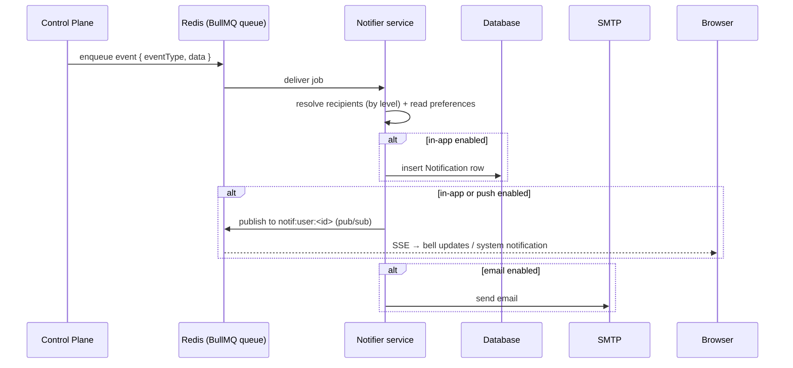

# Notifications

VaultysClaw can notify you about events that happen across the platform. Every
user decides **what** they want to be notified about and **how** — through three
channels:

- **In-app** — a bell in the top bar with a dropdown of your notifications (stored
  in the database, so they persist across sessions).
- **Email** — sent via the SMTP server configured in the control plane. Emails are
  richly formatted: a summary, a details table (workspace, agent, workflow, error,
  …) and, when relevant, an action button that deep-links straight to the relevant
  page in the app.
- **Push** — a system/browser notification, delivered in real time over SSE while
  you have the app open.

If no channel is enabled for an event, you simply aren't notified about it.

## Notification levels

Every event has a **level** that controls who is allowed to receive and configure
it. You only ever see the events your role has access to:

| Level | Who can receive it | Example |
|-------|--------------------|---------|
| `user`  | The specific user concerned | You were added to / removed from a workspace |
| `admin` | Admins and Owners | A new user joined VaultysClaw (onboarding) |
| `owner` | Owners only | *(reserved for future events)* |

The visibility is cumulative: a **Member** sees only `user` events, an **Admin**
sees `user` + `admin`, and an **Owner** sees everything.

## Configuring your notifications

Go to **Settings → Notifications**. Events are grouped by level, and each event
has a checkbox per channel (in-app / email / push). Tick the channels you want;
untick all of them to stop being notified about that event.

To receive **push** notifications, click **Enable push** once to grant the
browser permission. Push notifications only appear while a VaultysClaw tab is
open — for anything you might miss, keep in-app enabled (it persists in the bell).

You can delete in-app notifications individually (the **✕** on each item) or clear
them all from the bell dropdown.

## How it works

Notifications are processed out of band so that the action that triggers an event
(e.g. adding someone to a workspace) returns immediately. A dedicated **notifier**
service does the fan-out and delivery.

- The **control plane** only enqueues events; it never blocks on delivery.
- The **notifier** resolves recipients from the event level, looks up each
  recipient's preferences (falling back to sensible defaults), and delivers on the
  enabled channels.
- The browser keeps a single **SSE** connection to
  `/api/notifications/stream`, which is how the bell updates live and push
  notifications are raised.

## Requirements

- **Redis** must be running — it backs both the BullMQ job queue and the
  per-user pub/sub used for live delivery. It is included in the Docker stack
  (`docker/docker-compose.yml`).
- **Email** delivery requires SMTP to be configured under
  **Admin → Settings → Integrations** (the notifier reads the same configuration).

## Available events

### User level

| Event | Who receives it | Description |
|-------|-----------------|-------------|
| `workspace.member_added`    | you            | You were added to a workspace |
| `workspace.member_removed`  | you            | You were removed from a workspace |
| `workspace.agent_added`     | workspace members | An agent was added to a workspace you belong to |
| `workspace.agent_removed`   | workspace members | An agent was removed from a workspace you belong to |
| `workspace.workflow_added`  | workspace members | A workflow was added to a workspace you belong to |
| `workspace.workflow_removed`| workspace members | A workflow was removed from a workspace you belong to |
| `inbox.message`             | you            | A new item was assigned to your inbox |
| `profile.updated`           | you            | Your profile was updated |
| `grant.received`            | you            | You were granted a capability delegation |
| `grant.revoked`             | you            | A capability delegation of yours was revoked |
| `tool.approval_required`    | workspace members | An agent is waiting for approval to run a tool |

### Admin level

| Event | Who receives it | Description |
|-------|-----------------|-------------|
| `user.joined`         | admins/owners | A user completed onboarding and joined |
| `agent.pending`       | admins/owners | An agent requested registration and needs approval |
| `policy.updated`      | admins/owners | A governance policy was created, updated or revoked |
| `workspace.created`   | admins/owners | A workspace was created |
| `workspace.deleted`   | admins/owners | A workspace was deleted |
| `agent.created`       | admins/owners | An agent was created |
| `agent.deleted`       | admins/owners | An agent was deleted |
| `model.added`         | admins/owners | A model was added to the registry |
| `model.removed`       | admins/owners | A model was removed |
| `knowledge.added`     | admins/owners | A knowledge source was added |
| `knowledge.removed`   | admins/owners | A knowledge source was removed |
| `skill.added`         | admins/owners | A skill was added |
| `skill.removed`       | admins/owners | A skill was removed |
| `workflow.failed`     | admins/owners | A workflow run failed |
| `workflow.succeeded`  | admins/owners | A workflow run completed successfully |

Each event carries a **level** (who may configure it) and an **audience** (who
receives it) — for most events these align, but workspace-scoped events are
configured by any user yet delivered only to members of the affected workspace.

New events are added to the shared catalog (`packages/shared/src/notifications.ts`);
see the notifier package documentation for the developer workflow.
