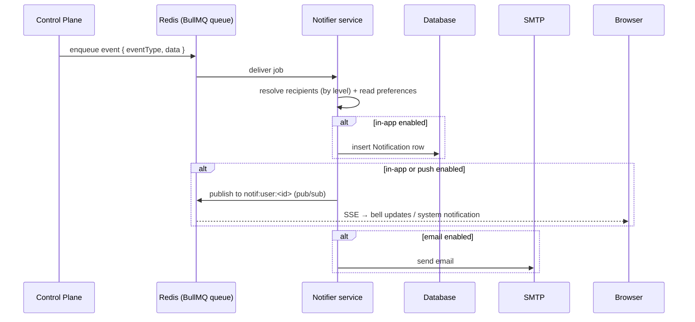

# Notifications

VaultysClaw can notify you about events that happen across the platform. Every
user decides **what** they want to be notified about and **how** — through three
channels:

- **In-app** — a bell in the top bar with a dropdown of your notifications (stored
  in the database, so they persist across sessions).
- **Email** — sent via the SMTP server configured in the control plane.
- **Push** — a system/browser notification, delivered in real time over SSE while
  you have the app open.

If no channel is enabled for an event, you simply aren't notified about it.

## Notification levels

Every event has a **level** that controls who is allowed to receive and configure
it. You only ever see the events your role has access to:

| Level | Who can receive it | Example |
|-------|--------------------|---------|
| `user`  | The specific user concerned | You were added to / removed from a workspace |
| `admin` | Admins and Owners | A new user joined VaultysClaw (onboarding) |
| `owner` | Owners only | *(reserved for future events)* |

The visibility is cumulative: a **Member** sees only `user` events, an **Admin**
sees `user` + `admin`, and an **Owner** sees everything.

## Configuring your notifications

Go to **Settings → Notifications**. Events are grouped by level, and each event
has a checkbox per channel (in-app / email / push). Tick the channels you want;
untick all of them to stop being notified about that event.

To receive **push** notifications, click **Enable push** once to grant the
browser permission. Push notifications only appear while a VaultysClaw tab is
open — for anything you might miss, keep in-app enabled (it persists in the bell).

You can delete in-app notifications individually (the **✕** on each item) or clear
them all from the bell dropdown.

## How it works

Notifications are processed out of band so that the action that triggers an event
(e.g. adding someone to a workspace) returns immediately. A dedicated **notifier**
service does the fan-out and delivery.

- The **control plane** only enqueues events; it never blocks on delivery.
- The **notifier** resolves recipients from the event level, looks up each
  recipient's preferences (falling back to sensible defaults), and delivers on the
  enabled channels.
- The browser keeps a single **SSE** connection to
  `/api/notifications/stream`, which is how the bell updates live and push
  notifications are raised.

## Requirements

- **Redis** must be running — it backs both the BullMQ job queue and the
  per-user pub/sub used for live delivery. It is included in the Docker stack
  (`docker/docker-compose.yml`).
- **Email** delivery requires SMTP to be configured under
  **Admin → Settings → Integrations** (the notifier reads the same configuration).

## Available events

The current catalog is intentionally small and easy to extend:

| Event | Level | Description |
|-------|-------|-------------|
| `workspace.member_added`   | user  | You were added to a workspace |
| `workspace.member_removed` | user  | You were removed from a workspace |
| `user.joined`              | admin | A user completed onboarding and joined |

New events are added to the shared catalog (`packages/shared/src/notifications.ts`);
see the notifier package documentation for the developer workflow.
