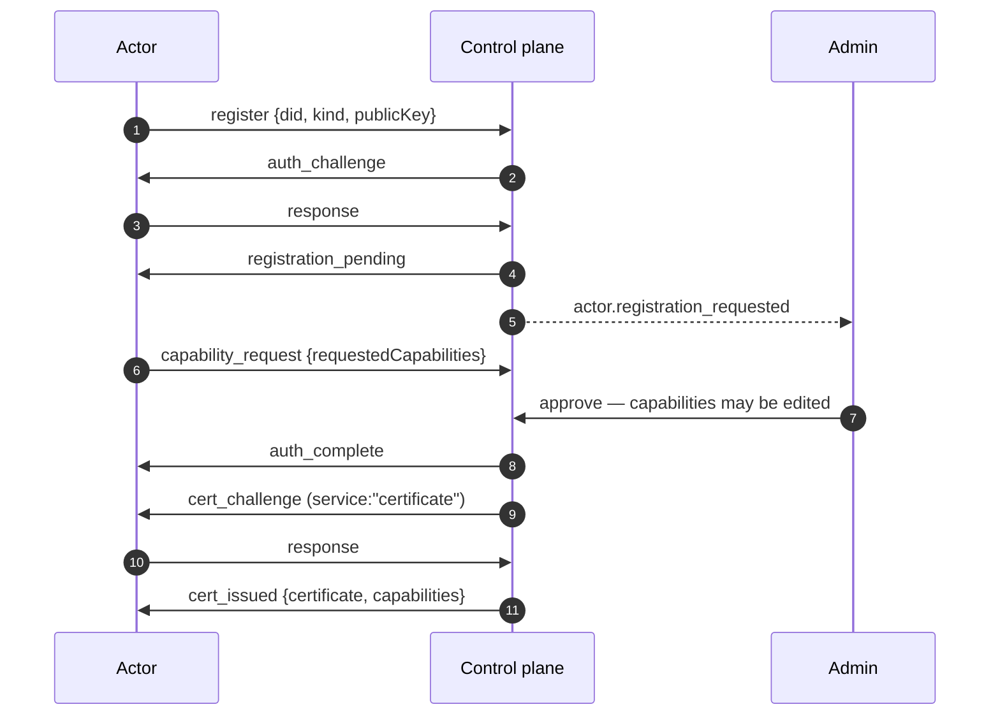

# Onboarding actors

Every non-human Actor joins the same way, regardless of kind, language, or
transport.

## The flow

## 1. The Actor registers

It presents its DID, its kind, and its public key. The control plane runs the
identity handshake immediately — **before** any decision about whether it is
welcome. An unknown DID that fails the handshake never becomes a pending
registration at all.

The public key observed here is persisted, which is what makes later offline
re-verification of anything that Actor signs possible.

A reconnecting unapproved Actor **reuses** its pending record rather than
creating duplicates.

## 2. It requests capabilities

Either as part of registration or, for an already-known Actor, at any time
afterwards. The message carries no signature of its own — the connection already
proved identity.

## 3. An admin decides

**Actors** shows pending registrations with the DID, kind, and requested
capabilities.

Three outcomes:

| Action | Result |
|---|---|
| **Approve as requested** | The Actor is created and the requested set is granted |
| **Approve with modifications** | Same action, edited input. Grant fewer, or different, capabilities. |
| **Deny** | No Actor is created |

:::tip Approving less than was requested is the normal case
The approval form defaults its checkboxes to what was requested, and you should
freely change them. The certificate records what was actually granted, the audit
entry carries `grantedCapabilities` — the filtered set actually persisted, not the
raw submission — and a well-built Actor functions correctly holding less than it
asked for.
:::

The per-kind allow-list is applied **server-side** on top of your choice. A
capability outside the Actor's kind list is dropped even if it arrives by direct
form post. A sensor cannot be granted `system_command` by any route.

## 4. The certificate is issued

Approval marks the registration approved with **delivery pending**. It does not
mint a certificate.

If the Actor is connected, the control plane sends `auth_complete` and then
proactively starts a live certificate exchange over the same connection.
Completing it persists the certificate and stamps delivery.

If the Actor is offline, delivery simply waits. The next time that DID
authenticates successfully, the exchange runs immediately.

:::note `deliveredAt: null` after approval means "waiting for the Actor", not "not granted"
This distinction matters when debugging. An approved registration with no
certificate yet is a normal state for an offline Actor, not a stuck one.
:::

### The zero-capability case

An Actor approved with **no** capabilities — a telemetry-only sensor, typically —
skips the certificate exchange entirely and is marked delivered. There is nothing
to certify.

`auth_complete` is still sent first, before that decision. Without it, a client
whose grant came back empty would never be told it was connected at all.

## Granting more later

A connected Actor sends another `capability_request`. This updates its record and
surfaces to an admin exactly like an initial request — same queue, same form, same
approval. The resulting certificate is an additional row; an Actor holds a set.

To *narrow* instead, revoke the existing certificate and issue a replacement. Both
are ledger writes and both are audited.

## Troubleshooting

| Symptom | Likely cause |
|---|---|
| Actor never appears in the pending list | The handshake did not complete. Check the WebSocket URL and that the identity file is readable. |
| Approved, but no certificate | The Actor is not connected. Delivery is deferred to its next authentication — restart it. |
| Actor connects but does nothing | It was granted fewer capabilities than it needs, and is gating correctly. Check its log and the granted set. |
| Duplicate pending entries | Should not happen — pending records are reused across reconnects. Check whether the Actor is regenerating its identity file each start. |

## Events emitted

`actor.registration_requested` (no human origin — attribution is explicitly null),
`actor.approved` (carrying `grantedCapabilities`), `actor.denied`,
`certificate.issued`. All land in the [audit log](/docs/concepts/audit-log) and go
out over [webhooks](/docs/guides/webhooks) and
[notification channels](/docs/guides/notification-channels).
