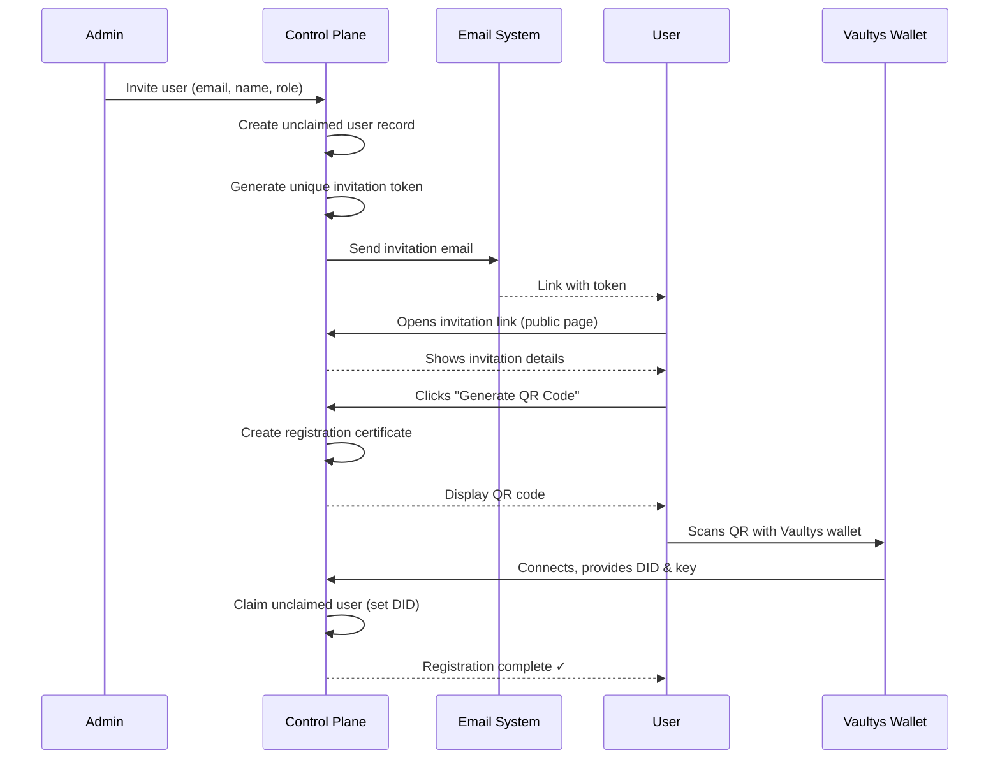

# User Invitations

VaultysClaw allows admins to invite users directly via email. Invitations create **unclaimed user records** with the user's name, email, and role preserved. When the user accepts the invitation and scans the QR code with their Vaultys wallet, their account is automatically claimed with their VaultysID (DID).

This provides a streamlined onboarding experience compared to QR-only invitations, as user details are captured upfront and persist through registration.

## How it works



## Key features

- **Name & email preserved**: Captured during invitation, saved with unclaimed user, persisted after registration
- **Single-use tokens**: Invitation links expire after 7 days and auto-delete after successful registration
- **Token regeneration**: Re-inviting the same email generates a new token and expires the old one
- **Unclaimed user list**: Invited users appear in the **Users > Unregistered** section until they claim their account
- **Multiple invitation methods**:
  - **Email invite**: Recommended — user gets a link, opens it on any device, then scans QR
  - **Direct QR**: Generate QR immediately for users to scan on the spot

## Inviting users

### Via Setup Wizard (First-time setup)

1. Go to **Setup Wizard** → **Users** step
2. Select the **Email Invite** tab
3. Enter user email, full name, and role (Member, Operator, Manager, Admin)
4. Click **Send Invitation**
5. User receives email with personalized registration link

### Via Users Management Page

1. Go to **Users** page
2. Click **Invite User** button (top right)
3. Choose invitation method:
   - **Send Email Invite**: Enter email, name, role → email sent
   - **Show QR Code**: Generate QR immediately → user scans

## User registration flow

### Step 1: User receives invitation email

The email contains:

- Personalized greeting with their name
- Role they will have (Member, Operator, etc.)
- Clickable "Accept Invitation" button
- Direct link as fallback
- Note that invitation expires in 7 days

Example email subject: `Invitation to VaultysClaw`

### Step 2: User opens invitation link

- Link is public and requires no authentication: `https://your-instance/invite/{token}`
- Page displays:
  - Platform name and description
  - Their name, email, and role
  - "Generate QR Code" button

### Step 3: User generates QR code

- Clicking "Generate QR Code" creates a secure P2P channel
- QR code displays on screen
- User is prompted to scan with Vaultys wallet app

### Step 4: User scans with wallet

- Opens Vaultys wallet app
- Scans the QR code
- Wallet connects to VaultysClaw
- Provides user's DID (decentralized ID) and public key

### Step 5: Registration completes

- Control plane **claims** the unclaimed user record
- Associates DID with user's email and name
- User can now log in with their wallet
- Invitation token is automatically deleted
- Page shows success message with "Go to Login" button

## Managing unclaimed users

Invited users who haven't completed registration appear in the **Users > Unregistered** tab.

### View unclaimed user details

1. Go to **Users** → **Unregistered** tab
2. Click on a user to see:
   - Name, email, role
   - Workspaces (if assigned)
   - Registration date
   - Options to edit or delete

### Edit unclaimed user

- Update name, email, or role
- Reassign to different workspaces
- Add a supervisor

### Delete unclaimed user

- Remove from system (cannot be undone)
- User can be re-invited with a new email link

### Re-invite unclaimed user

- From the user's detail page, click "Invite" (or invite from Users page)
- System generates new invitation token
- Old token is expired automatically
- User receives new email link

## Invitation tokens

### Token format

- **Unique**: UUID-based, cryptographically random
- **Single-use**: Deleted after successful registration
- **Expiration**: 7 days from creation
- **Storage**: `user_invitations` table in SQLite database

### Token lifecycle

| Stage                       | Duration | Status                             |
| --------------------------- | -------- | ---------------------------------- |
| Created                     | T+0      | Active, pending user action        |
| User claims unclaimed user  | T+x      | Marked as claimed (claimed_at set) |
| User completes registration | T+y      | Deleted from database              |
| After 7 days (unclaimed)    | T+7d     | Expired, returns 404 on access     |

### Re-invitation

If a user's email is invited again before they register:

1. System finds existing active invitation for that email
2. Deletes the old token
3. Creates new unclaimed user record (or updates existing one)
4. Generates fresh token
5. Sends new invitation email

## API Reference

### Send email invitation

**POST** `/api/users/invite/email`

Owner-only endpoint.

**Request:**

```json
{
  "email": "alice@company.com",
  "name": "Alice Johnson",
  "role": "manager"
}
```

**Response:**

```json
{
  "token": "uuid-string",
  "userId": "uuid-string"
}
```

**Possible errors:**

- `403`: Not owner
- `400`: Missing email or name
- `500`: SMTP not configured or email send failed

---

### Get invitation details

**GET** `/api/invitations/{token}`

Public endpoint (no authentication required).

**Response:**

```json
{
  "email": "alice@company.com",
  "name": "Alice Johnson",
  "role": "manager"
}
```

**Possible errors:**

- `404`: Token not found or expired

---

### Generate QR from email invitation

**POST** `/api/users/invite/from-email`

Public endpoint (no authentication required).

**Request:**

```json
{
  "token": "uuid-string"
}
```

**Response:**

```json
{
  "qrUrl": "https://wallet.vaultys.net/#...",
  "connectionString": "...",
  "inviteToken": "cert-connection-token",
  "serverDid": "did:vaultys:..."
}
```

**Possible errors:**

- `404`: Token not found or expired
- `500`: Failed to generate QR

---

### Delete invitation

**POST** `/api/invitations/{token}/delete`

Public endpoint (no authentication required).

**Response:**

```json
{
  "success": true
}
```

Typically called automatically after successful registration.

---

## Unclaimed users API

### Get unclaimed users

**GET** `/api/users?hasAccount=false`

Admin-only endpoint.

**Query parameters:**

- `page`: Page number (default 1)
- `pageSize`: Items per page (default 20, max 100)
- `sortBy`: `name`, `email`, or `registeredAt`
- `sortDir`: `asc` or `desc`

**Response:**

```json
{
  "users": [
    {
      "id": "uuid",
      "did": null,
      "name": "Alice Johnson",
      "email": "alice@company.com",
      "role": "manager",
      "registeredAt": "2026-05-21T10:30:00Z",
      "workspaces": []
    }
  ],
  "total": 5,
  "page": 1,
  "pageSize": 20,
  "totalPages": 1
}
```

---

## Best practices

### 1. Capture user details upfront

Always use **email invitation** rather than direct QR codes. This ensures:

- Names are captured and persisted
- Users can register from any device
- Admin has record of who was invited

### 2. Set appropriate roles

Assign roles based on responsibilities:

- **Member**: Read-only access, no approvals
- **Operator**: Can execute workflows, approve tasks
- **Manager**: Can manage agents, assign capabilities
- **Admin**: Full control plane access

### 3. Assign workspaces during invitation

If using workspaces, assign users to appropriate workspaces during or after invitation. Users can:

- Be assigned at sync time
- Be edited after unclaimed creation
- Be unaware of workspaces until they claim account

### 4. Monitor unclaimed users

Regularly check **Users > Unregistered** to:

- Identify pending registrations
- Delete users who won't be joining
- Re-invite users if links expire

### 5. Cleanup expired invitations

The system automatically deletes invitation tokens 7 days after creation. For tokens that are claimed and deleted earlier:

- No cleanup needed — happens automatically on success
- You can manually delete unclaimed users if they leave

## Combining with Entra ID

You can use both email invitations and Entra ID sync:

| Method | Use case                              | Users appear         | How they register          |
| ------ | ------------------------------------- | -------------------- | -------------------------- |
| Email  | Individual additions, one-off invites | Users > Unregistered | Scan QR link from email    |
| Entra  | Bulk employee provisioning            | Users > Unregistered | Email with QR or direct QR |

Both create unclaimed user records in the same place. The `entra_id` field distinguishes Entra users; email-invited users have `entra_id = NULL`.

## Troubleshooting

### "Email not configured" or SMTP errors

**Issue**: `POST /api/users/invite/email` returns 500 with SMTP error.

**Solution**: Configure SMTP in **Server Settings** → **Email Configuration**. The setup wizard has a dedicated **Email** step for this.

---

### Invitation link shows "Invitation expired"

**Issue**: User gets 404 when opening email link.

**Solution**:

- Check if 7+ days have passed since invitation
- Check if user already registered (token auto-deleted)
- Re-invite the user from **Users** page

---

### QR code doesn't load on invitation page

**Issue**: Clicking "Generate QR Code" shows error or spinner stuck.

**Solution**:

- Ensure browser allows public pages (check middleware)
- Verify `/api/users/invite/from-email` is accessible and not blocked
- Check browser console for network errors
- Ensure wallet URL is configured in settings

---

### User can't claim account after scanning QR

**Issue**: QR scans but user doesn't appear as registered.

**Solution**:

- Wallet must be Vaultys wallet app (not other VaultysID clients)
- Check wallet has internet connectivity
- Verify P2P connection succeeded in wallet
- Check control plane server logs for registration errors

---

## See also

- [Entra ID User Sync](./entra-sync.md) — Provision users from Azure AD
- [User Management](../api/users.md) — User API endpoints
- [Configuration](./configuration.md) — SMTP and email settings
