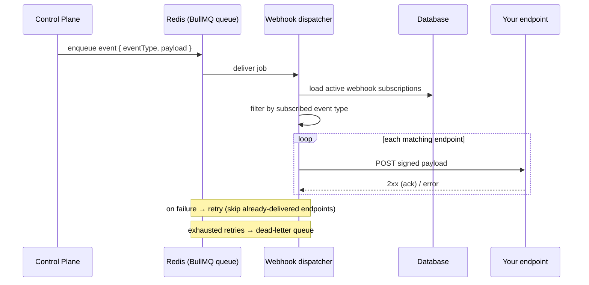

# Webhooks

Webhooks let VaultysClaw notify **your own services** over HTTP when something
happens on the platform — a workspace is created, an agent is approved, a
workflow fails, a user signs in. Where [notifications](./notifications.md) reach
*people* (in-app / email / push), webhooks reach *machines*: each subscribed
endpoint receives a signed `POST` request it can verify and act on.

Webhooks are **org-global** and configured by admins — they are not per-user and
have no notion of level or audience. A subscription simply lists the event types
it cares about and the URL to deliver them to.

## Configuring a webhook

Go to **Admin → Settings → Integrations → Webhooks** (Admin or Owner only). Each
webhook has:

- **Name / description** — for your own reference.
- **URL** — the HTTPS endpoint that will receive the `POST` requests.
- **Events** — the list of event types this endpoint subscribes to.
- **Active** — a toggle to pause deliveries without deleting the configuration.

When you create a webhook (or regenerate its secret) a **signing secret**
(`whsec_…`) is shown **once, in clear**. Copy it immediately — it is never
displayed again. You need it to verify incoming deliveries (see below).

The **Docs** button on the Webhooks tab opens an in-app reference with the exact
example payload for every event, generated from the real payload builders so the
examples never drift from what is actually sent.

## The delivery request

Each delivery is an HTTP `POST` with a JSON body and a set of signature headers.

**Headers:**

| Header | Meaning |
|--------|---------|
| `Content-Type` | Always `application/json` |
| `User-Agent` | `VaultysClaw-Webhooks/1.0` |
| `X-VaultysClaw-Event` | The event type, e.g. `workspace.created` |
| `X-VaultysClaw-Delivery` | A unique id for this delivery attempt |
| `X-VaultysClaw-Timestamp` | Millisecond epoch used in the signature |
| `X-VaultysClaw-Signature` | `sha256=<hmac>` — see [Verifying the signature](#verifying-the-signature) |

**Body:**

```json
{
  "event": "workspace.created",
  "occurredAt": "2026-07-16T10:00:00.000Z",
  "data": {
    "id": "ws-1",
    "name": "Marketing"
  }
}
```

- `event` — the event type (matches the `X-VaultysClaw-Event` header).
- `occurredAt` — ISO 8601 timestamp of when the domain event happened.
- `data` — an explicitly-built, **sanitized** payload for the event. It only ever
  contains safe fields — never a secret, password, token or key. The exact shape
  per event is in the in-app **Docs** reference.

## Verifying the signature

The signature scheme mirrors Stripe/GitHub: an HMAC-SHA256 over
`` `${timestamp}.${rawBody}` `` using your webhook's signing secret, hex-encoded
and prefixed with `sha256=`.

To verify a delivery, recompute the HMAC from the **raw request body** (before any
JSON parsing) and the `X-VaultysClaw-Timestamp` header, then compare it to the
`X-VaultysClaw-Signature` header using a constant-time comparison:

```javascript
import crypto from "node:crypto";

function verify(secret, req, rawBody) {
  const timestamp = req.headers["x-vaultysclaw-timestamp"];
  const received = req.headers["x-vaultysclaw-signature"];
  const expected =
    "sha256=" +
    crypto.createHmac("sha256", secret).update(`${timestamp}.${rawBody}`).digest("hex");

  // Constant-time comparison to avoid timing attacks.
  return (
    received.length === expected.length &&
    crypto.timingSafeEqual(Buffer.from(received), Buffer.from(expected))
  );
}
```

:::tip Use the raw body
Sign and verify against the exact bytes received, not a re-serialized object —
re-encoding JSON can reorder keys or change whitespace and break the signature.
Reject the request if the signature does not match.
:::

You can also reject deliveries whose `X-VaultysClaw-Timestamp` is too old to
guard against replay of captured requests.

## Retries and delivery guarantees

Delivery is **at-least-once per endpoint**. If your endpoint is slow or returns a
non-2xx status, the delivery is retried automatically:

- Each event is attempted up to **5 times** with exponential backoff.
- When an event fans out to several endpoints and only some fail, a retry only
  re-sends to the endpoints that **actually failed** — endpoints that already
  received the event successfully are **not** delivered to again.
- If an endpoint keeps failing after all attempts, the event is moved to a
  **dead-letter queue** for inspection and manual replay rather than being
  silently dropped.

Design your receiver to be **idempotent**: use `X-VaultysClaw-Delivery` (or a
natural id inside `data`) to detect and ignore a delivery you have already
processed. Respond with a `2xx` status as soon as you have durably accepted the
event; do heavy processing asynchronously so you don't trip the delivery timeout
(`WEBHOOK_TIMEOUT_MS`, 10 s by default).

## How it works

Like notifications, webhooks are processed out of band so the action that
triggers an event returns immediately. A dedicated **webhook-dispatcher** service
does the fan-out, signing and delivery.



- The **control plane** only enqueues events; it never blocks on delivery, and if
  Redis is not configured it simply no-ops (the triggering request is unaffected).
- The **webhook-dispatcher** loads every active subscription, keeps the ones
  subscribed to the event, and POSTs a signed request to each.

## Requirements

- **Redis** must be running — it backs the BullMQ webhook queue. It is included in
  the Docker stack (`docker/docker-compose.yml`).
- The **webhook-dispatcher** service must be running to deliver events
  (`pnpm webhook:dev`, or the `webhook-dispatcher` service in Docker).

## Available events

| Event | Group | Description |
|-------|-------|-------------|
| `user.login`   | Authentication | A user successfully signed in |
| `user.logout`  | Authentication | A user signed out |
| `user.created` | Users | A new user account was created |
| `user.updated` | Users | A user account was modified |
| `user.deleted` | Users | A user account was deleted |
| `user.joined`  | Users | A user completed onboarding and joined the organization |
| `agent.approval_requested` | Agents | An agent registered and is awaiting admin approval |
| `agent.created` | Agents | An agent was approved and created |
| `agent.updated` | Agents | An agent's configuration was modified |
| `agent.deleted` | Agents | An agent was deleted |
| `workspace.created` | Workspaces | A workspace was created |
| `workspace.updated` | Workspaces | A workspace was modified |
| `workspace.deleted` | Workspaces | A workspace was deleted |
| `model.created` | Models | A model was added to the registry |
| `model.updated` | Models | A model in the registry was modified |
| `model.deleted` | Models | A model was removed from the registry |
| `knowledge.created` | Knowledge | A knowledge source was added |
| `knowledge.deleted` | Knowledge | A knowledge source was removed |
| `skill.created` | Skills | A skill was added to the org library |
| `skill.updated` | Skills | A skill in the org library was modified |
| `skill.deleted` | Skills | A skill was removed from the org library |
| `workflow.succeeded` | Workflows | A workflow run completed successfully |
| `workflow.failed` | Workflows | A workflow run failed |

New events are added to the shared catalog
(`packages/shared/src/webhooks.ts`); see the webhook-dispatcher package
documentation for the developer workflow.
