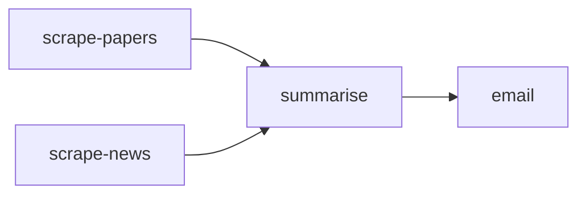

# Workflows

Workflows let you define reusable, multi-step sequences of agent actions. They can be triggered on demand, via API, or on a schedule, and are parameterisable with variables.

## Workflow structure

```typescript
interface WorkflowDefinition {
  steps: WorkflowStep[];
  triggers?: WorkflowTrigger[];
  variables?: Record<string, any>;
}

interface WorkflowStep {
  id: string;
  name: string;
  agentDid?: string;          // Target agent (or broadcast)
  action: string;
  params: Record<string, any>;
  dependsOn?: string[];       // Step IDs that must complete first
  condition?: string;         // Expression evaluated before executing
  onError?: "stop" | "continue" | "retry";
  retries?: number;
}
```

## Creating a workflow

### Via the dashboard

1. Navigate to **Workflows** in the sidebar
2. Click **New Workflow**
3. Select a realm and give the workflow a name
4. Add steps using the visual editor

### Via API

```bash
curl -X POST https://vaultysclaw.acme.com/api/workflows \
  -H "Content-Type: application/json" \
  -d '{
    "name": "Daily Research Digest",
    "description": "Scrapes research papers and emails a summary",
    "realmId": "realm_research",
    "definition": {
      "variables": {
        "topic": "large language models",
        "recipients": ["team@acme.com"]
      },
      "steps": [
        {
          "id": "scrape",
          "name": "Scrape recent papers",
          "agentDid": "did:vaultys:z6MkResearcher...",
          "action": "search_arxiv",
          "params": {
            "query": "{{variables.topic}}",
            "maxResults": 10
          }
        },
        {
          "id": "summarise",
          "name": "Summarise findings",
          "agentDid": "did:vaultys:z6MkResearcher...",
          "action": "summarise_documents",
          "params": {
            "documents": "{{steps.scrape.output}}",
            "format": "executive_summary"
          },
          "dependsOn": ["scrape"]
        },
        {
          "id": "email",
          "name": "Send digest email",
          "agentDid": "did:vaultys:z6MkMailer...",
          "action": "send_email",
          "params": {
            "to": "{{variables.recipients}}",
            "subject": "Research Digest: {{variables.topic}}",
            "body": "{{steps.summarise.output}}"
          },
          "dependsOn": ["summarise"]
        }
      ]
    }
  }'
```

## Running a workflow

### On demand

```bash
curl -X POST https://vaultysclaw.acme.com/api/workflows/{id}/run \
  -H "Content-Type: application/json" \
  -d '{
    "params": {
      "topic": "retrieval-augmented generation"
    }
  }'
```

Response (202 Accepted):
```json
{
  "runId": "run_01HZ...",
  "status": "running"
}
```

### Check run status

```bash
curl https://vaultysclaw.acme.com/api/workflows/{id}/runs/{runId}
```

```json
{
  "runId": "run_01HZ...",
  "status": "completed",
  "startedAt": "2026-05-15T09:00:00Z",
  "completedAt": "2026-05-15T09:02:34Z",
  "steps": {
    "scrape":    { "status": "completed", "durationMs": 8420 },
    "summarise": { "status": "completed", "durationMs": 12300 },
    "email":     { "status": "completed", "durationMs": 340 }
  }
}
```

## Step dependencies

Use `dependsOn` to create a DAG (directed acyclic graph) of steps. Steps without `dependsOn` run in parallel:



```json
{
  "steps": [
    { "id": "scrape-papers", "action": "...", "agentDid": "..." },
    { "id": "scrape-news",   "action": "...", "agentDid": "..." },
    { "id": "summarise",     "dependsOn": ["scrape-papers", "scrape-news"], "agentDid": "..." },
    { "id": "email",         "dependsOn": ["summarise"], "agentDid": "..." }
  ]
}
```

## Variable interpolation

Reference variables and previous step outputs using `{{...}}` syntax:

| Expression | Resolves to |
|---|---|
| `{{variables.topic}}` | The workflow-level variable `topic` |
| `{{params.format}}` | A run-time parameter passed at invocation |
| `{{steps.scrape.output}}` | The full output of the `scrape` step |
| `{{steps.scrape.output.papers[0].title}}` | A nested field in the step output |

## Error handling

Each step can specify `onError`:

| Value | Behaviour |
|---|---|
| `stop` (default) | Abort the entire workflow run |
| `continue` | Mark the step as failed but continue to the next step |
| `retry` | Retry the step up to `retries` times (default: 3) with exponential back-off |

## Scheduled workflows

Combine with the scheduling feature to run workflows on a cron schedule:

```bash
curl -X POST https://vaultysclaw.acme.com/api/schedules \
  -d '{
    "workflowId": "wf_01HZ...",
    "cron": "0 8 * * 1-5",
    "params": { "topic": "LLM research" },
    "timezone": "Europe/Paris"
  }'
```

This runs the workflow at 08:00 every weekday (Paris time).

## Workflow templates

Vaultys Claw ships with a library of workflow templates for common patterns:

- **Document summarisation pipeline** — ingest → chunk → summarise → deliver
- **Multi-agent research** — parallel scraping → synthesis → report
- **Approval-gated deployment** — analyse → human approval → execute
- **Scheduled digest** — gather → format → distribute on a schedule

Browse templates in the dashboard under **Workflows → Templates**.
