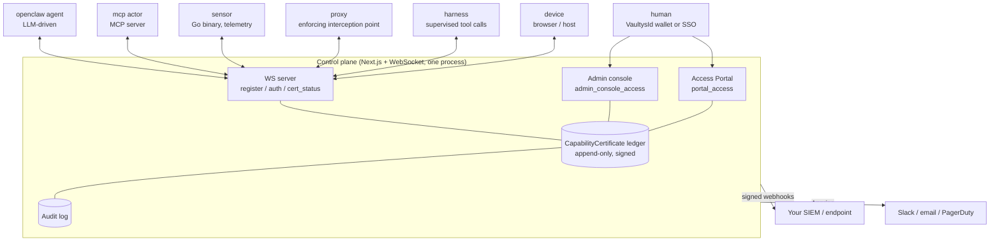

# VaultysClaw

**VaultysClaw is a trust plane for AI agents.** It gives every agent, device, sensor,
and human in your organisation a cryptographic identity, records every permission
any of them holds as a signed, revocable certificate in one append-only ledger, and
provides a protocol that lets anyone — the control plane, another agent, a third
party — check whether a given permission is still valid *right now*.

It is deliberately **not** an agent framework, a workflow engine, or a chat product.
Those exist and are good. What is missing at most organisations is the answer to four
questions, and that is all VaultysClaw is built to answer:

| Question | VaultysClaw's answer |
|---|---|
| **Who is this agent?** | A VaultysId DID, proven per connection by an SRP-style challenge/response handshake. Not an API key. |
| **What is it allowed to do?** | A `CapabilityCertificate` — signed by the control plane *and* by the agent itself, independently verifiable offline by anyone. |
| **Is that still true?** | The `cert_status` protocol: a signed, timestamped status response any party can request, cache, or forward. Revocation is a ledger write, not a hopeful push. |
| **What actually happened?** | One append-only audit log, every entry attributed to a DID, keyed to the exact certificate that authorised the action. |

## The Zero Trust framing

VaultysClaw is designed against **Anthropic's "Zero Trust for AI Agents"**
guidance, and we publish our self-assessment against it rather than claiming
compliance in the abstract.

That assessment is a living document, not marketing copy: it names what is built,
what is partial, and what is not there at all — including the domains where we
currently score zero.

- **[Zero Trust overview](/docs/zero-trust/overview)** — the framework, and how VaultysClaw maps onto it
- **[The compliance matrix](/docs/zero-trust/matrix)** — all twelve domains, tier by tier, with current status
- **[Gaps and roadmap](/docs/zero-trust/roadmap)** — what is missing and in what order it is being closed

## What is in the box

Everything on that diagram is an **[Actor](/docs/concepts/actors)** — one entity,
one registration flow, one ledger, one audit trail. Humans are Actors too. A
sensor is not a special table; a proxy is not a special protocol. The only thing
that differs per kind is the configuration it carries and the admin panel that
edits it.

## Where to start

**Evaluating VaultysClaw?** Read the [Zero Trust matrix](/docs/zero-trust/matrix)
first — it is the most honest single page on this site — then
[Concepts → Certificates](/docs/concepts/certificates).

**Deploying it?** [Quickstart](/docs/guides/quickstart), then
[Bootstrapping the first admin](/docs/guides/bootstrap) and
[Onboarding actors](/docs/guides/onboarding-actors).

**Building an agent against it?** [Agent kinds](/docs/architecture/agent-kinds)
and the [WebSocket protocol](/docs/reference/websocket-protocol).

## A note on maturity

VaultysClaw is in **public alpha**, and the control plane described by these docs
is a **ground-up rebuild** (`packages/controlplane`) that lives alongside the
older proof-of-concept (`packages/control-plane`). The rebuild deliberately
removed a large amount of product surface — workflow orchestration, human chat
channels, Teams bridges, the in-app notification stack, and the ts-rest REST API —
to do a much smaller thing properly.

If you are looking for docs on those features, see
[What was removed, and why](/docs/reference/removed-surface). They are not coming
back; VaultysClaw's job is agent identity and trust, and orchestration is better
served by tools built for it.
