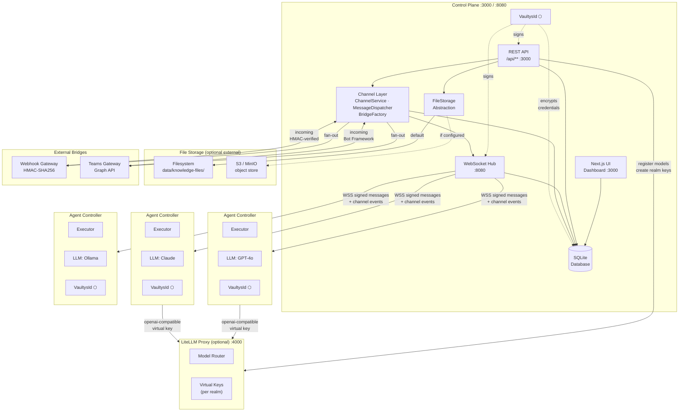
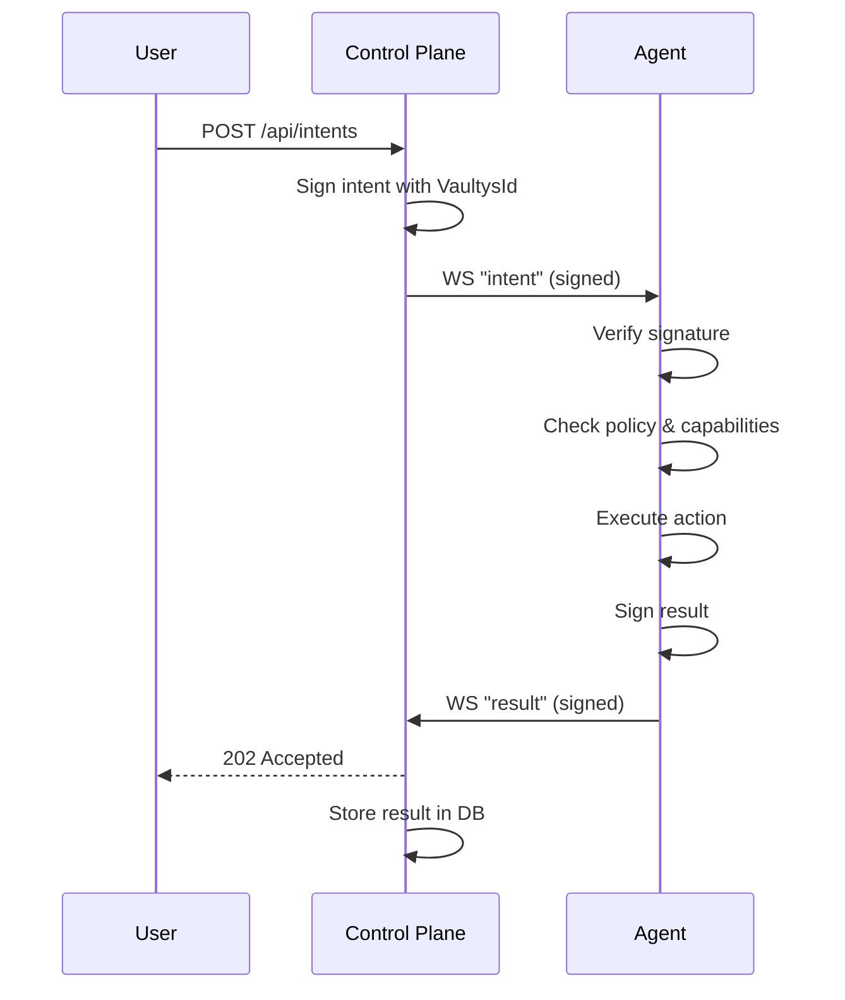
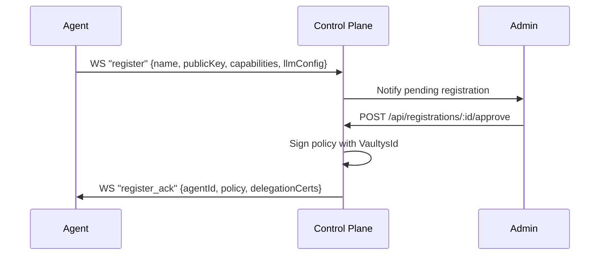
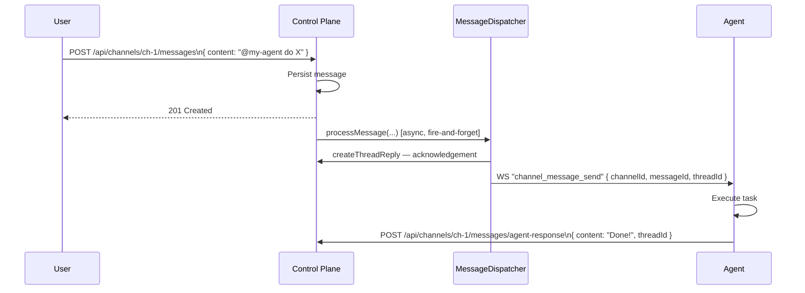
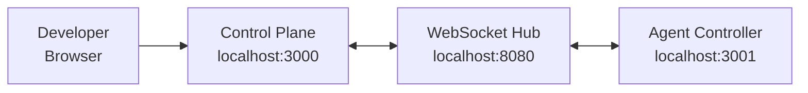
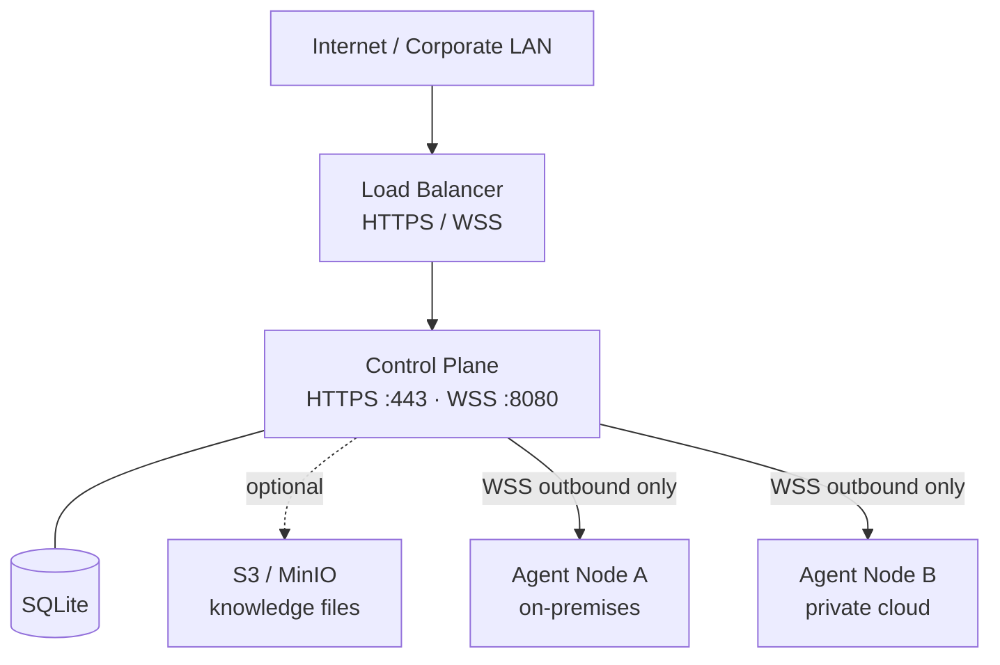

# Architecture

Vaultys Claw is designed as a **hub-and-spoke** system. A central control plane acts as the hub; any number of agent controllers are the spokes. The connection is always outbound from the agent, which means agents can run behind strict firewalls with no inbound ports exposed.

## Component overview



## Control plane

The control plane runs as a **Next.js 14+ application** and serves two concerns simultaneously:

### REST API (`/api/**`)

Provides CRUD endpoints for every resource in the system (agents, policies, intents, realms, users, workflows, tool approvals). All endpoints require authentication via NextAuth.js and enforce role-based access control.

See the full [API Reference](/docs/api/overview).

### WebSocket hub (port 8080)

A persistent WebSocket server that agent controllers connect to. The hub:

- Maintains the registry of connected agents (in-memory + heartbeat tracking)
- Routes signed intents to target agents or broadcasts by capability
- Distributes policy updates and delegation certificates
- Receives signed execution results and stores them
- Handles tool approval requests (agent → control plane → admin → agent)
- Delivers `channel_message_send` events to @mentioned agents

### Dashboard

A React 19 single-page application rendered server-side by Next.js. Provides live visibility over agents, an interactive graph of the trust graph, a chat interface, workflow management, and the admin approval queue.

### File storage

Knowledge file content is decoupled from the SQLite database through a `FileStorage` abstraction layer. Two backends are supported:

| Backend                  | When to use                                                                               |
| ------------------------ | ----------------------------------------------------------------------------------------- |
| **Filesystem** (default) | Single-node deployments. Files written to `data/knowledge-files/` alongside the database. |
| **S3 / MinIO**           | Multi-node or cloud deployments. Any S3-compatible service — AWS S3, MinIO, Ceph, etc.    |

The active backend is determined at startup from the `settings` table. S3 credentials (access key ID + secret) are stored encrypted, signed with the server's VaultysId — never in environment variables. Switching backends takes effect immediately without a restart; the cached storage singleton is invalidated when configuration is saved.

Uploaded files keep their binary content out of SQLite: the `knowledge_files` table stores a `file_path` key and delegates reads/writes to the active backend. Legacy rows with a `content` BLOB (pre-migration) remain readable through the same abstraction.

## Agent controller

Each agent controller is a **Node.js process** that:

1. **Generates or loads** a VaultysId (persistent across restarts)
2. **Connects** to the control plane WebSocket hub (with auto-reconnect and exponential back-off)
3. **Registers** by sending its name, public key, capabilities, and LLM config
4. **Receives** signed intents, policies, and delegation certificates
5. **Verifies** every intent signature against the control plane's public key
6. **Enforces** policies before executing any action
7. **Signs** execution results and returns them to the control plane

The agent controller also exposes a lightweight HTTP server (default port 3001) for health checks and test endpoints.

## Communication protocol

### WebSocket message envelope

Every message on the WebSocket channel is a JSON object with at minimum:

```json
{
  "type": "<message-type>",
  "payload": { ... },
  "signature": "<base64-encoded-signature>",
  "publicKey": "<sender-public-key>",
  "timestamp": "<ISO-8601>"
}
```

Receiving parties verify `signature` against `payload + timestamp` using `publicKey`. Messages older than a configurable threshold or with invalid signatures are rejected.

### Message flow: intent execution



### Message flow: agent registration



### Message flow: channel @mention → agent response



## Database schema

Vaultys Claw uses **SQLite** (via `better-sqlite3`) for zero-ops local deployments. Migrating to PostgreSQL for high-availability production deployments is on the roadmap.

Key tables:

| Table                   | Purpose                                                                                               |
| ----------------------- | ----------------------------------------------------------------------------------------------------- |
| `settings`              | Key-value store for all server configuration (storage type, S3 credentials encrypted, Docling URL, …) |
| `agents`                | Registered agent controllers with DID, capabilities, LLM config                                       |
| `users`                 | Human users with DID, email, admin flag                                                               |
| `realms`                | Organisational scopes                                                                                 |
| `agent_realms`          | Agent ↔ realm associations                                                                            |
| `user_realms`           | User ↔ realm associations                                                                             |
| `user_grants`           | Capability grants from users to agents                                                                |
| `delegation_certs`      | Control-plane-signed delegation certificates                                                          |
| `certificates`          | Agent certificates issued by the control plane                                                        |
| `policies`              | Signed policies pushed to agents                                                                      |
| `pending_registrations` | Agents awaiting admin approval                                                                        |
| `intent_log`            | Dispatched intents with status, payload, and results                                                  |
| `workflows`             | Workflow definitions (steps, schedule, trigger config)                                                |
| `workflow_runs`         | Execution history per workflow                                                                        |
| `workflow_steps`        | Per-step execution log within a run                                                                   |
| `workflow_approvals`    | Human-in-the-loop approval requests                                                                   |
| `knowledge_sources`     | RAG sources per agent (URL, text, file — with sync status)                                            |
| `knowledge_files`       | Uploaded file metadata + `file_path` key into the FileStorage backend                                 |
| `model_registry`        | Registered LLMs with provider, model ID, and LiteLLM name                                             |
| `model_realm_access`    | Which models each realm can access                                                                    |
| `realm_router_keys`     | Per-realm LiteLLM virtual keys and allowed model lists                                                |
| `org_skills`            | Organisation-level skill library entries                                                              |
| `realm_skills`          | Realm-scoped skill overrides                                                                          |
| `agent_skill_overrides` | Per-agent skill configuration                                                                         |
| `channels`              | Named rooms (realm-scoped or global)                                                                  |
| `channel_members`       | User and agent membership with roles                                                                  |
| `channel_messages`      | Persisted messages with optional threading                                                            |
| `channel_bridges`       | External service integrations (webhooks, Teams)                                                       |
| `agent_token_usage`     | Rolling token counters per agent (budget enforcement)                                                 |
| `user_invitations`      | Pending email invitations                                                                             |
| `entra_identities`      | Microsoft Entra ID / Azure AD identity links                                                          |

## Technology stack

| Layer              | Technology                                                  |
| ------------------ | ----------------------------------------------------------- |
| Monorepo           | pnpm workspaces + Turborepo                                 |
| Control plane HTTP | Next.js 14+                                                 |
| Authentication     | NextAuth.js                                                 |
| Database           | SQLite / better-sqlite3                                     |
| File storage       | Filesystem (default) · S3 via @aws-sdk/client-s3 (optional) |
| WebSocket          | ws 8.x                                                      |
| Agent HTTP         | Express.js                                                  |
| Identity           | @vaultys/id 3.x                                             |
| Frontend           | React 19, Tailwind CSS                                      |
| LLM SDKs           | openai, @anthropic-ai/sdk, @google/generative-ai, ollama    |
| LLM proxy          | LiteLLM (optional, self-hosted)                             |
| Language           | TypeScript 5.x throughout                                   |

## Deployment topologies

### Development (single machine)



### Production (typical enterprise)



Agents always connect **outbound** — no inbound firewall holes required. S3-compatible object storage is optional but recommended when running multiple control-plane replicas or when you want knowledge files managed separately from the database volume.
