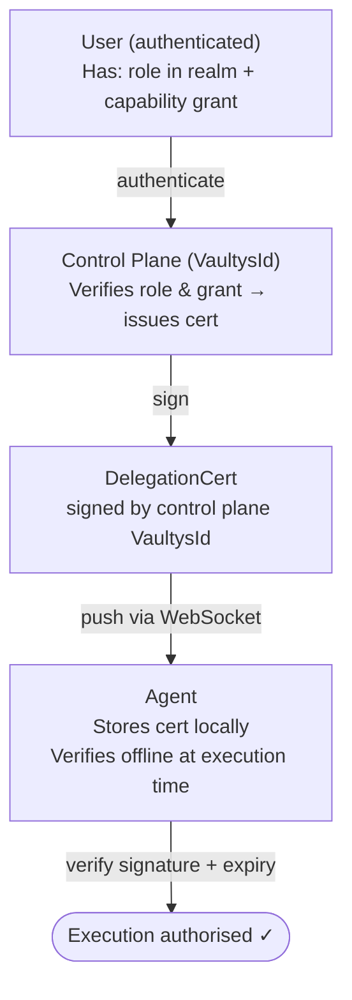
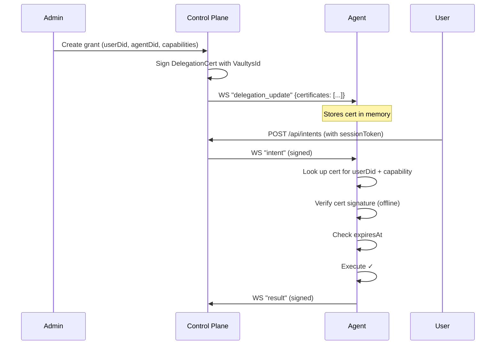
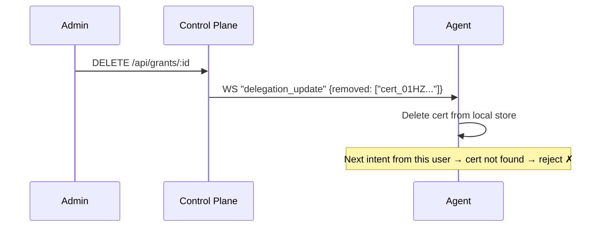
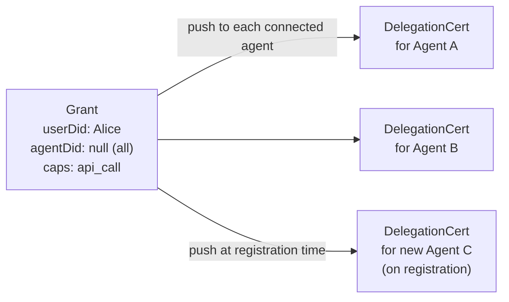

# Delegation

Delegation is the mechanism by which a human user authorises an agent to act on their behalf with specific capabilities. Vaultys Claw implements delegation through cryptographically-signed certificates — so agents can verify authorisation **without** a live query to the control plane.

## The delegation model



## Certificate structure

```typescript
interface DelegationCertPayload {
  id: string; // Unique cert ID
  grantId: string; // Source grant in control plane DB
  userDid: string; // The user being delegated from
  agentDid: string; // The agent being delegated to
  // (or "*" for all agents)
  capabilities: AgentCapability[]; // What is delegated
  certificate: string; // base64-encoded signature
  expiresAt?: string; // ISO 8601 optional expiry
}
```

## Certificate lifecycle



### When certificates are created

Certificates are created whenever:

1. An agent registers (all existing grants are pushed as certs)
2. A new grant is created (cert is pushed to the relevant agent immediately)
3. A cert expires and is renewed

### Revocation



## Distribution via WebSocket

The control plane pushes certificates to agents via the `delegation_update` message:

```json
{
  "type": "delegation_update",
  "payload": {
    "certificates": [
      {
        "id": "cert_01HZ...",
        "userDid": "did:vaultys:z6MkUser...",
        "agentDid": "did:vaultys:z6MkAgent...",
        "capabilities": ["api_call", "file_access"],
        "certificate": "base64...",
        "expiresAt": "2026-12-31T23:59:59Z"
      }
    ],
    "removed": []
  },
  "signature": "base64...",
  "publicKey": "z6MkCP..."
}
```

## Grant-to-cert relationship

Each **grant** (stored in the control plane database) produces one or more **delegation certificates** (pushed to agents).



## Agent peer grants

The same delegation mechanism is used for **agent-to-agent** communication:

```typescript
interface AgentPeerGrant {
  id: string;
  sourceDid: string; // Calling agent DID
  targetDid: string; // Target agent DID
  targetName: string; // Human-readable name
  skillDescription: string; // Used as the LLM tool description
  capabilities: string[]; // Capabilities the source can invoke on target
  certificate: string; // Signed by control plane
  expiresAt?: string;
}
```

Peer grants are distributed via the `agent_peer_catalog` WebSocket message. The calling agent verifies the certificate before routing a request to the peer.

## Security properties of delegation

| Property            | How it is achieved                                                       |
| ------------------- | ------------------------------------------------------------------------ |
| Unforgeable         | Only the control plane's VaultysId private key can sign certificates     |
| Tamper-evident      | Any modification to the certificate content breaks the signature         |
| Offline-verifiable  | Agent holds the control plane's public key; no network round-trip needed |
| Time-limited        | Optional `expiresAt` field enforced by the agent                         |
| Instantly revocable | Control plane pushes a removal message; agent deletes the cert           |
| Scoped              | Cert specifies exact capabilities — not "everything"                     |
