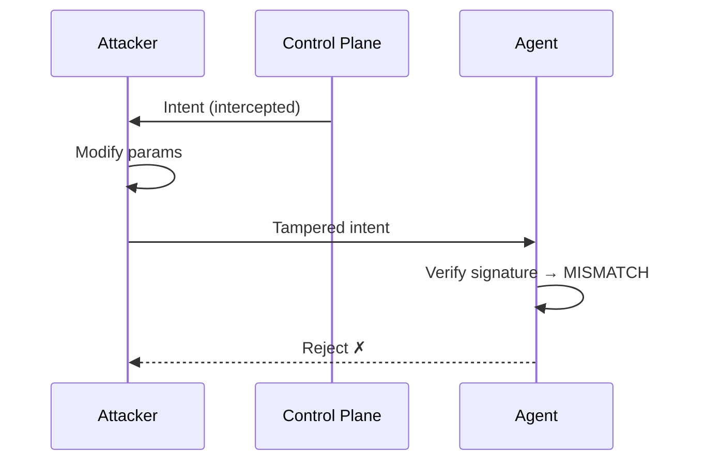
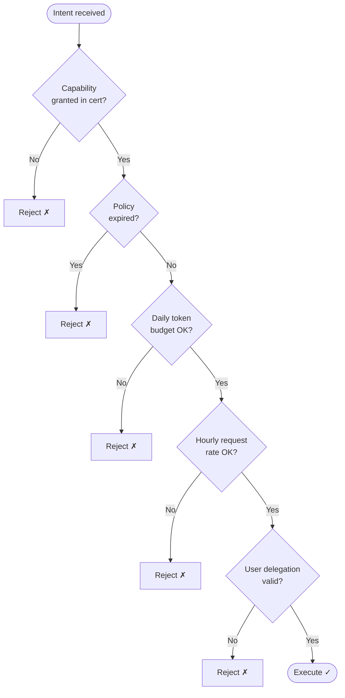

# Security Model

Vaultys Claw is designed with a **zero-trust** security posture. No component trusts another by default — all trust is established through cryptographic proof.

## Threat model

The system is designed to remain secure even if:

- Network traffic between the control plane and agents is intercepted
- An individual agent is fully compromised
- A low-privilege user gains elevated access to the control plane machine (but not the VaultysId private key)

It is **not** designed to resist:

- Compromise of the control plane's VaultysId private key
- Physical access to an agent machine that extracts the agent's private key

## Security controls

### 1. Cryptographic identity (VaultysId)

Every participant — control plane, agent, user — has a non-transferable VaultysId. All messages are signed by the sender and verified by the recipient. See [VaultysId](/docs/security/vaultys-id).

### 2. End-to-end message integrity

Every intent, policy, result, and delegation certificate is individually signed. An attacker who intercepts and modifies a message in transit will cause a signature verification failure on the receiving end.

### 3. Replay attack prevention

Intents include a unique `id` and an ISO 8601 `timestamp`. Agents:

- Track processed intent IDs in memory (and optionally persist them)
- Reject any intent whose timestamp is older than the configured staleness threshold (default: 5 minutes)

### 4. Certificate-embedded policy enforcement

Capabilities and resource limits are embedded inside the **VaultysId Challenger certificate** that both the control plane and agent co-sign during the auth handshake. This replaces the old separate `policy_update` message flow.

Key properties of this approach:

- **Tamper-evident** — both sides sign the metadata; any modification invalidates the certificate
- **Offline-verifiable** — agents enforce limits without querying the control plane
- **Replay-resistant** — a stale certificate from a previous session cannot be reused because the Challenger state machine tracks session state

When a policy changes, the control plane sends `update_capabilities` followed by a fresh `auth_challenge`. The new certificate carries the updated metadata.

### 5. Intent execution decision tree

### 6. Blast radius containment

If an agent is compromised, the damage is limited to:

- The capabilities that agent was explicitly granted
- The data within that agent's workspace root
- Actions within the agent's resource limits

Other agents are unaffected. The compromised agent's identity can be revoked instantly from the control plane — its delegation certificates will no longer be distributed, and existing ones will expire.

### 7. Delegation certificate chain

Users do not directly authorise agents. The control plane acts as an intermediary — it verifies the user's role and grant, then issues a delegation certificate signed with its own VaultysId. Agents verify this certificate offline, without trusting the user's claims directly.

### 8. Role-based access control (RBAC)

All REST API endpoints enforce RBAC. The enforcement happens server-side in Next.js route handlers and cannot be bypassed by a client.

### 9. Tool approval workflow

Sensitive tools can be flagged as requiring human approval. When an agent encounters such a tool during execution, it pauses, sends an approval request to the control plane, and waits. An admin reviews the request — including the full context and parameters — before approving or rejecting.

## Threat mitigations table

| Threat | Control | Mitigation |
|---|---|---|
| Intent tampering in transit | Cryptographic signature | Signature mismatch → rejected |
| Replay attack | Intent ID + timestamp | Duplicate / stale → rejected |
| Policy tampering | Cert co-signed by both parties | Modification invalidates certificate |
| Policy replay | Challenger session state | Stale cert from old session rejected |
| Resource limit bypass | Limits in signed cert metadata | Agent reads from certificate, not network message |
| Runaway token spend | `maxTokensPerDay` in policy | Agent blocks intents when daily budget exhausted |
| Unconstrained request rate | `maxRequestsPerHour` in policy | Rolling window counter enforced pre-execution |
| Expired policy still used | `policyExpiresAt` check | Agent rejects intents after expiry timestamp |
| Compromised agent | Capability scoping | Blast radius limited to granted caps |
| Agent impersonation | VaultysId (non-transferable) | Private key cannot be cloned |
| Privileged user overreach | RBAC + capability grants | Server-side enforcement |
| Man-in-the-middle | All messages signed E2E | Tampering detected at receiver |
| Unauthorised agent | Registration approval flow | Admin must approve before agent connects |
| Stale delegation | Expiry timestamps | Certificates expire and are not renewed |
| Control plane compromise | Key is the root of trust | Rotate control plane identity, re-issue certs |

## Network security recommendations

For production deployments:

- Serve the control plane over **HTTPS** (TLS 1.3)
- Use **WSS** (WebSocket Secure) for agent connections
- Place the control plane behind a **reverse proxy** (nginx, Caddy, Traefik)
- Restrict port 8080 (WebSocket hub) to known agent IP ranges where possible
- Use **private networking** or a VPN for agent-to-control-plane communication
- Enable **TLS certificate verification** on agents (`NODE_TLS_REJECT_UNAUTHORIZED=1`)

## Audit logging

All security-relevant events are logged using [Pino](https://getpino.io/):

- Agent registration (approved / rejected)
- Intent submission and routing
- Policy updates
- Delegation certificate issuance
- Tool approval requests and decisions
- Authentication events

In production, pipe Pino output to your SIEM (Splunk, Elastic, Datadog) for centralised analysis.

## Compliance considerations

Vaultys Claw's design is well-suited for environments requiring:

- **SOC 2** — audit trail, access control, least privilege
- **ISO 27001** — asset management (agent registry), access control, cryptography controls
- **GDPR / data residency** — all data stays on your infrastructure; no external telemetry
- **Zero-trust network access** — no implicit trust, all communications authenticated

Consult your compliance team before deploying in regulated environments.
