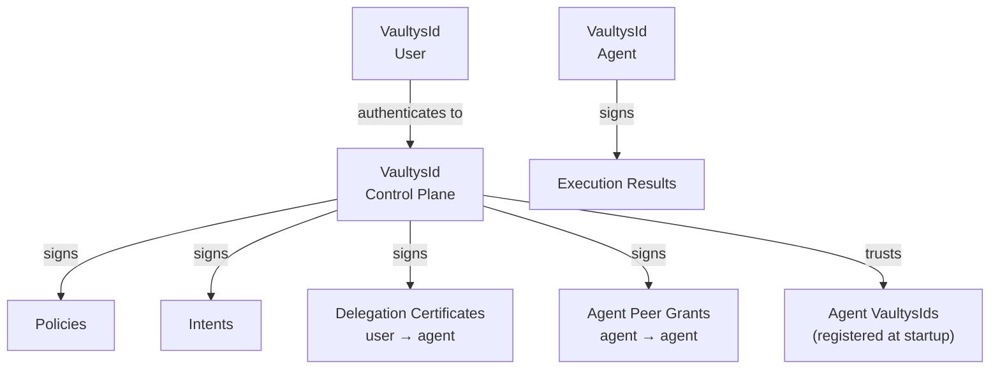
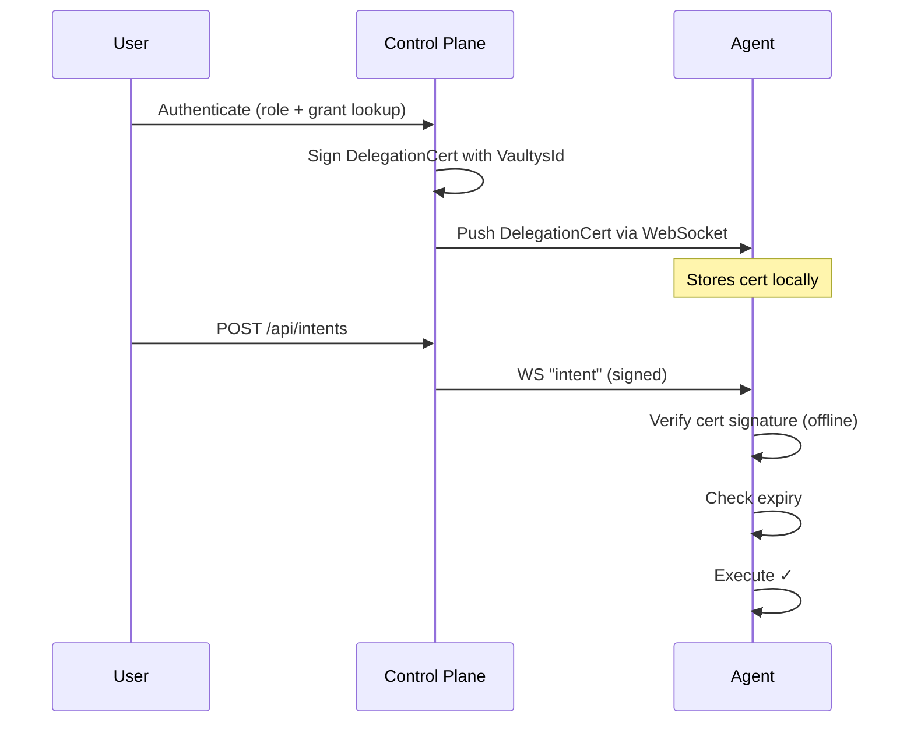

# VaultysId — Decentralised Identity

VaultysId is the cryptographic identity layer that underpins all security in VaultysClaw. Every participant in the system — the control plane, each agent controller, and every human user — has a VaultysId: a self-sovereign, non-transferable identity backed by a cryptographic key pair.

## Why decentralised identity?

Traditional enterprise systems rely on a central identity provider (IdP) — an LDAP server, an OAuth service, an API gateway — to authenticate requests. This creates a single point of failure and a high-value target for attackers.

VaultysId eliminates the central trust anchor:

| Traditional IdP                                | VaultysId                                     |
| ---------------------------------------------- | --------------------------------------------- |
| Central server that can be taken offline       | No central server; identity is self-contained |
| Session tokens that can be stolen and replayed | Non-transferable cryptographic keys           |
| Revocation requires online check               | Offline verification using public keys        |
| Issuer can forge identities                    | Private key never leaves the owner            |
| Single compromise affects all users            | Compromise of one identity is contained       |

## How it works

### Key generation

When an agent controller or the control plane first starts, it generates a **VaultysId** — a public/private key pair stored locally:

```
.vaultys/
└── control-plane.id    ← serialised VaultysId (contains private key)
```

```
.vaultys/
└── agent.id            ← agent's VaultysId
```

The **DID** (Decentralised Identifier) is derived from the public key and looks like:

```
did:vaultys:z6Mkf9x3TQGm7p...
```

### Message signing

Every message sent over the WebSocket channel is signed:

```typescript
// Control plane signs an intent
const intent = {
  id: crypto.randomUUID(),
  agentControllerId: agentDid,
  action: "summarise_document",
  params: { url: "...", format: "bullets" },
  timestamp: new Date().toISOString(),
};

const signature = await vaultysId.sign(JSON.stringify(intent));

const signedMessage = {
  type: "intent",
  payload: intent,
  signature,
  publicKey: vaultysId.publicKey,
};
```

### Signature verification

The receiving agent verifies before executing:

```typescript
// Agent verifies the intent
const isValid = await VaultysId.verify(
  JSON.stringify(message.payload),
  message.signature,
  message.publicKey
);

if (!isValid) {
  throw new Error("Invalid signature — rejecting intent");
}

// Also verify it's from the trusted control plane
if (message.publicKey !== trustedControlPlaneKey) {
  throw new Error("Intent not from known control plane");
}
```

## The trust hierarchy



## Delegation

Users can delegate capabilities to agents. Rather than the agent trusting the user directly, the **control plane signs a delegation certificate** that proves the user's authorisation:



This means an agent can verify a user's delegation without any network round-trip to the control plane.

```typescript
interface DelegationCertPayload {
  id: string;
  grantId: string;
  userDid: string;
  agentDid: string; // "*" for all agents
  capabilities: AgentCapability[];
  certificate: string; // base64, signed by control plane
  expiresAt?: string; // Optional expiry (ISO 8601)
}
```

## Replay attack prevention

Every signed intent includes:

1. **A unique `id`** — agents track processed intent IDs and reject duplicates
2. **A `timestamp`** — agents reject intents older than a configurable threshold (default: 5 minutes)

This prevents an attacker who captured a valid signed intent from replaying it later.

## Agent peer grants

Agents can be granted the ability to call other agents directly (for multi-agent workflows). These **peer grants** are also signed by the control plane:

```typescript
interface AgentPeerGrant {
  id: string;
  sourceDid: string; // The calling agent
  targetDid: string; // The target agent
  targetName: string;
  skillDescription: string; // Used as an LLM tool description
  capabilities: string[];
  certificate: string; // Signed by control plane
  expiresAt?: string;
}
```

## Key storage and rotation

### Where keys live

| Entity        | Key location                                                     |
| ------------- | ---------------------------------------------------------------- |
| Control plane | `.vaultys/control-plane.id` (configurable via `VAULTYS_ID_PATH`) |
| Agent         | `.vaultys/agent.id` (configurable via `AGENT_VAULTYS_ID_PATH`)   |

### Backup

Keys must be backed up securely. Losing a key means the entity must re-register with a new identity, and existing delegation certificates pointing to the old key become invalid.

:::warning
Never commit `.vaultys/` directories to version control. Add them to `.gitignore`.
:::

### Rotation

Key rotation requires:

1. Stopping the agent / control plane
2. Deleting the old `.id` file (a new one will be generated on next start)
3. Re-registering and re-issuing any delegation certificates

Rotation tooling is on the roadmap.

## Comparison with alternatives

| Mechanism                  | VaultysClaw | JWT / API keys        | mTLS     |
| -------------------------- | ------------ | --------------------- | -------- |
| Central authority required | No           | Yes (issuer)          | Yes (CA) |
| Non-repudiation            | Yes          | Limited               | Yes      |
| Offline verification       | Yes          | Yes (with public key) | No       |
| Per-message integrity      | Yes          | No                    | Yes      |
| Key transfer risk          | Minimal      | High                  | Medium   |
| Setup complexity           | Low          | Very low              | High     |
