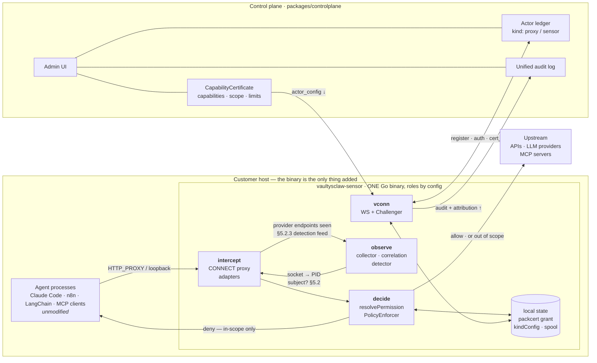
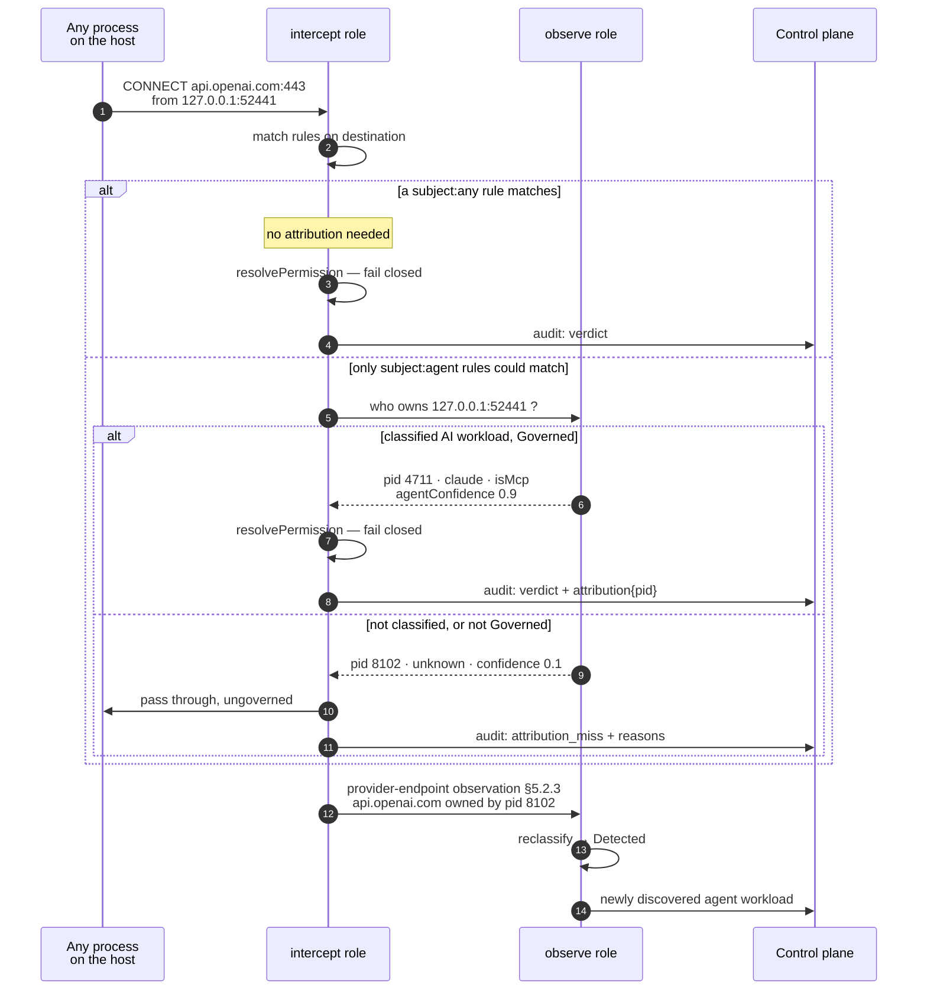
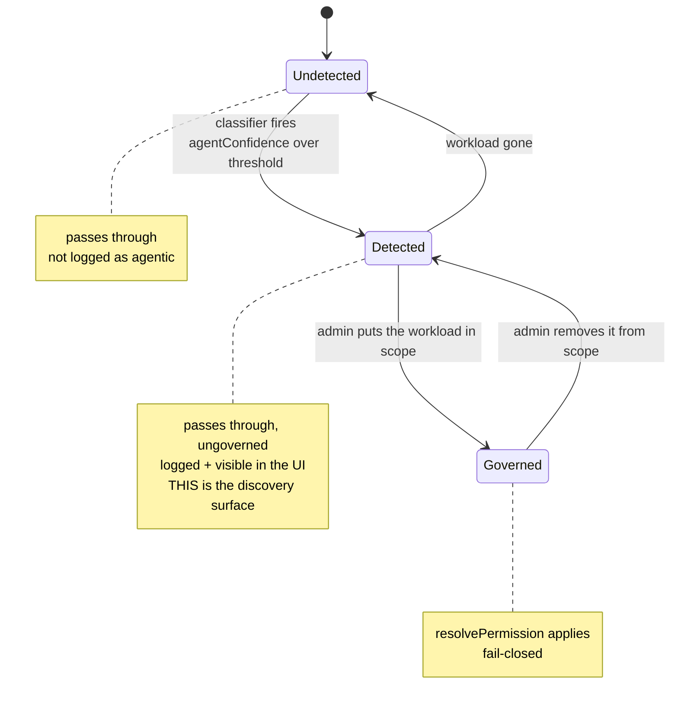
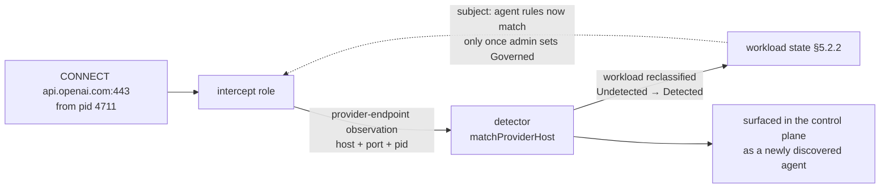
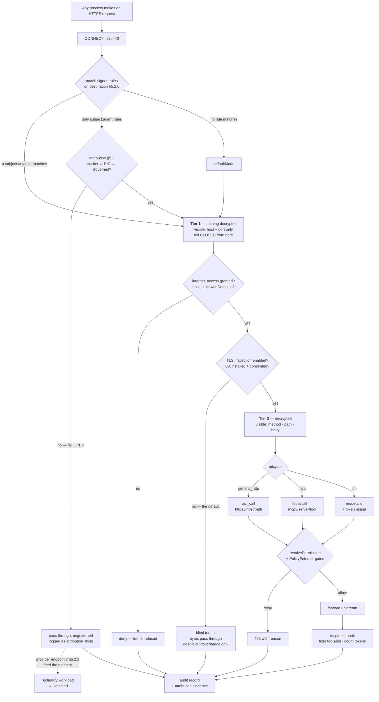

# Interception Points — Target Architecture

**Status:** Phase 1a partially built on `rebuild/core`. A first, superseded proxy implementation
exists on branch `go-agent-controller` (`packages/proxy`, `packages/mcp-proxy`, five `Proxy*` Prisma
models in `packages/control-plane`); §9 reviews it and this design replaces it.

Built and tested in `vaultysclaw-sensor/`:

| Package | What |
|---|---|
| `internal/authz` | §3.3's Go port of `resolvePermission`, held to `packages/trust` by `conformance/permission-vectors.json` (25 cases, run by both suites) |
| `internal/grant` | §9.2's offline packcert verification + the §8.1 trust anchor, with a TypeScript-signed interop fixture (`conformance/grant-fixture.json`) |
| `internal/rules` | §5.2's signed rule sets, subjects, deny-overrides, strict host matching |
| `internal/intercept` | §8 tier-1 CONNECT proxy: `Decide`, the listener, the durable audit spool (G7), and the store that verifies both artefacts against the anchor |
| `internal/config` + `cmd/sensor` | the `intercept` config block and role wiring — disabled by default, `explicit` mode only |

Verified end to end against the real binary: an allowed destination tunnels, a `subject: any` deny
rule refuses without consulting the certificate, and an off-allowlist host is refused by
`allowedDomains` — each with a distinct reason in the spool.

Built in `packages/controlplane`:

| File | What |
|---|---|
| `lib/proxy-rules.ts` | §5.2.0 rule-set authoring, validation, and signing, pinned to the Go verifier by `conformance/rules-fixture.json` |
| `lib/proxy-kind.ts` | the `proxy` kind's `kindConfig` schema, parsing, and author-time warnings |
| `lib/actor-config.ts` | building the §12 payload: packcert grant selection, rule-set signing, and the translated trust block |
| `lib/protocol.ts` | the `actor_config` message type and payload (§12) |
| `lib/ws-server.ts` | `pushActorConfig`, sent on reconnect and after certificate issuance |
| `lib/actor-kinds.ts` + map components | the `proxy` kind |
| `components/proxy/*` + the Actor detail page | the kind panel: mode, `maxStatusAgeSeconds`, the rule list, and every warning rendered inline |

Verified in a real browser against a live dev server: the panel renders a stored config, refuses a
wildcard host with the verifier's own reasoning shown in place (keeping the rejected values so one
field can be fixed), persists a valid rule with hosts split and ports parsed, and warns that a
subject-scoped rule will make the agent refuse the whole set in `explicit` mode.

**Not yet built:** anchor pinning is out-of-band only — trust-on-first-use from a live handshake is
deliberately not wired into the enforcement role. Phases 2–6 of §13 are untouched.

The push is a **delivery mechanism, not a trust path** — a point provisioned entirely from local token
files behaves identically to one that received a push, because both go through the same offline
verification. That is why the enforcement half shipped complete before the transport existed.

**One correction worth carrying forward.** An earlier version of the Go decider read its zero value as
"no staleness bound", i.e. the most permissive setting. `CERTIFICATE_WEB_OF_TRUST.md` §5.2 defines
`stapleTtlSeconds: 0` as "force live query every time" — the *strictest* choice. The two were exactly
inverted, so an admin asking for maximum rigor would have got maximum laxity. The knob is now
`maxStatusAgeSeconds`, where `0` keeps its strict meaning (no cached status is acceptable, which
offline means deny under fail-closed) and unbounded must be written explicitly as a negative. It is
also no longer inherited from `stapleTtlSeconds`: an offline decider cannot perform a live query, so
the value is translated at the push rather than copied.

**Depends on:** [`CERTIFICATE_WEB_OF_TRUST.md`](CERTIFICATE_WEB_OF_TRUST.md) and
[`REBUILD_ARCHITECTURE.md`](REBUILD_ARCHITECTURE.md) §4 (the `Actor`/kind model). Read both first.

**Targets:** `packages/controlplane` for the server half; **`vaultysclaw-sensor/` (Go)** for the
agent half — see §3.

---

## 1. Mandate: interception, not integration

Every governance surface VaultysClaw has today assumes the agent opted in — it embeds
`@vaultysclaw/sdk`, holds a VaultysId, speaks the handshake. That covers agents we deploy and none of
the agents already running in a customer's estate.

A company adopting VaultysClaw has, in almost every case, **already deployed AI agents**: n8n
workflows, LangChain or CrewAI services, Claude Code on developer laptops, off-the-shelf MCP servers,
and a quantity of in-house glue nobody has inventoried. None of it will be rewritten to embed our
SDK. Waiting for that rewrite means governing nothing.

The mandate is therefore narrow: **interface agnostically with an agent fleet we did not deploy, to
(a) report security-relevant activity up and (b) push refusals down.** "This deployment may not reach
the internet, because its certificate does not grant `internet_access`" must hold for an agent that
has never heard of VaultysId.

## 2. The interception-point pattern

An **interception point** is an Actor deployed *into* an existing agent estate that observes activity
it did not originate and, when authorized to, refuses it. It is a pattern, not a feature:

| Role | Observes | Enforces | Status |
|---|---|---|---|
| `observe` | processes, AI/agent classification, MCP presence, sockets per PID | nothing | **built** — `vaultysclaw-sensor`, the one remote kind wired end to end today |
| `intercept` | API calls, MCP JSON-RPC, LLM completions | yes, in the request path | designed here |
| `both` | the union, correlated locally (§5) | yes | the target |

Two consequences shape everything below.

**The sensor already solved half of it, and solved it honestly.** Its telemetry carries
`aiConfidence`, `agentConfidence`, `reasons: string[]`, `isMcp`, `mcpServers`, `identityEvidence` —
graded confidence with the reasoning attached, feeding a human's judgement, never an authorization
decision. §6 reuses that exact shape rather than inventing a second vocabulary.

**An interception point's own trust story is the standard one.** It registers as an Actor, an admin
approves it, it receives a `CapabilityCertificate`. No parallel mechanism.

### 2.1 Where things happen



Every allow/deny decision is taken **inside the host**, from local state, with no control-plane round
trip. The control plane's only role in the request path is having signed the certificate earlier. What
crosses the boundary is configuration and certificates downward, audit and telemetry upward.

The two roles are wired **both ways**, and that is the load-bearing detail. `observe → intercept`
supplies the subject when a matched rule needs one (§5.2); `intercept → observe` feeds provider-endpoint
sightings back into the detector, so the request path improves the classifier that gates it (§5.2.3).
Neither direction exists in a two-process deployment — this is what §3's merge is actually for.

## 3. One Go binary, several roles

Both roles ship as **one Go binary in `vaultysclaw-sensor/`**, selected by configured role. The
argument is not "fewer binaries" — it is §5's correlation, which is only possible in one process on
one host. What already exists there makes this the cheap path as well as the right one:

- `internal/vconn/` — `handshake.go`, `cert_handshake.go`, `capstate.go`, `envelope.go`, with
  `e2e_test.go` **and `realcp_test.go`**: register → auth → certificate issuance, tested against a
  real control plane.
- `internal/collector/`, `correlation/`, `detector/`, `state/`, `identity/` — with tests.
- `cmd/sensor`, `cmd/collector` — the multi-binary layout already exists; a role flag or a third
  `cmd/` target is idiomatic here, not a restructuring.
- `packages/agent-controller-go/internal/cert/cert.go` (branch) already implements the **packcert
  codec** in Go: `unpack()` handles `base64(4-byte-LE len | msgpack(body) | signature)` and
  `serverID.VerifyChallenge(body, sig)` works. `verifyCapabilityGrantCert` in Go is ~40 lines on top
  of it. The crypto port is de-risked; fold that package into the sensor module.

### 3.1 The `kind` question

The `kind` reflects what the Actor *does*: `sensor` while observe-only, `proxy` once interception is
active. The capability reflects what it *may* do. One binary, two kinds by configured role, and no
rename of the `sensor` kind — which would touch the only remote path wired end to end today.

### 3.2 Blast radius, and why enforcement is capability-gated

The sensor today is observe-only and therefore **cannot break the host**. Adding enforcement means a
bug in the intercept path can take down every agent on the machine *and* blind the telemetry at the
same time. Three mitigations, all load-bearing:

1. Separate `cmd/` targets from one module — a pure observer deployment never links the intercept
   path.
2. Interception is inert unless the certificate grants it (§10's `proxy_enforce`). The capability is
   the kill switch: revoke it and the host degrades to observe-only rather than going dark.
3. §7's fail-mode rules, which in this deployment are far more consequential than in a per-zone one.

### 3.3 Two implementations of the authorization decision

`resolvePermission` is TypeScript in `packages/trust`. A Go enforcement path is a second
implementation of an authorization function — a classic source of divergence vulnerabilities.

Non-negotiable mitigation: a **shared conformance-vector file** (JSON: certificate sets, actions,
expected decisions) executed by both `packages/trust`'s Vitest suite and the Go suite. The two
invariants `packages/trust/CLAUDE.md` already declares — revoking never grants more access, adding
never removes it except through explicit scope-narrowing supersession — become the vector file's
spine. A vector that passes in one language and fails in the other is a release blocker.

## 4. Deployment modes

How agent traffic reaches the interception point. This is orthogonal to the role, and it is where
adoption is won or lost.

| Mode | How traffic arrives | Needs | Catches |
|---|---|---|---|
| `explicit` | agents are configured to point at it (a per-zone chokepoint) | agent reconfiguration | only what was reconfigured |
| `system` | the binary registers itself as the host's HTTP proxy | admin/root on the host | newly-started processes that honour proxy config |
| `transparent` | pf / nftables / iptables REDIRECT to the local port | root + network config | everything, including already-running processes |

`system` is the mode worth optimizing for. It requires **no agent modification at all** — §1's whole
constraint — and it places the interception point on the same host as the agents, which is what makes
§5 work. `explicit` remains necessary for fleets where a per-host daemon is impossible (some
Kubernetes topologies, managed runtimes), and `transparent` is the escalation for uncooperative or
already-running processes.

### 4.1 What `system` mode actually reaches

"Register as the system proxy" is several unrelated mechanisms, with materially different coverage:

| Surface | Honoured by |
|---|---|
| `HTTP_PROXY` / `HTTPS_PROXY` / `NO_PROXY` | Python `requests`/`httpx` (so the OpenAI and Anthropic Python SDKs), Go `net/http` via `ProxyFromEnvironment`, curl, most CLI tooling |
| OS network settings (macOS `networksetup`, Windows WinINET, GNOME gsettings) | browsers and GUI apps; patchy for CLI agents |
| PAC file | whatever honours the OS setting |

Environment variables are the high-leverage surface, because much of the target population is Python.
But there is a specific, important gap: **Node's `fetch` (undici) does not honour `HTTP_PROXY` by
default.** Claude Code is Node. n8n is Node. Recent Node exposes `NODE_USE_ENV_PROXY=1` (Node 24+ —
the exact version matrix needs checking per target), and older runtimes need an explicit
`ProxyAgent`. So `system` mode must set that variable alongside the proxy ones, and must report
per-host which runtimes it can and cannot reach. A mode that silently misses the Node agents while
reporting "enforcing" is worse than no mode.

Two more constraints on `system` mode:

- **It only affects newly-started processes.** Environment variables cannot be injected into a
  running process. Already-running agents keep bypassing until restarted, so the control plane must
  show "configured" and "actually observed flowing through us" as two different facts.
  `transparent` mode is the only answer for running processes.
- **`NO_PROXY` must exempt the control plane**, or the binary proxies its own WS connection through
  itself and deadlocks on startup. It should also exempt OS update and package-manager endpoints by
  default; a governance product that breaks `apt` gets uninstalled.

### 4.2 This looks exactly like malware, and must be loud

A privileged daemon that installs itself as the system proxy — and, in §8's inspection mode, a CA in
the trust store — is precisely the EDR signature of an adversary-in-the-middle. Handled quietly, this
is an adoption blocker and a genuine incident. Handled openly it is a trust-builder: signed binary,
documented behaviour, explicit admin consent per host, both changes visible and revertible from the
control plane, and every trust-store modification an audit event. This belongs in the product, not in
a footnote.

## 5. Local correlation: the identification answer

Identifying which AI agent made a given API call is not solvable from the request. Every available
signal is circumstantial:

| Signal | What it actually proves |
|---|---|
| API key / bearer token | which *credential*, and only if an admin registered it against something |
| `User-Agent` | which SDK family, at best |
| MCP `initialize` → `clientInfo` | a self-reported, trivially spoofable name |
| a header the caller sets | nothing — the caller asserts it |

The design rule that follows, and the one this document is organized around:

> **Inference decides what is in scope. Only cryptography decides what is permitted.**
>
> Detection may route a request into governance or out of it (§5.2). It may never satisfy a
> permission check.

This is a refinement of an earlier, blunter formulation ("inference informs observation, never
authorization"), and the difference matters: detection *does* now sit in the enforcement path, as a
gate on whether enforcement happens at all. §5.2 is about making that honest rather than pretending
otherwise.

The correlation primitive is what §3's merge buys, and it is already built.
`internal/collector/collector.go` defines `Connection` as "a single TCP socket owned by a process";
`internal/correlation/correlation.go`'s `Build` **already groups connections by PID** and emits an
`Observation` of process + children + outbound sockets + listening ports, which the detector
classifies.

In `system` mode the join is cheaper and stronger than it would be from a remote vantage point:
traffic arrives on the loopback interface, so the proxy has an exact local `(127.0.0.1, ephemeral
port)` tuple, and the collector already enumerates precisely that socket against its owning PID. The
chain is **socket → PID → classified AI workload**, entirely from local system state, with no
cooperation from the agent and no spoofable header anywhere in it.



Two things to read off the order. Rule matching comes **first**, on the destination — attribution is
requested only when a matched rule's subject requires it (§5.2). And the last three lines are the
feedback loop: the same request that just passed ungoverned is what teaches the detector that pid 8102
is an agent, so the next one will not.

## 5.2 Rule subjects: what needs attribution, and what does not

An interception point in `system` or `transparent` mode sees **all** host traffic. Governing all of it
would mean a stale certificate takes the whole machine off the network — OS updates, package managers,
the user's browser. That is not a security posture, it is an outage.

But the fix is not a global "is this an agent?" gate in front of everything. Rules differ in whether
they need to know *who* made the request:

| Rule subject | Example | Attribution needed | If attribution is unavailable |
|---|---|---|---|
| `any` | "nothing on this host may reach `openai.com`" | **no** — decided on destination alone | n/a; the rule is unaffected |
| `agent` | "AI agents may not reach the internet" | **yes** | **fail open** — pass, log the miss |
| `workload:<id>` | "this Claude Code install may reach `github.com` only" | **yes** | **fail open** — pass, log the miss |

Two consequences.

**Attribution is computed lazily.** The observe role is consulted only when a *matched* rule carries a
subject that needs it. A host whose rules are all `subject: any` never does a socket→PID join in the
request path at all.

**A `subject: any` rule cannot be evaded by evading classification.** This corrects a real error in an
earlier draft of this document, which made detection a universal precondition for enforcement: under
that model, "block `openai.com`" would have silently failed for any process the classifier missed —
exactly backwards, since a destination rule is the one kind that needs no classifier to be correct.

**Precedence: explicit deny wins over allow, regardless of subject specificity.** A
`subject: workload:X` grant does not override a `subject: any` denylist. Without a stated
deny-overrides rule, ordering ambiguity returns — the same class of defect as G9.

### 5.2.0 The rule set is a policy source, so it must be signed

Rules now carry authorization semantics that certificates alone do not express (a host-wide
destination denylist is not a capability grant). That makes `kindConfig` a second policy source, and
§9's central criticism of the branch was precisely that authorization arrived as unsigned pushed
config the proxy trusted because it came over the socket.

So the rule set is **signed by the control plane with the existing `signCert` primitive** and verified
offline by the interception point, exactly as it verifies its own certificate — §3's `unpack` +
`VerifyChallenge` already does this in Go. No new cert format, no new crypto, and the channel stops
being trusted. Whether `subject` should instead live in `CertScope` (cleaner, one policy source, but a
change to `packages/policy` and the trust doc) is §14's open question.

### 5.2.1 The cost, bounded to subject-scoped rules

For subject-scoped rules only, the failure mode flips:

- **Before:** a false positive breaks something that was never an agent — loud, immediately noticed,
  fixed by an admin.
- **After:** a false negative silently permits an agent action nobody authorized — quiet, invisible,
  and indistinguishable from correct operation.

The second is more dangerous precisely because it is quieter, and in a governance product an
unmeasured gap is worse than a known one. Three requirements follow, and they are not optional:

1. **Every ungoverned pass is logged as such**, with the reasons the classifier gave. "We passed
   41,208 connections we could not classify" is a number an admin must be able to see. A silent
   pass-through is the one outcome this design cannot afford.
2. **Detection is per-workload, not per-request.** The detector classifies a PID's workload once;
   every connection that PID owns inherits it. Per-request heuristics would be both weaker and
   unstable — the same agent classified differently on consecutive calls.
3. **Detection quality is a reported metric, not an assumption.** The control plane shows, per host,
   what fraction of traffic was classifiable and which runtimes the point could not reach (§4.1's
   Node gap is exactly this).

### 5.2.2 Scope is a per-workload state, not a boolean

Enforcing the moment a workload is first detected would surprise people — a newly-installed agent
would be governed by a certificate written before it existed. So a workload moves through states, and
an admin decides when it crosses into enforcement:



`Detected` is the state that makes rollout safe and is also the product's discovery surface: an admin
watches real agent traffic pass, sees what it actually calls, and only then writes a certificate for
it. Enforcement is opt-in per workload, never a side effect of a classifier firing.

### 5.2.3 The destination signal feeds detection back — the loop that shrinks the gap

§5.2.1's gap is bounded by something the interception point is uniquely placed to notice: **an agent
can hide its process name and command line, but it cannot hide that it talks to an LLM API.** Calling
`api.openai.com` is the one thing an agent must do to be an agent.

So traffic to a known provider endpoint is itself a classification signal, and it flows *backwards*
from the intercept role into the detector — which already scores exactly this:
`internal/detector/ai.go`'s `matchProviderHost` matches a connection's remote host against a
configured `ProviderRule` catalog (exact, dot-prefixed suffix, or substring), with optional
reverse-DNS assistance, and `detector_test.go` already covers `api.openai.com`, `api.anthropic.com`,
`mycompany.openai.azure.com`, and ollama.

This is therefore not a new detector. It is a **higher-fidelity feed into the existing one**, and the
fidelity gain is real:

| | Poller (observe role today) | Intercept role |
|---|---|---|
| Cadence | every ~30s | at the moment of the CONNECT |
| Short-lived connections | missed if opened and closed between polls | always seen |
| Hostname | reverse DNS from an IP, ambiguous or unavailable | verbatim from the CONNECT line / SNI |
| Cost | enumerate every socket on the host | already in the request path |



Two properties make the loop safe rather than dangerous.

**A new detection cannot block anything.** Per §5.2.2, the destination signal promotes a workload to
`Detected`, which still passes through ungoverned. A false positive from destination matching costs a
row in the discovery UI, never an outage. The state machine was written before this feedback loop
existed and happens to make it safe by construction.

**It works at tier 1.** The hostname is in the CONNECT line and the SNI, both in the clear. No
decryption, consistent with §8.

And one honest limit: this has excellent precision on the common case and **no coverage on deliberate
evasion**. An agent pointed at a self-hosted model, a private LLM gateway, or an intermediate proxy
produces no provider-endpoint signal at all. Destination matching shrinks the accidental gap — someone
running an unregistered agent — and does nothing about the adversarial one.

### 5.2.4 A distinct and louder state: known-agentic traffic, unknown owner

The signals can disagree in one particularly informative way: the destination is a known provider
endpoint, but no PID can be resolved for the socket at all. That is not "out of scope" and must not be
logged as such — it is the loudest evidence this design can produce that something is evading
observation. It deserves its own audit outcome and its own prominence in the UI, above ordinary
unclassified traffic.

### 5.2.5 In `explicit` mode, subjects are free

When agents are configured to point at the interception point deliberately, everything arriving is
agent traffic by construction — `subject: agent` needs no attribution because the premise is
structural. §5.2's attribution machinery is specifically the price of `system` and `transparent` modes.
Worth remembering when comparing modes: `explicit` has weaker coverage but zero classification risk.

That local correlation is a materially stronger identity than any header heuristic, and it is not
cryptographic — a local attacker with root can lie to it. So it sits at its own rung in §11, above
inference and below a signed request, and the UI must render it as what it is.

## 6. What flows up

Every decision produces a record on the existing unified audit log (`lib/audit.ts`) — action,
resource, verdict, granting certificate id, latency. This has value even when every verdict is
`allow`: a customer who has never had an inventory of what their agents call gets one.

Alongside it, **attribution evidence**, in the sensor's existing shape rather than a new one:

```
attribution: {
  agentConfidence: number         // 0..1
  reasons: string[]               // "socket 127.0.0.1:52441 -> pid 4711 (claude, isMcp)"
  pid?: number                    // §5 local correlation, when available
  credentialFingerprint?: string  // hash of the presented key — never the key
  clientInfo?: string
}
```

Three rules, the operational form of §5's design rule: it is never an input to `resolvePermission`
(whose signature makes this structurally true — there is nowhere to pass it); credentials are
fingerprinted, never stored or forwarded; and it renders as graded evidence, never as an identity
badge.

## 7. What flows down: existing vocabulary only

No new capability or limit vocabulary. The mapping to `packages/policy` is direct:

| Intent | Existing primitive | Enforcement |
|---|---|---|
| "no internet from this host" | `internet_access` absent from the cert | deny egress |
| "internet, but only these hosts" | `ResourceLimits.allowedDomains` | allowlist the destination host |
| "may call APIs / send mail / execute code" | `api_call`, `mail_send`, `code_execution` | route classes, §8's adapters |
| "N requests/hour, M tokens/day" | `maxRequestsPerHour`, `maxTokensPerDay` | `PolicyEnforcer`'s existing gates |
| "only this MCP tool, twice, until Friday" | `CertScope.resourcePattern` + `maxUses` + `expiresAt` | `resolvePermission`, unchanged |

Two of these the interception point makes real for the first time. **`allowedDomains` is enforced
nowhere today** — declared in `packages/policy/src/types.ts`, collected by a form in
`GovernanceTab.tsx`, rendered in `AuditCertificatePanel.tsx` and the environment graph, and read by
zero enforcement code. `PolicyEnforcer` gates capability, expiry, tokens, and rate — never domains.
Egress filtering cannot be done honestly in-process anyway; it needs the request path.
`maxRequestsPerHour` and `maxTokensPerDay` likewise have no caller on this path yet.

### 7.1 Fail mode, bounded by scope

§5.2 is what makes fail-closed tenable here. Without it, the interception point is the host's only
route out and a stale certificate takes the **whole machine** off the network. With it, the blast
radius is exactly the workloads an admin explicitly put in scope: "your AI agents pause until the
proxy reconnects" is survivable in a way that "your laptop has no network" is not.

So `trust.failMode`'s default of `closed` — persisted in `lib/org-settings.ts` alongside
`trust.stapleTtlSeconds` (default `0`), and per `packages/controlplane/CLAUDE.md` read by nothing
today — can be inherited rather than re-litigated. This is their first consumer. `stapleTtlSeconds: 0`
still means "no staleness bound at all," which must be surfaced in the UI as the choice it is.

**One availability risk §5.2 does not fix.** In `system` mode, `HTTP_PROXY` points at a local port. If
the binary dies, that port stops answering and *every* proxy-honouring client on the host fails —
including the non-agent traffic §5.2 exists to protect. Scope-limiting governs what the binary
*decides*; it cannot govern what happens when the binary is not there to decide. That needs a
watchdog, or `transparent` mode where a netfilter rule can be removed on process death, and it is the
largest remaining "bricks the computer" risk in this design.

## 8. TLS visibility: the layer that decides what is enforceable

Almost all agent traffic is HTTPS, and this single fact partitions the whole feature set.

**Tier 1 — CONNECT only, no interception of content.** The proxy sees `CONNECT api.openai.com:443`
and the destination host, nothing more. That is enough for host-level allow/deny — which is to say
**exactly `internet_access` and `allowedDomains`**, the two primitives §7 says are enforced nowhere
today. No CA, no trust-store change, no decryption of customer credentials, and it works against
certificate-pinned clients. The entire phase-1 enforcement story fits in tier 1.

**§5.2's detection gate also fits in tier 1**, which is the fortunate part: the strongest classification
signal — socket → PID → classified workload — comes from local system state, not from request content,
so it needs no decryption at all. Destination host (`api.openai.com`, `api.anthropic.com`) is a second
tier-1 signal. Only the weaker, content-derived signals (`User-Agent`, JSON-RPC shape, API path) need
tier 2. A tier-1 deployment can therefore both classify agent traffic and enforce host-level policy on
it, with nothing decrypted anywhere.

**Tier 2 — TLS inspection with an own CA in the host trust store.** Required for anything body-level:
the `mcp` adapter (JSON-RPC `tools/call`, `tools/list` filtering), the `llm` adapter (model, token
counts), and per-path rules. Also: it decrypts the customer's credentials in transit, breaks
certificate pinning, and is the §4.2 optics problem in its sharpest form. Many enterprises already
run a corporate MITM proxy, in which case chaining to it upstream is better than adding a second.

The layering is not a compromise — it is a fortunate alignment. Tier 1 delivers §11's rung 1
completely, with the lowest possible deployment risk, and tier 2 is an explicit, per-host, admin-
consented, capability-gated escalation bought only when a customer wants MCP-level arbitration.

## 9. Review of the `go-agent-controller` implementation

**What survives:** the runtime skeleton — an Actor-like process with its own VaultysId and the
standard handshake; config pushed down and cached so decisions are offline; one governance code path
(`evaluateRequest` / `forwardRequest`) shared by every front-end.

**What this design deletes:** `ProxyPrincipal` + `governanceRules: String[]` (§7 — grants live in
`CapabilityCertificate`); `resolveIdentity` / `extractPrincipalId` / `principalIdSource` (§5 — a
request-supplied identifier must not back an allow decision); `provisionIdentity` +
`provisioned_identities`; `identity.ts`'s `X-VAULTYSID` path (returns at §11's rung 4, where it is
the *strong* binding); the `Proxy`/`ProxyUpstream`/`ProxyRule`/`ProxyActivityLog` models (§12);
`packages/mcp-proxy` as a separate package with a second Actor identity; and `proxy_config` as a
proxy-specific message. Also the TypeScript proxy runtime itself — §3 moves the agent half to Go.

**What else was wrong.** Certificates arbitrated nothing: `governanceRules.includes(...)` is a
database ACL, and `pushProxyConfig` sent it unsigned into SQLite, so the proxy trusted the *channel*
to define its authorization rules. Method+URL globs cannot classify agent activity: `*` compiles to
`.*` so it crosses `/` and `?`, the query string is included so `GET /v1/orders` misses
`/v1/orders?x=1`, and with no explicit `deny` rules one ordering mistake silently opens a route.
Request-only and fully buffered: no response inspection, so no `tools/list` filtering and no token
accounting; `readBody()` has no size limit at all. And `vc_proxy_request(method, path, headers, body)`
is an HTTP tunnel wearing MCP clothes — it shows the client no real tools, so an LLM can be blocked
but never steered.

### 9.1 Hardening list

Verified against branch source. The v1 column reflects the deletions above.

| # | Issue | v1 |
|---|---|---|
| G1 | **URL bypass / SSRF.** `new URL(req.url, upstream.baseUrl)` resolves `GET //evil.com/x` to `https://evil.com/x`, and absolute-form `GET http://evil.com/` to itself — rule matching *and* forwarding then target the attacker's host. | **fix** |
| G2 | `resolveUpstream`'s `if (upstreams.length === 1) return upstreams[0]` skips Host validation entirely. | **fix** |
| G3 | `forwardRequest` passes `authorization`/`cookie` upstream verbatim, strips no hop-by-hop headers, sets no `X-Forwarded-*`, and copies `content-encoding`/`content-length` from an already-decompressed body. | **fix** |
| G4 | **Replay.** `verifySelfSignedHeader` accepts any timestamp within ±`MAX_SKEW_MS` with no nonce cache. | moot (deleted; returns at rung 4) |
| G5 | **Stale config is stale authority** — cache honoured indefinitely. | **fix** (§7.1) |
| G6 | Minted VaultysId secrets stored as plaintext `TEXT`. | moot (deleted) |
| G7 | `pendingLogs` in-memory, uncapped, fire-and-forget — a crash loses decisions taken on a security boundary. | **fix** |
| G8 | `provisionIdentity()` mints on first sight of an unauthenticated string: unbounded DIDs, rows, and admin notifications. | moot (deleted) |
| G9 | `patternToRegex` neither anchors away the query string nor stops `*` crossing path segments. | **fix** |
| G10 | No request or response size cap. | **fix** |

### 9.2 One inherited gap, in the sensor

`internal/vconn/capstate.go` persists `{certId, certificate, capabilities []string}` — the challenger
certificate plus the capability list **in clear, with no signature over it**, because a challenger
certificate carries no signed metadata (see `CertIssuedPayload`'s doc comment: a Go-side Challenger
bug makes non-empty signed metadata unverifiable, so capabilities travel as a plain adjacent field).

For telemetry that is acceptable. For **enforcement** it is not: anyone with local write access to
that file grants themselves `internet_access`. The intercept role must therefore run on a
**packcert** grant token, re-verifiable offline against the control plane's public key via §3's
already-working `unpack` + `VerifyChallenge`. This is the single most important technical prerequisite
of the merge, and it is small — but not optional.

## 10. The decision pipeline



Three boundaries to read off the diagram. **Rule matching is first**, on the destination alone — so a
`subject: any` denylist reaches `Tier 1` without ever asking who the caller was. **Attribution is the
only node that fails open**, and it is reached only when a matched rule needs a subject; everything
downstream of `Tier 1` fails closed. **The tier boundary**: everything below the `Tier 2` node needs
§8's TLS inspection and therefore a CA in the host trust store — Tier 1 alone, the default with no
trust-store change, already does classification plus `internet_access` and `allowedDomains`, which is
phase 1's entire enforcement story.

Note the two paths out of `PASS`. An ungoverned pass still reaches the audit record — it is an
observation, not a non-event (§5.2.1) — and if the destination is a known provider endpoint it also
feeds the detector, so the same traffic that escaped once is what closes the gap for next time
(§5.2.3).

There is no identity-resolution stage anywhere in the pipeline. That is §11's rung 1 in one line.

| Adapter | Tier | Produces |
|---|---|---|
| `egress` | 1 | `internet_access` + `resource: "host:port"` from the CONNECT line; `allowedDomains` |
| `generic_http` | 2 | `api_call` + `resource: "https://host/path"` |
| `mcp` | 2 | `tools/call` → `resource: "mcp://<server>/<tool>"` from `params.name`; `tools/list` gated **and response-filtered** |
| `llm` | 2 | `resource: "model://<id>"` + token usage from the response, feeding `maxTokensPerDay` |

The `mcp` adapter's response filtering is what a customer notices: `tools/list` returns only what the
certificate authorizes, so the model never sees a tool it cannot use. That is the difference between
blocking an agent and steering it — and it is the literal form of "use the certificates to arbitrate
the use of tools": the tool list *is* the certificate.

A rule is `{ adapter, match, action | deny }`. Path and query match separately, `*` does not cross
path segments, and `deny` rules exist so a route closes without depending on ordering.

## 11. The identity ladder

Each rung adds authorization granularity only when a stronger *binding* exists — never when inference
merely gets more confident.

| Rung | Identity of record | Binding | Granularity |
|---|---|---|---|
| **1 — zone/host** | the interception point's own DID | its own handshake | per host or zone; more granularity = more deployments |
| **2 — attributed** | still the point's DID | none; §6 evidence correlated in the UI | authorization unchanged; the *inventory* becomes per-caller |
| **3 — locally correlated** | still the point's DID, with a PID-resolved workload attached | local system observation (§5): socket → PID → classified workload | per process, non-cryptographic — a local root attacker can lie |
| **4 — bound credential** | a per-caller Actor DID | mTLS, or an API-key fingerprint an admin registered against that Actor | per credential |
| **5 — self-signed** | a per-caller Actor DID | the caller holds a VaultysId and signs the request (`X-VAULTYSID`) | per agent, fully cryptographic |

Rung 3 is the one §3's merge creates, and it is the honest answer to "identification is hard": not
better header heuristics, but a second observation channel on the same machine. Whether it may
*authorize* — as opposed to attribute — is §13's open question, and the answer likely depends on
whether the host is one we consider trusted.

Note the ordering: the strongest binding is *last*, because it requires the customer to modify their
agents — the thing §1 says we cannot wait for. Rungs 1–4 govern an unmodified estate.

## 12. Target model on the control plane

Zero new tables.

| Branch model | Rebuild equivalent |
|---|---|
| `Proxy` | `Actor{kind:"proxy"}`; role, deployment mode, TLS tier, upstreams, and rules in `kindConfig` |
| `ProxyUpstream`, `ProxyRule` | `kindConfig` JSON |
| `ProxyPrincipal`, `governanceRules` | deleted (§11 rung 1); the point's own `CapabilityCertificate` |
| `ProxyActivityLog` | the existing unified audit log |

Registering needs **no protocol change**: `RegisterPayload.kind` is `string` and open-ended,
`getActorKindMeta()` falls back gracefully, `PendingRegistration.kind` exists. One new message,
kind-agnostic because `lib/protocol.ts`'s own rule says nothing kind-specific belongs there:
**`actor_config`** — `{ kindConfig: unknown }`, pushed on connect and on change. Certificates need no
new message; the point governs on its own, which arrives via the existing `cert_issued` flow.

## 13. Sequencing

| Phase | Scope |
|---|---|
| 1a | **Rung 1, tier 1, `explicit` mode only.** Go, in `vaultysclaw-sensor`: CONNECT proxy enforcing `internet_access` + `allowedDomains` from a packcert grant (§9.2); `actor_config`; `proxy_enforce` gating; audit + durable spool; the §3.3 conformance vectors. Control plane: the `proxy` kind, its panel, `failMode`/`stapleTtlSeconds` wired. Everything arriving is agent traffic by construction (§5.2.3), so no detection gate is needed yet. |
| 1b | **`system` mode + rule subjects.** `subject: any`/`agent`/`workload` with lazy attribution and deny-overrides precedence (§5.2); signed rule sets (§5.2.0); the socket→PID join at request time; the §5.2.2 workload state machine; the §5.2.3 provider-endpoint feedback into the existing detector; `attribution_miss` records, the §5.2.4 unknown-owner outcome, and §5.2.1's coverage metrics; proxy-env installation with §4.1's caveats and §4.2's consent. **1b cannot be skipped to reach `system` mode** — without it, phase 1 in `system` mode governs the whole host. |
| 2 | **Richer attribution.** §6 evidence surfaced in the sensor's existing visual language; the discovery→certificate loop over `Detected` workloads. `PolicyEnforcer` rate/token gates wired. |
| 3 | **Tier 2 + the `mcp` adapter.** CA management with §4.2's consent and audit requirements; `tools/list` filtering, per-tool gating, response hooks, streaming/SSE. The phase a customer demos. |
| 4 | **The `llm` adapter.** Model and token extraction. |
| 5 | **`transparent` mode.** pf / nftables redirect, for already-running and uncooperative processes — and the fail-open-on-death property §7.1 wants. |
| 6 | **Rungs 4–5.** Bound credentials, then `X-VAULTYSID` self-signing with replay protection. |

The 1a/1b split exists because they carry different risk. 1a is a chokepoint agents were pointed at
deliberately: nothing on the host can break that was not already routed through us. 1b is the moment
the binary starts seeing traffic it was never asked to see, and every §5.2 requirement is what makes
that safe. Shipping 1a first means the decision path, certificate handling, and audit trail are proven
before the scope gate is the only thing standing between a classifier bug and someone's laptop.

Phase 1 is deliberately unglamorous and deliberately complete: a customer installs one binary, gets an
inventory and egress control on day one, and never touches an agent. Phase 3 is what sells, and it
depends on 1 for a decision function worth trusting.

## 14. Open questions

- **Does rung 3 authorize, or only attribute?** A PID-resolved classified workload is a far better
  identity than any header, and it is not cryptographic. Letting it select *which* certificate
  applies would give real per-agent governance on an unmodified estate — the product's most valuable
  possible feature — at the cost of trusting local system state. The answer probably depends on
  whether the host itself is attested, which is a larger question than this doc.
- **Does `subject` belong in `CertScope` or in a signed rule set?** §5.2.0 takes the cheap path —
  sign `kindConfig` with the existing `signCert` primitive — which keeps `packages/policy` untouched
  but leaves two policy sources to reason about. Putting `subject` in `CertScope` instead would make
  the certificate the single authority, at the cost of a change to `packages/policy` and the trust
  doc, and of expressing a host-wide destination denylist as a capability grant, which it is not.
  Decide before 1b, because the rule wire format is hard to change later.
- **What is an acceptable classification miss rate, and how is it measured?** §5.2.1 requires the gap
  be counted, not that it be zero — but nobody has said what number is tolerable, or how a customer
  audits it. Without an answer, "we govern your AI agents" is a claim with no error bar. Sampling
  known-agent traffic against the classifier on a reference host is the likely method; it should exist
  before 1b ships.
- **What happens when the binary dies in `system` mode (§7.1)?** Scope-limiting bounds what the binary
  decides, not what happens in its absence — a dead local proxy port fails *everything* that honours
  proxy config, agent or not. Watchdog, or accept that `transparent` mode is the only production-safe
  answer for hosts that matter?
- **Does an interception point need `proxy_enforce` to enforce at all?** §3.2 assumes yes and uses it
  as the kill switch. Confirm, because it is awkward to add once deployments exist.
- **Can a workload enter `Governed` automatically?** §5.2.2 makes it an explicit admin action, which is
  safe and does not scale — a fleet of 500 laptops spawning agents weekly needs a rule ("any workload
  matching this pattern, in this workspace, is in scope on detection") or an admin will simply leave
  everything in `Detected` forever and the product enforces nothing.
- **Which Node runtimes can `system` mode actually reach (§4.1)?** The `NODE_USE_ENV_PROXY` version
  matrix needs establishing against the real targets — Claude Code and n8n specifically — before
  phase 1 claims coverage it does not have.
- **Where does attribution evidence live?** Audit records are append-only fact; graded attribution is
  an interpretation that may be *revised* as correlation improves. Storing a mutable interpretation in
  an immutable log is a category error worth resolving before phase 2 writes any of it.

## 15. Non-goals

- Solving agent *authorization* by inference. Inference scopes (§5.2); certificates authorize.
- Governing non-agentic host traffic. §5.2 is explicit that this is out of scope, by design — an
  interception point is not a firewall and must not become the host's general egress policy.
- Response-body inspection beyond what an adapter needs — no DLP, no PII scanning.
- Being a general API gateway: no rate tiers, no quota billing, no caching, no transformation.
- Governing traffic between an agent and its own control plane — already certificate-gated by the
  handshake; a second, weaker check there adds nothing.
